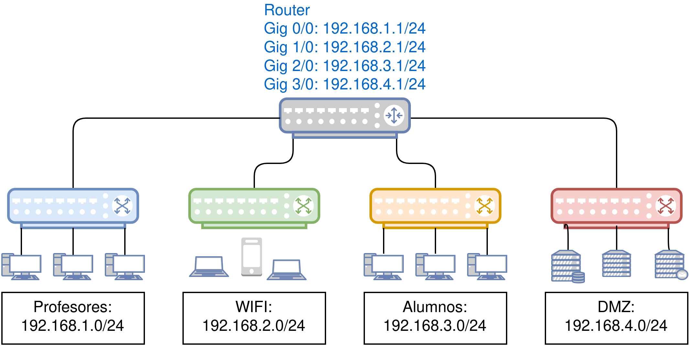
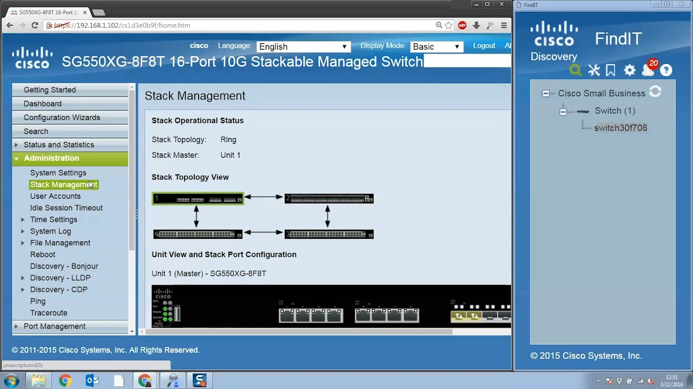

<!-- TODO: este apartado hay que hacerlo
# Conexión de redes a nivel físico {#conexión-de-redes-a-nivel-físico}

## Sistemas de transmisión {#sistemas_transmisión}

guiados:
- cable par trenzado
- coaxial
- optica
FTTH

no guiados
- radiofrecuencia

# Conexión de redes a nivel de enlace de datos {#conexión-de-redes-a-nivel-de-enlace-de-datos}

## Administración de switches {#administración-de-switches}
-->

# Interconexión de redes {#interconexión-de-redes}

Hoy en día no suele ser habitual tener redes completamente aisladas, ya que la comunicación sólo se podría realizar entre los nodos y los dispositivos de la misma.

En el momento en el que una red quiera comunicarse con otra vamos a necesitar de un dispositivo que realice de intermediación para el intercambio de paquetes, y ese dispositivo es el **router**.

## Router profesional {#router-profesional}

:::::::::::::: {.columns }
::: {.column width="20%"}
{width=100%}

:::
::: {.column width="70%" }
Los routers profesionales difieren de los routers caseros en que cada interfaz que tienen van a formar parte de una red distinta, y que deberemos de configurar nosotros los servicios que nos interesen ya que no suelen venir pre-configurados.
:::
::::::::::::::


En Packet Tracer podemos encontrar distintos modelos de routers, pero los que más vamos a utilizar son unos que no existen en la vida real, los denominados "**PT-Empty**". Al igual que con los switches, estos routers no cuentan con ninguna interfaz asociada en el momento en el que lo situamos en nuestra simulación, y nos permite añadir hasta diez interfaces que queramos.

Los routers son los dispositivos en capa 3 que se encargan de enrutar tráfico entre distintas redes. Hay que tener claro que puede encaminar tráfico a redes a las que pertenece, o a redes a las que sabría llegar (a través de rutas).

A continuación se van diferenciar distintos apartados básicos en la configuración de los routers.

### Setup {#setup}

Al igual que sucede con los switches, los routers cuentan con un comando setup con el que poder realizar una primera configuración. Las preguntas que nos realizará son las mismas que las de los switches.
En este caso, las IPs se configuran en los interfaces físicos que tiene el router.

### Comandos básicos {#comandos-básicos}

En los routers Cisco que vamos a utilizar, los comandos de consola son similares a los que hemos visto con los switches.

::: mycode
[Ver la configuración]{.title}
```powershell
Router# show running-config
```
:::

Siempre que realicemos cualquier tipo de modificación, debemos guardar la configuración para que esta se mantenga en el próximo arranque.

::: mycode
[Guardar la configuración]{.title}
```powershell
Router# copy running-config startup-config
```
:::


La configuración de la IP que queremos que tenga nuestro router irá asociado a un interfaz que esté en contacto con la red. Es importante que no confundamos con lo que sucede en los switches, que en ellos la IP va asociada a la VLAN.

::: mycode
[Configurar un interfaz con una IP]{.title}
```powershell
Router# configure terminal

Router(config)# interface GigabitEthernet0/0

Router(config-if)# ip address 192.168.1.1 255.255.255.0
```
:::


Los interfaces físicos, en los routers por defecto están deshabilitados, por lo que da igual que haya un cable conectado a él. Para que exista enlace se tiene que habilitar:

::: mycode
[Habilitar interfaz]{.title}
```powershell
Router# configure terminal

Router(config)# interface GigabitEthernet0/0

Router(config-if)# no shutdown
```
:::


### Router Casero {#router-casero}

En la simulación de los *Home-Router* que tiene Packet Tracer, el interfaz es el real que tenían los míticos [Linksys WRT54G](https://es.wikipedia.org/wiki/WRT54G), siendo la configuración del DHCP la siguiente:

::: center
{width="80%" framed=true}
:::

### Servidores {#servidores}

En los servidores de Packet Tracer podemos realizar la configuración de un servidor DHCP en el siguiente interfaz:

::: center
{width="80%"}
:::

### Router profesional {#router-profesional-1}

Aunque algunos routers Cisco profesionales cuentan con un interfaz web de configuración, es recomendable conocer los comandos para realizar la configuración a través del ***CLI***.

Vamos a suponer que el router que tenemos que configurar cuenta con dos interfaces cuyas IPs son **192.168.1.1 /24** y **172.16.0.1 /22**.

::: mycode
[Configurar DHCP para la primera red]{.title}
```powershell
Router(config)# ip dhcp excluded-address 192.168.1.1
Router(config)# ip dhcp pool lan
Router(dhcp-config)# network 192.168.1.0 255.255.255.0
Router(dhcp-config)# default-router 192.168.1.1
Router(dhcp-config)# dns-server 8.8.8.8
```
:::


::: mycode
[Configurar DHCP para la segunda red]{.title}
```powershell
Router(config)# ip dhcp excluded-address 172.16.0.1
Router(config)# ip dhcp pool alumnos
Router(dhcp-config)# network 172.16.0.0 255.255.252.0
Router(dhcp-config)# default-router 172.16.0.1
Router(dhcp-config)# dns-server 8.8.8.8
```
:::


## Encaminamiento de tráfico a otras redes {#encaminamiento-de-tráfico-a-otras-redes}

Tal como hemos dicho, un router se encarga de encaminar el tráfico entre redes, ya sean redes a las que esté directamente conectado o no. En caso de que sea un paquete a una red ajena, existen distintas maneras de tratarlo:

- Reenviar el tráfico a la puerta de enlace predeterminada.
- Consultar la tabla de enrutamiento (o tabla de rutas).

La tabla de enrutamiento se almacena en los routers y nos indicará cómo llegar a nodos u otras redes a las que no tenemos acceso de manera directa. La tabla de enrutamiento se puede genera haciendo uso de:

- **Rutas estáticas**: deben ser introducidas a mano.
- **Rutas dinámicas**: mediante un protocolo de enrutamiento dinámico.


### Rutas estáticas {#rutas_estaticas}

Las rutas estáticas sirven para obligar a los paquetes, cuyo destino coincide con la ruta, a ir a través de la puerta de enlace especificada, en lugar de ir por la puerta de enlace predeterminada. Lógicamente, para que esto suceda, la puerta de enlace tiene que ser alcanzable por el router, por lo que tenemos que tener acceso a través de la misma red.

La ruta estática se configura para conseguir conectividad con un dispositivo que no esté directamente conectado al equipo que tenga las rutas. Las rutas estáticas permiten la construcción manual de la tabla de enrutamiento.

::: center
{width="80%"}
:::

Teniendo en cuenta el dibujo, para que un equipo de la red 1 pueda comunicarse con un equipo de la red 2 el tráfico debe ser enrutado por el router R1. En este caso, el router R1 no tiene conexión directa con la red 2, pero tiene una ruta estática que para poder llegar a la red 2 le puede redirigir el tráfico al router R2 a través de la IP2 (que está en la misma red que la IP1).

Para que la conectividad funcione, es necesario configurar la ruta en ambas direcciones. Es decir, para que la comunicación vuelva, el router R2 también tendrá que tener a su vez una ruta estática para llegar a la Red1 yendo a través del router R1.

#### Rutas estáticas con distancia administrativa {#rutas-estáticas-con-distancia-administrativa}

En algunas arquitecturas de red, puede existir la posibilidad de llegar a una misma red a través de dos rutas. En estos casos, debemos priorizar una de las rutas, quedando la otra como secundaria y que sólo será utilizada en caso de que la primera ruta falle.

Tomemos como ejemplo la siguiente arquitectura:

::: center
{width="80%"}
:::

Para que la red 1 se pueda comunicar con la red 2 el router R1 puede ir por dos caminos distintos. En este caso, las rutas estáticas a crear serían:

- **Ruta principal**: priorizamos el tráfico por R2, a través de la IP3.
- **Ruta menos prioritaria**: en caso de falla la anterior ruta, el router R1 enviará el tráfico por router R3 llegando a él por la IP4.


En este caso, a las rutas menos prioritarias se les añade una "distancia administrativa" (a veces también llamado "peso"). Esta distancia es un número entero que indicará la prioridad (cuanto mayor el número, menor la prioridad).


#### Ejemplos {#ejemplos}

La creación de rutas estáticas se realiza con [ip route RED  MÁSCARA  SALTO]{.commandbox} siendo:

- **ip config**: el comando que indica que vamos a crear una ruta.
- **RED**: la red a la que queremos llegar.
- **MÁSCARA**: Máscara de la red a la que queremos llegar
- **SALTO**: IP del dispositivo a través del cual queremos llegar a la red indicada anteriormente. Este dispositivo tiene que estar en nuestra misma red y tenemos que poder llegar a él.

Por lo tanto, un ejemplo real podría ser:


::: mycode
[Crear ruta estática para una red]{.title}
```powershell
Router(config)# ip route 172.20.10.0  255.255.252.0  10.0.0.2
```
:::


También podemos realizar rutas estáticas sólo para una IP, siendo la máscara /32 en decimal:

::: mycode
[Crear ruta estática para un equipo]{.title}
```powershell
Router(config)# ip route 172.20.10.25  255.255.255.255  10.0.0.3
```
:::


Cuando hay rutas distintas para una IP y una red, se prioriza de lo más específico a lo más genérico. Por lo tanto, se prioriza la ruta de una IP, aunque se indique que para toda la red haya que ir por otro salto.

##### Crear ruta estática con "distancia administrativa" {#crear-ruta-estática-con-distancia-administrativa}

A la hora de crear una ruta estática con "distancia administrativa", se realiza de la misma forma que acabamos de ver, pero añadiendo al final la distancia administrativa de la ruta, siendo un número entero. Este "peso" es utilizado cuando en la tabla de rutas existen dos rutas para llegar al mismo destino por caminos diferentes, por lo que se priorizará la ruta con el número más pequeño (o que no tenga número).

::: mycode
[Crear ruta estática y ruta con distancia administrativa]{.title}
```powershell
Router(config)# ip route 172.20.10.0  255.255.252.0  10.0.0.2

Router(config)# ip route 172.20.10.0  255.255.252.0  192.168.1.1  10
```
:::


Como se puede ver, para llegar al mismo destino (172.20.10.0 /22) podemos elegir dos saltos por los que llegar: 10.0.0.2 y 192.168.1.1. La ruta que tenga menor distancia administrativa será la predeterminada, y por tanto los paquetes se irán por ella.

### Enrutamiento dinámico {#enrutamiento-dinámico}

El enrutamiento dinámico permite a los encaminadores ajustar, en tiempo real, los caminos utilizados para transmitir paquetes IP. Cada protocolo posee sus propios métodos para definir rutas (camino más corto, utilizar rutas publicadas por pares, etc.).

#### BGP (Border Gateway Protocol) {#bgp-border-gateway-protocol}

El protocolo BGP (en castellano protocolo de "Puerta de Enlace de Frontera") es un protocolo mediante el cual **se intercambia información de encaminamiento entre sistemas autónomos**.

Un **Sistema Autónomo** (o **AS**, de *Autonomous System*) es un grupo de redes IP controladas por una misma compañía (normalmente un proveedor de internet ISP, o una gran compañía) que son gestionadas de manera independiente y realiza su propia gestión del tráfico. Los sistemas autónomos cuentan con un número (**ASN**) de 16 o 32 bits que debe ser respetado, ya que al igual que las IPs, existen ASN públicos y privados. En la wikipedia aparece una [lista de estos rangos](https://es.wikipedia.org/wiki/Sistema_aut%C3%B3nomo#Tabla_con_ASN_de_16-bit_y_32-bit).

El intercambio de esos rangos de IPs se realiza en los denominados "router frontera" o "router externos", que son los que están comunicados con otros routers de otros AS. Estos routers son los encargados de **anunciar** las propias redes del AS a sus "vecinos" (neighbors en inglés), que a su vez propagarán esa información a sus propios vecinos \...

Si un AS decide anunciar una nueva red, automáticamente sus vecinos son actualizados, que a su vez propagan la actualización. Si un router recibe su propia actualización, la rechaza.

::: errorbox 
**Es importante que un router no anuncie redes IP que no le pertenecen.**
:::


En la [wikipedia](https://en.wikipedia.org/wiki/BGP_hijacking) aparecen distintos incidentes por errores en la propagación de rutas.
Cuando un router propaga una red (ya sea suya o de otro AS) añade su ASN, y de esta manera se conoce para llegar a una ruta por cuántos AS se pasan (pero no por cuántos routers internos).

Hoy en día Internet funciona con el protocolo BGP y actualmente el protocolo anuncia más de 900.000 rutas ([fuente](https://blog.apnic.net/2022/01/06/bgp-in-2021-the-bgp-table/)):

::: center
{width="80%"}
:::

#### Ejemplos {#ejemplos-1}

En los routers debemos crear la configuración para que se convierta en un "*Autonomous System*" (AS, Sistema Autónomo).

::: mycode
[Crear sistema autónomo]{.title}
```powershell
Router(config)# router bgp 100
```
:::


Una vez dentro del sistema autónomo, habrá que indicar qué red se quiere propagar a los "vecinos":


::: mycode
[Anunciar red a propagar]{.title}
```powershell
Router(config-router)# network 192.168.1.0 mask 255.255.255.0
```
:::


Para poder propagar la red, debemos indicar a qué vecinos se los vamos a propagar:

::: mycode
[Vecinos a los que propagar la red]{.title}
```powershell
Router(config-router)# neighbor 10.10.2.1 remote-as 200
```
:::


Para conocer el estado de las rutas BGP podemos realizar:

::: mycode
[Comprobar estado de BGP]{.title}
```powershell
Router#show ip bgp
BGP table version is 6, local router ID is 192.168.1.1
Status codes: s suppressed, d damped, h history, * valid, > best,
              i - internal, r RIB-failure, S Stale

Origin codes: i - IGP, e - EGP, ? - incomplete

Network               Next Hop           Metric LocPrf  Weight  Path
*> 192.168.1.0/24      0.0.0.0                0     0    32768       i
*> 192.168.2.0/24    10.10.2.1                0     0        0   200 i
```
:::


### Tabla de rutas completa {#tabla-de-rutas-completa}

Los routers Cisco tienen una opción que nos muestra todas las rutas a las que el router puede acceder:

::: {.mycode size=small}
[Comprobar estado de BGP]{.title}
```powershell
Router# show ip route
Codes: C - connected, S - static, I - IGRP, R - RIP, M - mobile, B - BGP
    D - EIGRP, EX - EIGRP external, O - OSPF, IA - OSPF inter area
    N1 - OSPF NSSA external type 1, N2 - OSPF NSSA external type 2
    E1 - OSPF external type 1, E2 - OSPF external type 2, E - EGP
    i - IS-IS, L1 - IS-IS level-1, L2 - IS-IS level-2, ia - IS-IS inter area
    * - candidate default, U - per-user static route, o - ODR
    P - periodic downloaded static route

Gateway of last resort is not set

        8.0.0.0/25 is subnetted, 1 subnets
C       8.8.8.0 is directly connected, GigabitEthernet1/0

        10.0.0.0/30 is subnetted, 1 subnets
C       10.10.0.0 is directly connected, GigabitEthernet2/0

        83.0.0.0/27 is subnetted, 1 subnets
C       83.85.67.0 is directly connected, GigabitEthernet0/0

        95.0.0.0/26 is subnetted, 1 subnets
B       95.94.32.0 [20/0] via 10.10.0.2, 00:00:00

        212.140.23.0/28 is subnetted, 1 subnets
S       212.140.23.16 [1/0] via 83.85.67.4
```
:::


Tal como aparece justo después del comando, hay unos códigos que nos indican si los rangos son:

- Red que podemos llegar mediante el protocolo BGP.
- Red a la que estamos directamente conectados a través de un interfaz físico.
- Red a la que podemos llegar siendo una ruta estática.


# Redes virtuales {#redes-virtuales}

Es habitual querer diferenciar distintas redes dentro de una arquitectura de red (para diferenciar departamentos en una empresa, separar servidores de equipos de trabajo, limitar el acceso entre redes, \...) pero eso supone la compra de distintos equipamientos físicos (distintos switches, puntos de acceso \...) que incrementa el coste de nuestra infraestructura.

Para evitar este incremento de precio, podemos hacer uso de las **VLAN** en nuestros dispositivos de red, ya sea en switches o en routers, que los soporten.

## VLAN {#vlan}

Una VLAN, acrónimo de *virtual LAN* (red de área local virtual), **es un método para crear redes lógicas independientes dentro de una misma red física**. Varias VLAN pueden coexistir en un único switch físico o en una única red física, y el tráfico estará separado entre distintas VLANs a nivel lógico.

Un equipo de una VLAN no se podrá comunicar con otro equipo de otra VLAN distinta salvo que haya un router que esté conectado en ambas VLANs y que encamine el tráfico de una a la otra. Lo mismo que si fuesen dos redes físicas, como hemos visto hasta ahora.

Las VLANs se diferencian a través de una cabecera extra la cual se añade dentro del encabezado original de la trama (**capa 2**). Esa cabecera consta de dos partes de 16 bits, siendo los últimos 12 los que correspondan al valor que identificará a la VLAN, y estará comprendido entre 1 y 4095, ya que el 0 está reservado. Esa cabecera indicará que el tráfico está etiquetado o "***tagged***".

::: infobox
Las VLANs se diferencian a través de una cabecera extra la cual se añade dentro del encabezado original de la trama (**capa 2**).
:::


A continuación se puede ver cómo se muestra tráfico etiquetado mediante las cabeceras del **protocolo 802.1Q**:

::: center
{width="90%" framed=true}
:::

- **TPID**: 16 bits en el que el valor "**0x8100**" indica que es una trama etiquetada del protocolo **802.1Q**.

- **TCI**: 16 bits (formando 4 caracteres en hexadecimal):

  - **PCP**: 3 bits que permiten priorizar el tráfico.

  - **DEI**: 1 bit, en conjunto con PCP, que permite saber si esta trama se puede descartar en caso de congestión.

  - **VID**: *VLAN IDentificator*, 12 bits ($2^{12} = 4096$). En este caso los últimos 3 caracteres hexadecimales "00A" que indica que es la VLAN 10.

Hay que tener en cuenta que aunque existe el límite de 4096 VLANs, algunos switches tienen una limitación de un número menor de VLANs activas. Es decir, puedes crear VLANs con el dígito que quieras (hasta 4095), pero quizá sólo te dejan crear 16 VLANs. Ejemplo de la limitación del número de VLANs que puede haber activas en switches "[Cisco de la serie 200 Cisco Small Business](https://www.cisco.com/c/dam/en/us/products/collateral/switches/small-business-100-series-unmanaged-switches/data_sheet_c78-634369_Spanish.pdf)":


|   |   |
|---|---|
| VLAN | Compatibilidad con hasta **256 VLAN simultáneas** (de 4096 ID de VLAN). **16 VLAN compatibles en SG200-08 y SG200-08P**. VLAN basadas en puertos y en etiquetas 802.1Q  | 
| VLAN de voz | El tráfico de voz se asigna automáticamente a una VLAN específica de voz y se trata con los niveles apropiados de QoS  | 

Table: {tablename=tblr colspec=X[2cm]X}

Como se puede apreciar, en este modelo de Switch, el límite es de 256 VLAN activas (aunque se puede elegir el ID de la VLAN de las 4096 posibles), y de "sólo" 16 VLANs en el modelo de 8 bocas ethernet de esa serie.

### Diferencia de arquitecturas con y sin VLANs {#diferencia-de-arquitecturas-con-y-sin-vlans}

Para que quede más claro lo explicado hasta ahora, vamos a analizar una misma infraestructura de red separada a nivel físico y separada a nivel lógico mediante VLANs.

#### Arquitectura sin VLAN {#arquitectura-sin-vlan}

En una arquitectura de red sin VLANs tendríamos que tener tantos switches como sean necesarios para realizar una separación física de las redes. Estos switches estarán conectados a un router que será el encargado de encaminar el tráfico entre las redes. La separación física de redes es más cara ya que se necesita más hardware y es posible que los switches estén infrautilizados.

::: center
{width="80%"}
:::

Se puede observar una arquitectura en la que un router actúa de intermediación en una red en la que existen 4 redes separadas físicamente mediante distintos switches. Si en una red existen pocos dispositivos, el switch de esa red estará infrautilizado. Si por el contrario necesitamos ampliar alguna de las redes, deberemos añadirle un switch en cascada en la red correspondiente, pero aún así ese nuevo switch podría estar infrautilizado.

#### Arquitectura con VLANs {#arquitectura-con-vlans}

En una arquitectura con **VLAN**s, tendremos un router que estará conectado a un switch mediante un enlace [trunk](#puerto_trunk), y en este switch se configurará cada interfaz en modo [access](#puerto_access) teniendo en cuenta el dispositivo que se vaya a conectar a dicha interfaz. En caso de necesitar ampliar las redes, se hará uso de las interfaces no utilizadas, y en caso de no haber más, el switch se podría expandir añadiendo uno nuevo y [creando un stack](#stack_switches) entre ellos.

::: center
{width="80%"}
:::

## VLANs en Switches {#vlans-en-switches}

En los switches se pueden realizar distintas configuraciones teniendo en cuenta las VLANs que vayamos a utilizar y la arquitectura de red que tengamos:

- **VLAN por defecto en el switch**: Es la VLAN en la que trabajará el switch. Por defecto suele ser la **VLAN 1**. El tráfico por defecto va en esa VLAN y para ir por cualquier otra VLAN el tráfico deberá estar "*tagged*" (etiquetado).

::: {#puerto_trunk}
:::
- **Puerto en modo "*trunk*"**: Normalmente utilizado para comunicación entre distintos switches y/o routers. A este enlace "***trunk***" (o troncal, o tronco) se le asigna una VLAN por defecto y las VLANs "**tagged**" permitidas que pasarán por él. Los switches sabrán a qué VLAN pertenece cada trama observando la etiqueta VLAN de la capa 2.

  El tráfico que **entra** en esta boca, si no está etiquetado estará en la VLAN por defecto. Si está etiquetado en una VLAN permitida se permitirá el tráfico.

  El tráfico que **sale** de esta boca saldrá de la misma manera con la que llegó a él (sin etiquetar o etiquetado con la VLAN que sea). El equipo que reciba esta trama tendrá que lidiar con el tráfico recibido (ya sea etiquetado o no).


::: {#puerto_access}
:::
- **Puerto en modo "*access*"**: La boca del switch se define en modo "access" (o "acceso") y se le asigna una **única VLAN** a la misma.

  Este tipo de configuraciones suele ser utilizada para conectar equipos en los que no podemos etiquetar VLANs en origen (impresoras por ejemplo), o nos resulte tedioso la configuración de la misma, pero queremos asegurar que su tráfico viaje por una VLAN.

  El **tráfico que entra** en esta boca, a partir de ese momento **se le añadirá la cabecera de la VLAN a la trama** convirtiéndose en tráfico "tagged".

  Si el **tráfico sale** de una boca en modo "access" se quitará la cabecera VLAN, por lo que **al equipo remoto le llegará el tráfico sin estar "tagged"**.

Teniendo en cuenta lo explicado previamente, se puede observar en el siguiente dibujo en el que aparecen varios switches, configurados con distintas bocas en modo **access** y otras en modo **trunk**. Como se puede ver, las bocas que comunican los distintos dispositivos (switches con switches y switch con router) están configuradas en modo TRUNK, y en ellas se permiten varias VLANs.

Las interfaces que sólo tienen un color, están configuradas en modo **access** con una VLAN. Los interfaces en blanco no están configurados (ya que usan la VLAN por defecto, en este caso la VLAN 1). Para que el router pueda enrutar las distintas redes, le tendrán que llegar a través de un enlace configurado en modo **trunk**.

::: center
{width="90%"}
:::

### Crear VLAN {#crear-vlan}

Para crear una VLAN primero deberemos identificar el identificador, y luego suele ser recomendable darle un nombre identificativo.

::: mycode
[Crear VLAN]{.title}
```powershell
Switch(config)# vlan 10
Switch(config-vlan)# name Profesores
```
:::


### Añadir IP en una VLAN {#añadir-ip-en-una-vlan}

En caso de necesitarlo, se podrá añadir una IP a cada nueva vlan que se haya creado, tal como se hace con la VLAN 1, pero eligiendo la VLAN correspondiente.

::: mycode
[Añadir IP a la VLAN]{.title}
```powershell
switch(config)# interface vlan10
switch(config-if)# ip address 10.10.0.254 255.255.255.0
switch(config-if)# no shutdown
```
:::


### Listar tabla de VLAN {#listar-tabla-de-vlan}

El siguiente comando nos muestra la base de datos interna de VLANs que tiene el switch, indicando el estado y un pequeño resumen de en qué bocas está activa. Hay que tener en cuenta que no nos indica en qué modo está configurada dicha VLAN en cada interfaz, por lo que deberemos comprobarlo mirando detalladamente la configuración completa.


::: mycode
[Listar la tabla de VLAN]{.title}
```powershell
Switch# show vlan

VLAN    Name            Status    Ports
---- ------------------ --------- --------
1    default            active    Gig1/1
10   profesores         active    Gig0/1
20   alumnos            active
...
```
:::


También hay que tener en cuenta que aunque un interfaz esté configurado con una VLAN, si no aparece en la base de datos, es como si no existiese.

### Configurar interfaz con VLAN en acceso {#configurar-interfaz-con-vlan-en-acceso}

Para configurar un interfaz en modo ***access*** tendremos que elegir primero el interfaz y después elegir el modo a configurar y para qué VLAN. Es importante haber creado primero la VLAN.

::: mycode
[Configurar interfaz en modo trunk]{.title}
```powershell
Switch(config)# interface GigabitEthernet 0/1
Switch(config-if)# switchport mode access
Switch(config-if)# switchport access vlan 10
```
:::


### Configurar interfaz con VLAN en trunk {#configurar-interfaz-con-vlan-en-trunk}

Para configurar un interfaz en modo ***trunk*** tendremos que elegir primero el interfaz y después elegir el método de configuración:

::: mycode
[Configurar interfaz en modo trunk]{.title}
```powershell
Switch (config)# interface GigabitEthernet 1/1
Switch(config-if)# switchport mode trunk
Switch(config-if)# switchport trunk allowed vlan  ???
```
:::


Donde "???" pueden ser varias opciones:

- **add**: add VLANs to the current list
- **all**: all VLANs
- **except**: all VLANs except the following
- **none**: no VLANs
- **remove**: remove VLANs from the current list

Podemos poner la VLAN por defecto en una boca en modo trunk con:

::: mycode
[Poner vlan por defecto en un trunk]{.title}
```powershell
Switch(config-if)# switchport trunk native vlan 10
```
:::


### VLANs en Routers {#vlans-en-routers}

En los routers, las VLANs van asociadas a una interfaz física. Al añadir una VLAN, se crea una interfaz "virtual", y dentro se le indica que va a ser de tipo "**encapsulation dot1Q**" y la VLAN que va a usar. Después, se le configura la IP como si fuera una interfaz normal. Como ejemplo para la VLAN 20:


::: mycode
[Crear VLAN 20 en Router y configurar una IP]{.title}
```powershell
Router(config)# interface GigabitEthernet0/0.20
Router(config-if)# encapsulation dot1Q 20
Router(config-if)# ip address 192.168.20.1 255.255.255.0
```
:::


### VLANs en servidores/ordenadores {#vlans-en-servidoresordenadores}

El tráfico que "sale" de un servidor/ordenador, por defecto, no está etiquetado con ninguna VLAN. En caso de que queramos que el tráfico saliente salga con una VLAN etiquetada, tendremos que configurar el interfaz de red para que funcione con dicha VLAN.

## Protocolo VTP {#protocolo-vtp}

VTP, o **VLAN Trunk Protocol**, es un protocolo que nos permite configurar y administrar VLANs en equipos Cisco de manera centralizada. De esta manera conseguimos simplificar la tarea cuando tenemos una red en la que disponemos de muchas VLANs

El protocolo funciona en modo servidor-cliente, por lo tanto debemos configurar un switch en modo servidor, que será en el que realizaremos la administración de las VLANs, que posteriormente serán propagadas por los switches que son clientes VTP y que pertenecen al mismo dominio.

::: warnbox 
La conexión entre switches debe estar en modo **trunk** para que el protocolo funcione de manera correcta.
:::


### Configurar switch como VTP Server {#configurar-switch-como-vtp-server}

Es tan fácil como elegir el modo servidor del protocolo VTP, indicar un dominio de propagación y una contraseña para el mismo.

::: mycode
[Crear configuración como VTP Server]{.title}
```powershell
Switch(config)# vtp mode server
Switch(config)# vtp domain instituto
Switch(config)# vtp password 1234
```
:::


### Configurar switch como VTP Client {#configurar-switch-como-vtp-client}

Similar al caso anterior, pero esta vez eligiendo que queremos que el switch sea cliente:

::: mycode
[Crear configuración como VTP Client]{.title}
```powershell
Switch(config)# vtp mode client
Switch(config)# vtp domain instituto
Switch(config)# vtp password 1234
```
:::


### Ver estado de VTP {#ver-estado-de-vtp}

Para comprobar el estado del servicio VTP, tanto en un switch que sea *server* o *client*:

::: {.mycode size=small}
[Ver configuración de estado de VTP]{.title}
```powershell
Switch# show vtp status

VTP Version                     : 2
Configuration Revision          : 2
Maximum VLANs supported locally : 255
Number of existing VLANs        : 7
VTP Operating Mode              : Server
VTP Domain Name                 : instituto
VTP Pruning Mode                : Disabled
VTP V2 Mode                     : Disabled
VTP Traps Generation            : Disabled
MD5 digest                      : 0x68 0x70 0x3B 0xF0 0x14 0xC8 0xF7 0xE9
Configuration last modified by 0.0.0.0 at 3-1-93 00:11:38
Local updater ID is 0.0.0.0 (no valid interface found)
```
:::


Y nos ofrece un resumen del estado del mismo.

# Alta Disponibilidad en sistemas de red {#alta-disponibilidad-en-sistemas-de-red}

La [Alta Disponibilidad](#altadisponibilidad) en una arquitectura de red es vital si queremos asegurar el acceso a otras redes o servicios. Para ello podemos hacer uso de distintas tecnologías que nos ayudarán a conseguirlo.

## Agregación de enlaces: Etherchannel / LACP {#agregación-de-enlaces-etherchannel-lacp}

La agregación de enlaces consiste en combinar (agregar) varias conexiones en paralelo para aumentar el ***throughput*** (la tasa de transferencia) que conseguiría una única conexión. Un grupo de agregación de enlaces (**LAG**, de *Link Aggregation Group*) combina una serie de puertos físicos de manera que se consigue una única ruta con más ancho de banda que un único enlace.

A lo largo de los años ha habido distintos estándares para la creación de agregación de enlaces. El último es el conocido como **LACP** (*Link Aggregation Control Protocol*), que provee un método para controlar la unión de varios puertos físicos formando un único canal lógico. LACP permite negociar automáticamente la unión entre dispositivos mediante el envío de paquetes LACP al otro dispositivo.
LACP permite el modo:

- **activo**: Habilita LACP de manera incondicional. Esto puede hacer que si en las bocas que están habilitadas en modo LACP se conecta algo que no está configurado para ello, no funcione de manera correcta

- **pasivo**: Habilita LACP sólamente cuando se detecta un dispositivo configurado con LACP

Como ya se ha comentado, la finalidad es la de unir distintas conexiones para aumentar la tasa de transferencia, y esto no sólo se puede realizar entre switches, si no que también se puede realizar entre un switch y un servidor.

A continuación podemos ver cómo sería un sistema LACP entre dos switches.

::: center
{width="70%"}
:::

Y aquí podemos ver cómo sería una agregación de enlaces entre un switch y un servidor (ya que en un servidor también podemos realizar la agregación de enlaces).

::: center
{width="60%"}
:::

### Configurar Etherchannel en Switches {#configurar-etherchannel-en-switches}

Antes de realizar ninguna configuración, debemos pensar qué interfaces queremos combinar en una agregación formada por el protocolo LACP.

Para realizar la configuración, deberemos entrar en cada interfaz y añadirlo a un channel-group (siendo el identificador entre el número 1 y el 6) y activar el protocolo a usar:

::: mycode
[Añadir interfaces a un LAG]{.title}
```powershell
Switch(config-if)# channel-group 1 mode active
Switch(config-if)# channel-protocol lacp
```
:::


Cuando se crea un grupo de agregación de enlaces se crea un nuevo interfaz llamado "**Port-Channel**" (abreviado como "**Po**"). Es decir, si hacemos la agregación de enlaces con las bocas "0/1" y "1/1" del switch para generar un "channel-group 1", el switch generará una boca nueva llamada "Port-Channel 1", la cual podrá ser configurada para hacer lo que necesitemos. En Packet Tracer se pueden tener hasta 6 port-channels:

::: mycode
[Configurar Port-Channel 1 en modo trunk]{.title}
```powershell
switch(config)# interface Port-Channel 1
switch(config-if)# switchport mode trunk
```
:::


Para poder ver el estado del etherchannel/agregación de enlaces:

::: mycode
[Ver el estado de los etherchannels]{.title}
```powershell
Switch# show etherchannel summary

Flags:  D - down        P - in port-channel
I - stand-alone s - suspended
H - Hot-standby (LACP only)
R - Layer3      S - Layer2
U - in use      f - failed to allocate aggregator
u - unsuitable for bundling
w - waiting to be aggregated
d - default port

Number of channel-groups in use: 2
Number of aggregators:           2

Group  Port-channel   Protocol   Ports
------+-------------+-----------+--------------------
1      Po1(SU)           LACP     Gig0/1(P) Gig1/1(P)
2      Po2(SU)           LACP     Gig2/1(P) Gig3/1(P)
```
:::


En este ejemplo, el switch tiene dos agregaciones de enlaces creadas, dos port-channels:

- **Po1**: Tiene configurados los interfaces: Gig 0/1 y Gig 1/1.

- **Po2**: Tiene configurados los interfaces: Gig 2/1 y Gig 3/1.

::: warnbox
Cada interfaz de cada agregación de enlaces tiene que aparecer con un "**(P)**". Eso significa que pertenece al port-channel y está correcto.
:::


## Stack de switches {#stack_switches}


:::::::::::::: {.columns }
::: {.column width="60%"}
De manera resumida, es la configuración aplicada a varios switches para que actúen como uno sólo. Esto se realiza mediante la interconexión de los switches (formando un anillo) a través de unos puertos especiales o unas conexiones habilitadas para ello.
:::
::: {.column width="35%" }
{width=100%}

:::
::::::::::::::


Tras la realización del "stackado" de switches las ventajas que obtendremos son muy significativas:

- Podremos configurar todas las bocas del conjunto de todos los switches que lo forman desde un único punto central (ya sea mediante el CLI o mediante la web de gestión).

- Tendremos redundancia en las comunicaciones.

- Permite escalar el tamaño de las comunicaciones y podríamos añadir más switches en un momento dado (algunas marcas permiten 12 switches en un mismo stack).

Hay que tener en cuenta que no todos los switches permiten realizar un stack de switches, por lo que tendríamos que asegurarnos que si vamos a necesitar esta funcionalidad, a la hora de comprar los switches lo soporten.

::: center
{width="60%" framed=true}
:::

### Integración de Stack y LACP {#integración-de-stack-y-lacp}

Si realizamos la combinación de configuraciones de Stack de switches junto con LACP con servidores, nos aseguraremos de tener una Alta Disponibilidad real en lo que se refiere a comunicaciones.

Veamos el siguiente dibujo:

::: center
{width="60%"}
:::

Podemos observar cómo tenemos un stack de 3 switches, que como ya hemos visto previamente actúan como si se tratara de uno sólo. Por otro lado tenemos el servidor, que cuenta con 3 tarjetas ethernet que han sido configuradas a nivel de sistema operativo en modo LACP, y cada una de ellas se ha conectado a un switch distinto del stack.

::: infobox
Con esta configuración, nos estamos asegurando que si un switch se estropea, la conectividad seguirá existiendo entre el servidor y el stack a través de los dos enlaces restantes.
:::

Es muy importante que nuestra infraestructura de red sea pensada para tener el menor número puntos de fallos posibles, y haciendo uso de stacks de switches y conexiones LACP podremos reducir esos puntos de fallo.

# Seguridad en red {#seguridad-en-red}

Tal como hemos visto hasta ahora, una red es una infraestructura compleja utilizada por dispositivos que nos permiten intercambiar información entre equipos y/o usuarios. Para asegurar que el acceso a esa información sólo se realiza desde los dispositivos autorizados, debemos realizar configuraciones de seguridad.

Normalmente, para limitar el acceso a los equipos se hace uso de **cortafuegos** (también conocidos como ***Firewalls***). Estos sistemas cortafuego se pueden implementar de las siguientes maneras:

- **Cortafuegos de red**: Normalmente es un dispositivo *hardware* (que puede ser el mismo router) que actúa como filtrador de paquetes entre las distintas redes que tiene configurado.

  De esta manera, podemos limitar el acceso teniendo en cuenta el origen, destino, puerto y/o protocolo de comunicación utilizado en la comunicación.

  Algunos ejemplos:

  - Routers caseros: tienen un sistema de cortafuegos básico.

  - Routers hardware Cisco.

  - [pfSense](#pfsense): una distribución basada en FreeBSD que actúa como firewall.

- **Cortafuegos en el equipo**: Para evitar las conexiones de equipos de la misma red, es habitual que los servidores/equipos cuenten con un firewall configurado mediante *software* (ya sea a través de "Windows Firewall" o reglas nftables/iptables en GNU/Linux).

- **Cortafuego de aplicación**: Este tipo de cortafuegos es capaz de entender el protocolo de aplicación y de esta manera filtrar teniendo en cuenta el contenido del paquete.

A la hora de limitar el tráfico, un firewall puede actuar de dos maneras:

- **Denegar por defecto**: Es la manera más habitual de trabajar de los Firewall. Por defecto, todo el tráfico es denegado, y hay que permitir el tráfico que nos interese.

- **Aceptar por defecto**: No tan habitual, ya que todo el tráfico es aceptado por defecto y debemos denegar el tráfico que no nos interese que exista.

## ACL {#acl}

Las ACL (*Access Control Lists* en inglés, o Listas de Control de Acceso) sirven para permitir o denegar el tráfico al pasar por el router y son configuradas teniendo en cuenta las redes a las que pertenece.

Existen dos tipos de ACL:

- **Estándar**: son ACLs limitadas. Sólo se permite aceptar o denegar de origen. El ID debe ser de 1 a 99.

- **Extendidas**: son ACLs con más opciones. Deben tener el ID de 100 a 199 y permiten aceptar/denegar:

  - protocolo

  - origen

  - destino

  - puerto

  - \...

Al crear una ACL en los routers de Packet Tracer, y crear una regla en ella, automáticamente entrará en funcionamiento el método "denegar por defecto" al final de las reglas.

::: errorbox
**Al crear una ACL extendida por defecto se crea una regla implícita que deniega todo el tráfico. Se añade al final de nuestras reglas**.
:::

Es muy importante entender esto, ya que todo el tráfico que no esté aceptado, será denegado por defecto, aunque nosotros no hayamos creado una regla para ello, ya que se crea por defecto y no aparece reflejado en la ACL.

::: infobox
**Al usar ACLs debemos usar la SIMULACIÓN si vemos que el tráfico no se acepta/deniega tal como esperamos.**
:::

### ACLs en entrada o salida {#acls-en-entrada-o-salida}

Las ACLs se crean en los interfaces en los que queremos realizar reglas para permitir y/o denegar tráfico. Antes de permitir o denegar tráfico entre redes, hay que entender que las ACLs se pueden crear teniendo en cuenta el sentido del tráfico en relación con el router. Por lo tanto, las ACLs se pueden crear del tipo:

- **IN**: el tráfico se analiza con la ACL **al intentar entrar en el router** por el interfaz indicado.

- **OUT**: el tráfico se analiza con la ACL **al intentar salir del router** por el interfaz indicado.

Podemos imaginar que la ACL es un policía y dependiendo de cómo se haya creado la ACL el policía se situará cortando el tráfico en un sentido o en otro.

Teniendo esto en cuenta, para realizar el mismo propósito se pueden utilizar distintas reglas IN o reglas OUT dependiendo de cómo se haga la configuración.

**Por ejemplo**: Tenemos 2 LANs y queremos que desde la LAN 1 se pueda hacer ping a la LAN 2, pero que desde la LAN 2 no se pueda hacer ping a la LAN 1. Para realizar este filtrado de tráfico, se puede realizar de dos formas distintas.

##### Forma 1: Regla OUT {#forma-1-regla-out}

La regla OUT se creará en el interfaz Gig0/0 y analizará el tráfico cuando vuelva de la LAN 2 e **intente salir del router hacia la LAN 1**.

Se permitirá el tráfico que vuelve, pero sólo el tráfico de tipo "*echo-reply*". Cualquier otro tráfico es denegado por defecto

::: center
{width="50%"}
:::

##### Forma 2: Regla IN {#forma-2-regla-in}

La regla IN se creará en el interfaz Gig 1/0 y **analizará el tráfico cuando entre al router desde la LAN 2**.

Se permitirá el tráfico entrante "echo-reply" y cualquier otro tipo de tráfico será bloqueado por defecto.

### Configurar y administrar ACLs {#configurar-y-administrar-acls}

A la hora de crear una ACL tenemos que tener en cuenta dos cosas:

- El interfaz en el que queremos crear la ACL.

- El sentido en el que se realizará el filtrado.


::: mycode
[Crear una ACL en modo IN]{.title}
```powershell
Router(config)# interface GigabitEthernet0/0
Router(config-if)# ip access-group 100 in
```
:::


Hemos indicado que se en el interfaz 0/0 existe una ACL con identificador 100 que filtrará el tráfico. A continuación debemos crear las reglas de las que constará ese grupo. Al crear una regla, se indican distintas opciones.

::: mycode
[Crear una regla en la ACL 100]{.title}
```powershell
Router(config)# access-list ID TIPO_FILTRADO TIPO_TRÁFICO ORIGEN  DESTINO  MISC
```
:::


Donde las opciones son:

- **ID**: sería el identificador de la regla, que tiene que coincidir con lo puesto en el interfaz correspondiente

- **TIPO_FILTRADO**: Suele ser:

  - **permit**: permitimos el tráfico

  - **deny**: se bloqueará el tráfico

- **TIPO_TRÁFICO**: Existen varias opciones del tipo de tráfico que podemos filtrar:

  - **icmp**: Internet Control Message Protocol

  - **ip**: cualquier tipo de tráfico

  - **tcp**: Transmission Control Protocol

  - **udp**: User Datagram Protocol

- **ORIGEN**: cuál es el origen del tráfico que se quiere coincidir con la ACL. Aquí puede haber varias opciones:

  - **IP + WILDCARD**: habrá que indicar el rango de IP y el wildcard que se necesite. Esto servirá para indicar un rango de red.

  - **any**: sirve para indicar cualquier IP.

  - **host + IP**: sirve para habilitar un único host con su IP.

- **DESTINO**: cuál es el origen del tráfico que se quiere coincidir con la ACL. Al igual que con el ORIGEN, existen varias opciones

- **MISC**: dependiendo del tipo de tráfico seleccionado, es posible añadir más opciones al final de la ACL.

Teniendo todo esto en cuenta, un ejemplo de regla para una ACL sería:

::: {.mycode size=scriptsize}
[Crear una regla en la ACL 100]{.title}
```powershell
Router(config)# access-list 100 permit icmp 192.168.2.0 0.0.0.255 192.168.1.0 0.0.0.255 echo-reply
```
:::


#### Orden de las reglas en las ACL {#orden-de-las-reglas-en-las-acl}

Cada ACL puede tener varias reglas y **es muy importante el orden**. Es decir, si la ACL con ID 100 tiene varias reglas, se aplicarán en el orden de creación. Por lo tanto, primero se deben de aplicar las reglas más concretas, las que son más específicas, y después las más generales.

**Por ejemplo**: Queremos permitir todo el tráfico entre 192.168.1.0 → 192.168.20.0 pero queremos evitar el tráfico de 192.168.1.5 → 192.168.20.0. Entonces, el orden tendrá que ser:

- **denegar** tráfico 192.168.1.5 → 192.168.20.0 /24 (porque es muy específico)

- **aceptar** tráfico 192.168.1.0 /24 → 192.168.20.0 /24

- denegar el resto de tráfico **¡¡REGLA POR DEFECTO, SE CREA SOLA!!**

#### Otros ejemplos {#otros-ejemplos}

Si queremos hacer uso de DHCP en nuestra red, veremos que en el momento en el que aplicamos ACLs entre redes dejará de funcionar. Por lo tanto tendremos que aceptar el tráfico UDP de los puertos que usa [DHCP](#dhcp).

Si queremos ver las ACL que están creadas, debemos hacer:

::: mycode
[Ver las ACLs y sus reglas]{.title}
```powershell
Router# show access-lists
```
:::


