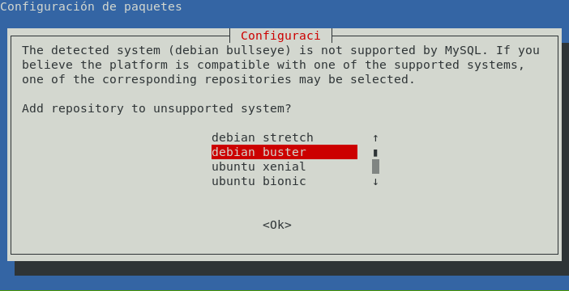
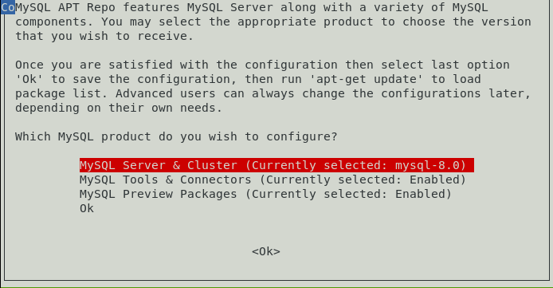
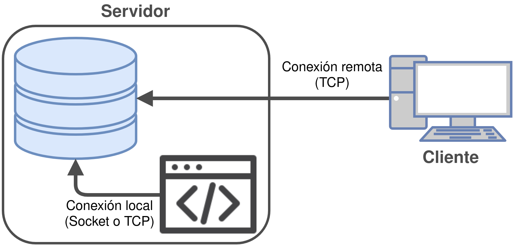
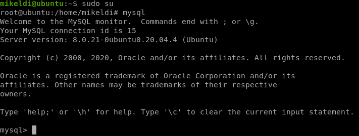
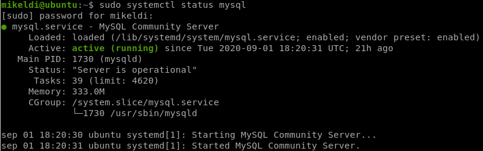

# Introducción {#introducción}

Hoy en día es habitual que los datos que usamos estén almacenados en una Base de Datos. Da igual que ese dato lo estemos utilizando desde un navegador web, en una aplicación de móvil o una videojuego. Cada consulta que realicemos al dato y cada posible modificación o eliminación del mismo realizará una petición (consulta o modificación) a un Sistema Gestor de Base de Datos.

Cada consulta realizada, cada petición de actualización o cada eliminación de datos, tendrá que ser procesada por el Gestor de Base de Datos y analizada para comprobar que lo que se va a realizar, como los permisos de quién pide la acción son adecuados, para posteriormente realizar la acción.

Los datos almacenados en una base de datos son de gran importancia en una empresa, por lo que la continuidad del servicio, así como la seguridad de los accesos recae en los administradores de Bases de Datos (DBA o DataBase Administrator) que deberán asegurar que el funcionamiento sea el esperado, así como la gestión de copias de seguridad de los mismos.

A lo largo de esta asignatura recordaremos los conceptos básicos de las bases de datos, comprenderemos la importancia y las funciones que desempeñan un Sistema Gestor de Base de Datos, aprenderemos a administrar el SGBD, crear y gestionar backups así como montar un sistema en [Alta Disponibilidad](#altadisponibilidad).

# Repaso {#repaso}

A modo de repaso rápido de la asignatura Gestión de Bases de Datos, veremos rápidamente unos conceptos que nos deberían ser conocidos.

## ¿Qué es una Base de Datos? {#qué-es-una-base-de-datos}

Recordemos que una base de datos es un conjunto de datos que suelen pertenecer a un mismo contexto y que está almacenado para poder ser consultado posteriormente. Aunque actualmente una base de datos se asocia a un sistema informático, una biblioteca también puede considerarse una base de datos, ya que almacena libros que se pueden consultar, y el bibliotecario (el que te da acceso a los libros, si es que perteneces a la biblioteca) podría ser el símil del sistema gestor de la base de datos.

Actualmente las bases de datos se encuentran en todos los lugares, no sólo en servidores específicamente creados para ellos. Algunos ejemplos:

-   Cada vez que usamos una aplicación de móvil, la propia aplicación cuenta con una base de datos interna (aparte de los datos que pueda consultar a bases de datos externas)

-   Las páginas web que visitamos almacenan datos en pequeñas bases de datos en los propios navegadores que usamos.

-   Aplicaciones de escritorio que guardan las preferencias del usuario en bases de datos.

No todas las bases de datos tienen por qué ser gestionadas por sistemas gestores (como los ejemplos puestos previamente), ya que el acceso a los datos quizá no sea necesario que esté controlado, pero en entornos empresariales es lo habitual.

## Tipos de Bases de Datos {#tipos-de-bases-de-datos}

Las bases de datos se pueden clasificar de varias maneras, teniendo en cuenta el contexto que estemos manejando, las necesidades que tengamos, el tipo de datos que estemos utilizando...

Nos vamos a centrar en la clasificación teniendo en cuenta los distintos modelos de administración de los datos, concrétamente en el **modelo relacional**, aunque veremos otros también utilizados.

### Bases de datos relacionales {#bases-de-datos-relacionales}

Es el modelo más utilizado actualmente para representar problemas reales y administrarlos de manera dinámica. El paradigma nació en **1970** de la mano de [Edgar Frank Codd](https://es.wikipedia.org/wiki/Edgar_Frank_Codd) cuya idea es el uso de "relaciones".


:::::::::::::: {.columns }
::: {.column width="60%"}
En este modelo, el lugar y la forma en que se almacenen los datos no tienen relevancia (que sí tenían otros modelos previos).

Para que una base de datos sea considerada relacional debe de seguir el modelo relacional, por lo que antes de introducir datos, para crear la base de datos **habremos realizado los pasos necesarios para pasar del modelo entidad-relación al modelo relacional**. Es por ello que hay que acordarse siempre de realizar la **normalización de la base datos**.

:::
::: {.column width="36%" }
](img/sgbd/ejemplo_diagrama_E-R_extendido.png){width="100%"}
:::
::::::::::::::


Para este tipo de bases de datos el lenguaje de consultas utilizado es el **SQL** (en inglés *Structured Query Language*; en castellano: lenguaje de consulta estructurada) el cual abordaremos más adelante.

### No relacionales {#no-relacionales}

Antes y después de la aparición del modelo relacional han existido distintos modelos de base de datos (jerárquico, de red, multidimensionales... ), por lo que hay que entender que el relacional no es el único modelo existente, aunque sí el más utilizado.

#### Bases de datos Documentales {#bases-de-datos-documentales}

Las bases de datos documentales son aquellas que se encargan de almacenar datos de tipo documento, también conocidos como datos semi-estructurados.

En el dato almacenado puede existir una estructura fija, o que puede ser modificada en el tiempo. Normalmente esta información suele estar almacenada en [JSON](#json) o XML.

Este tipo de bases de datos entran dentro de las denominadas [NoSQL](https://es.wikipedia.org/wiki/NoSQL), cuyos datos no requieren estructuras fijas como tablas y cuyo acceso suele realizarse mediante el sistema "clave-valor".

Las bases de datos NoSQL están altamente optimizadas para las operaciones recuperar y agregar, y normalmente no ofrecen mucho más que la funcionalidad de almacenar los registros. No suele ser habitual el poder realizar consultas de tipo JOIN, por lo que este tipo de operaciones se realizaría desde la aplicación que realiza las consultas de obtención de datos.

No entraremos en este modelo de base de datos, debido a sus diferencias con el modelo relacional, pero es obligatorio conocer que existen y que son utilizadas en aplicaciones como las redes sociales (por ejemplo).

Algunos ejemplos de gestores NoSQL son: [MongoDB](https://es.wikipedia.org/wiki/MongoDB), [Elasticsearch](https://es.wikipedia.org/wiki/Elasticsearch), ...


# Sistemas Gestores de Bases de Datos {#sistemas-gestores-de-bases-de-datos}


:::::::::::::: {.columns }
::: {.column width="80%"}

Un Sistema Gestor de Base de Datos es un conjunto de programas que permiten el almacenamiento, modificación y consulta de datos de una base de datos. Teniendo en cuenta los permisos del solicitante se le otorgarán ciertos privilegios lo que hará que se le permitirá acceder (o no) a ciertas funciones que podrá realizar sobre los datos.

Estos sistemas proporcionan distintas tareas para mantener la integridad de los datos, administrar el acceso y la opción de recuperar información en caso de que el sistema se corrompa.

:::
::: {.column width="17%" }
](img/sgbd/Componentes_de_un_base_de_datos.jpg){width="100%"}
:::
::::::::::::::


Tal como se puede ver en la imagen, el ejemplo de uso habitual de un Sistema Gestor de Base de Datos se puede resumir de la siguiente forma:

-   El usuario se comunica con el SGBD (Sistema Gestor de Base de Datos, o en inglés DBMS: DataBase Management System).

-   El SGBD comprueba que el usuario tiene permisos para acceder a los datos.

-   El SGBD conoce cómo están almacenados los datos por lo que hará uso del método de acceso adecuado de cómo se han guardado los datos.

-   Se recuperan los datos del dispositivo físico concreto donde estén almacenados los datos, teniendo en cuenta los datos pedidos por el usuario y el método de acceso.

-   Se le entregan los datos al usuario.

Todas estas tareas deben de realizarse de la manera más rápida posible, por lo que la optimización de cada una de las partes debe de ser adecuada.


## Componentes de un SGBD {#componentes-de-un-sgbd}

Normalmente un SGBD tiene los siguientes componentes:

-   El **motor de la base de datos** acepta peticiones lógicas de los otros subsistemas del SGBD, las convierte en su equivalente físico y accede a la base de datos y diccionario de datos en el dispositivo de almacenamiento.

-   El **subsistema de definición de datos** ayuda a crear y mantener el diccionario de datos y define la estructura del fichero que soporta la base de datos.

-   El **subsistema de manipulación** de datos ayuda al usuario a añadir, cambiar y borrar información de la base de datos y la consulta para extraer información. El subsistema de manipulación de datos suele ser la interfaz principal del usuario con la base de datos, y normalmente se hace uso del lenguaje SQL.

-   El **subsistema de administración** ayuda a gestionar la base de datos ofreciendo funcionalidades como almacenamiento y recuperación, gestión de la seguridad, optimización de preguntas, control de concurrencia y gestión de cambios.

Dependiendo del SGBD que utilicemos, podremos contar con otros apartados que vienen incluídos, o programas externos que podremos utilizar para ampliar alguna funcionalidad del mismo.

## Modelo ACID de transacciones {#modelo-acid-de-transacciones}

En bases de datos se denomina **ACID** a las características de los parámetros que permiten clasificar las transacciones de los sistemas de gestión de bases de datos, donde ACID es un acrónimo en inglés de ***A**tomicity, **C**onsistency, **I**solation and **D**urability* (en castellano: Atomicidad, Consistencia, Aislamiento y Durabilidad).

Las definiciones son:

-   **Atomicidad**: Una transacción es una unidad lógica de trabajo que contiene una o varias sentencias SQL. El principio básico de una transacción es el todo o nada, una operación atómica tiene éxito o falla como un todo.

    -   Un SGBD ha de ser capaz de asegurar la integridad de los datos ante la concurrencia de varios usuarios a la vez.

    -   Un SGBD debe de ser capaz de agrupar varias sentencias SQL,de tal manera que puedan ser validadas (**commit**) o desechadas (**rollback**) como una unidad.

    -   **Ejemplo**: en el caso de una transacción bancaria o se ejecuta tanto el depósito y la deducción o ninguna acción es realizada

-   **Consistencia**: (Integridad). Es la propiedad que asegura que sólo se empieza aquello que se puede acabar. Por lo tanto se ejecutan aquellas operaciones que no van a romper las reglas y directrices de Integridad de la base de datos.

    -   El SGBD debe asegurar que cualquier transacción llevará a la base de datos desde un estado válido a otro también válido.

    -   El SGBD debe asegurar que los datos son exactos y consistentes, es decir que estén siempre intactos, sean siempre los esperados y que de ninguna manera cambian ni se deformen. De esta manera podemos garantizar que la información que se presenta al usuario será siempre la misma.

-   **Isolation / Aislamiento**: Esta propiedad asegura que una operación no puede afectar a otras.

    -   Esto asegura que la realización de dos transacciones sobre la misma información sean independientes y no generen ningún tipo de error.

    -   Esta propiedad define cómo y cuándo los cambios producidos por una operación se hacen visibles para las demás operaciones concurrentes.

    -   El aislamiento puede alcanzarse en distintos niveles, siendo el parámetro esencial a la hora de seleccionar SGBDs.

-   **Durabilidad / Persistencia**: Esta propiedad asegura que una vez realizada la operación, ésta persistirá y no se podrá deshacer aunque falle el sistema y que de esta forma los datos sobrevivan.


## Software SGBD {#software-sgbd}

Actualmente existen distintos SGBD que podemos instalar en nuestros servidores. Cada uno de ellos cuentan con sus características propias, por lo que tendremos que conocer las necesidades que tenemos a la hora de elegir entre ellas.

-   [MySQL](https://es.wikipedia.org/wiki/MySQL): base de datos relacional, desarrollada por Oracle desde que en 2008 ésta se hiciera con Sun Microsystems y de licencia libre (aunque también cuenta con una versión no-libre).

-   [PostgreSQL](https://es.wikipedia.org/wiki/PostgreSQL): base de datos relacional, desarrollada por PostgreSQL Global Development Group y de licencia libre.

-   [SQL Server](https://es.wikipedia.org/wiki/Microsoft_SQL_Server): base de datos relacional, desarrollada por Microsoft.

-   [Oracle Database](https://es.wikipedia.org/wiki/Oracle_Database): base de datos de tipo objeto-relacional desarrollada por Oracle Corporation.

-   [DB2](https://en.wikipedia.org/wiki/IBM_Db2_Family): base de datos relacional, desarrollada por IBM.

-   [MongoDB](https://es.wikipedia.org/wiki/MongoDB): base de datos documental, desarrollada por MongoDB y de licencia libre.

-   [Cassandra](https://es.wikipedia.org/wiki/Apache_Cassandra): base de datos NoSQL distribuida y basada en el modelo clave-valor, desarrollada por Apache y de licencia libre.

-   [Elasticsearch](https://es.wikipedia.org/wiki/Elasticsearch): base de datos documental que cuenta con un servidor de búsqueda de texto completo.

Existen otros SGBD (tanto relacionales como no), pero el listado muestra las más conocidas y utilizadas a día de hoy. La elección del SGBD que vayamos a utilizar en nuestro proyecto debería ir acompañado de un análisis profundo de las características de cada uno de ellos, así como de las necesidades que requerimos.


# MySQL como Sistema Gestor de Base de Datos {#mysql-como-sistema-gestor-de-base-de-datos}

El SGBD que usaremos durante esta asignatura es MySQL.


## Introducción {#introducción-1}

:::::::::::::: {.columns }
::: {.column width="70%"}

MySQL es un sistema de gestión de bases de datos relacional desarrollado actualmente por Oracle Corporation, conocida empresa que también tiene su sistema SGBD Oracle privativo. MySQL cuenta con una **licencia dual**: Licencia Pública General ([GPL](#licencias_libres)) y licencia comercial, por lo que en su página web podremos encontrar ambas versiones (la primera de código abierto y gratuita, y la segunda con opción de pago, con servicios extra y soporte).

:::
::: {.column width="25%" }
{width="100%"}
:::
::::::::::::::

Actualmente MySQL está considerada como la base de datos relacional de código abierto más popular y se puede instalar en los tres sistemas operativos más conocidos actualmente.


### Un poco de historia {#un-poco-de-historia}

MySQL fue inicialmente desarrollado por MySQL AB (empresa fundada por David Axmark, Allan Larsson y Michael Widenius). MySQL AB fue adquirida por Sun Microsystems en 2008, y ésta a su vez fue comprada por Oracle Corporation en 2010.

Es cierto que aunque en sus primeras versiones carecía de características como la integridad referencial y transacciones (debido al motor MyISAM utilizado en la creación de tablas), que son características muy importantes en un SGBD (y que [PostgreSQL](https://es.wikipedia.org/wiki/PostgreSQL) sí tenía), no impidió que cogiera fama en los denominados entornos LAMP (Linux + Apache + MySQL + PHP).

Poco antes de la compra de Oracle, desde la comunidad libre se realizó un fork (una copia completa) del código fuente de MySQL que dió origen a **MariaDB**. Desde ese momento, ambos SGBD han tenido vidas paralelas, pero el origen es el mismo.

Muchas distribuciones GNU/Linux contaban con MySQL como sistema SGBD para poder ser instalado, pero a medida que el desarrollo de MariaDB fue ganando adeptos muchas distribuciones realizaron el cambio, por lo que en ciertas distribuciones no es posible instalar MySQL desde los [repositorios oficiales](#repositorio_de_software). De hecho, algunas distribuciones mantienen el [paquete](#paquete_de_software) MySQL pero siendo un alias para que se instale MariaDB.

Desde la compañía [Percona](https://www.percona.com/) también crearon un fork de MySQL en el que añaden mejoras creadas por ellos y también venden soporte para el mismo.

Como veremos a continuación, el no poder realizar la instalación desde los repositorios oficiales no nos impedirá tener MySQL instalado en nuestro sistema.

### Versiones de MySQL {#versiones-de-mysql}

MySQL cuenta con distintas versiones de SGBDs que hay que conocer para saber qué versión se necesita en cada caso concreto. Nos vamos a centrar en las versiones **Community** (las de licenciamiento libre), pero estas versiones también cuentan con su versión con licencia comercial.

#### MySQL Community Server {#mysql-community-server}

Es el SGBD que vamos a utilizar. Es la versión "clásica" de MySQL como SGBD, que permite crear bases de datos, introducir datos, manipularlos, ... Esta versión cuenta con la opción de crear un sistema replicado "Primario → Réplica" o "Primario ←→ Primario" como veremos a lo largo del curso.

#### MySQL Cluster {#mysql-cluster}

Originalmente MySQL no soportaba crear clusters de servidores, sólo el sistema de replicación que soporta la versión "Community Server", por lo que surgió la necesidad de poder crear un sistema clusterizado de 3 nodos o más que se gestionasen entre ellos, mantuvieran la información replicada... Eso se pudo realizar gracias a la librería Galera, que sirve para sincronizar la replicación de múltiples padres.

Hay que recordar que **MySQL Server es distinto a MySQL Cluster**, aunque desde un punto de vista de usuario que no entiende pueda parecer lo mismo.

#### MySQL Router {#mysql-router}

MySQL Router provee un enrutado transparente entre la aplicación de un usuario y cualquier servidor de MySQL. Puede sernos útil en sistemas de alta disponibilidad o de escalado para enrutar el tráfico al backend que más nos interese.

#### MySQL Workbench {#mysql-workbench}

Es un interfaz gráfico que nos proporciona herramientas para comprobar el estado de MySQL en el sistema remoto que tengamos que administrar. Existen versiones para distintos sistemas operativos y podremos instalarlo para conectarnos a servidores MySQL Remotos.

## Características de MySQL Community Server {#características-de-mysql-community-server}

MySQL cuenta con una serie de características que hace que sea utilizado como SGBD de manera generalizada actualmente. Entre las características a destacar:

-   **Facilidad de uso**: Es un SGBD sencillo de utilizar en comparación con otras alternativas libres o privativas (PostgreSQL u Oracle respectivamente)

-   **Soporte de motores de almacenamiento**: Hasta la versión 5.5 se hacía uso del motor MyISAM que no tenía integridad referencial, pero eso se cambió por el uso del motor **InnoDB** que es el utilizado actualmente. [Soporta varios motores](https://dev.mysql.com/doc/refman/8.0/en/storage-engines.html), entre los que podemos destacar:

    -   **InnoDB**: el utilizado por defecto actualmente. Es ACID compliant, seguro en transacciones, posibilidad para realizar commit y rollback.

    -   **MyISAM**: debería usarse sólo para tablas de lectura, ya que no soporta transacciones, pero es muy rápido.

    -   **Memoria**: se guarda toda la información en RAM, por lo que no sirve para persistencia de datos, pero hace que la información sea más rápida al acceder a ella

    -   **CSV**: las tablas realmente son ficheros de texto en formato CSV. No soporta indexado.

-   **Diseño multi-thread**: por lo que permite hacer uso de múltiples hilos de CPU en caso de que estén disponibles.

-   **Replicación**: Permite crear entornos de replicación Primario → Réplica y Primario ←→ Primario.

-   **Multiplataforma**: Funciona en distintas plataformas (distintas versiones de GNU/Linux, MacOS, Windows, FreeBSD, ...).

-   **Software Libre**: Tiene [licencia libre](#licencias_libres) lo que hace que podamos ver cómo funciona, y realizar modificaciones al código. Con ello se ha conseguido:

    -   **Mucho soporte de la comunidad**: Existen muchas herramientas realizadas por la comunidad que facilitan el uso y/o la administración de servidores MySQL.


## Instalación de MySQL Community Server {#instalación-de-mysql-community-server}

Como ya se ha mencionado antes, en algunas distribuciones MySQL ha sido sustituido por MariaDB (como en el caso de Debian), mientras que en otras se puede realizar la instalación de cualquiera de las dos (el caso de [Ubuntu](#ubuntu)).

Aunque haremos uso de la distribución Ubuntu, también se va a explicar brevemente cómo se haría la instalación en sistemas donde no podemos contar con el paquete en el repositorio oficial.

### Sin paquete en el repositorio oficial {#sin-paquete-en-el-repositorio-oficial}

En caso de que nuestra distribución no cuente con el paquete en los repositorios oficiales, la instalación no será tan directa, pero eso no significa que sea difícil. La versión Community Server la podremos encontrar en su [web de descarga](https://dev.mysql.com/downloads/mysql/), y desde aquí podremos descargarnos la versión que necesitemos para el sistema operativo que queramos.

En el caso de que queramos instalarlo en una distribución de GNU/Linux como Debian, Red Hat o Suse podremos hacer uso de los repositorios oficiales de MySQL para realizar la instalación. En el caso de Debian, sería:


- Descargar el paquete para poder configurar el repositorio oficial de MySQL para Debian/Ubuntu.
- Instalar el paquete:

::: mycode
[Instalar paquete MySQL descargado de la web oficial]{.title}

``` console
ruben@server1:~$ sudo dpkg -i mysql-apt-config_0.8.15-1_all.deb
```
:::

- Elegir en el menú que nos aparecerá:
  - En qué distribución estamos (ya que el mismo paquete sirve para Debian y Ubuntu).

    {width="60%" framed=true}

  - Qué versión vas a querer instalar (dependiendo de la distribución y la versión en la que nos encontremos nos dejará unas versiones u otras).

    {width="60%" framed=true}

- Instalar mysql-server (tal como veremos a continuación en Ubuntu).


### En Ubuntu 20.04 {#en-ubuntu-20.04}

La versión [LTS](#lts) de Ubuntu 20.04 cuenta con la versión **8.0 de MySQL** (concretamente la **8.0.21** en el momento en el que es creado este documento).

Debido a que contamos con esta versión, que es la última versión de MySQL podremos realizar la instalación de la siguiente manera:

::: mycode
[Instalar paquete MySQL del repositorio de la distribución]{.title}

``` console
ruben@server1:~$ sudo apt install mysql-server-8.0
```
:::


# Administración básica de MySQL {#administracion-basica-mysql}

Una vez tenemos instalado nuestro SGBD tenemos que aprender los conceptos básicos para poder conectarnos a él, poder configurarlo y llegar a administrarlo.

## Antes de empezar {#antes-de-empezar}

MySQL, al igual que otros SGBD y servidores en general, y más cuando hablamos de Software Libre, cuenta con una documentación online realizada por los creadores del software con la que nos tenemos que familiarizar.

El [manual de referencia de MySQL](https://dev.mysql.com/doc/refman/8.0/en/) cuenta con mucha información acerca del servicio, de la configuración y administración, pero también de cómo utilizar el lenguaje SQL. Por lo tanto, es obligatorio tener soltura buscando información en él.


## Arquitectura Cliente → Servidor en MySQL {#arquitectura-cliente-servidor-mysql}

MySQL funciona en "modo servidor" esperando a las conexiones de un cliente, lo que comúnmente se denomina "arquitectura Cliente → Servidor".

{width="60%"}

El cliente que efectúa la conexión puede encontrarse en la misma máquina donde está situado el servidor (conexión local) o desde una máquina externa (conexión remota).

### Conexión local (Socket) {#conexion-local-socket}

En entornos UNIX existe la posibilidad de realizar la conexión a ciertos servidores que están en la misma máquina desde la que se origina la conexión, mediante lo que se denomina un **Unix domain Socket**.

**Los sockets** en entornos GNU/Linux se pueden ver como un fichero, y **son un medio de comunicación entre procesos que se ejecutan en la misma máquina**.

La configuración estándar de MySQL arranca creando un fichero Socket en la siguiente ruta por defecto [/var/run/mysqld/mysqld.sock]{.configfile}, por lo que la posibilidad de realizar una conexión local mediante dicho socket es posible.

De hecho, nada más realizar la instalación de MySQL es la única manera de poder realizar la conexión y sólo será posible desde el usuario root:

{width="80%"}


Como se puede ver, en la imagen, los pasos para poder realizar la conexión han sido:

1. Convertirnos en root
2. Ejecutar el comando [mysql]{.commandbox}.


Este comando es el **cliente** MySQL que realizará la conexión contra el Servidor MySQL. Debido a que no se le ha pasado ningún parámetro al comando, éste realizará un primer intento de conexión a la ruta del socket estándar (indicada anteriormente).

Una vez realizada la conexión veremos que nos aparece un *prompt*  [mysql>]{.inlineconsole} que indica que la conexión se ha realizado correctamente y estamos en el CLI (*Command Line Interface*, Interfaz de Línea de Comandos) donde podremos ejecutar órdenes de configuración, administración o peticiones a las bases de datos.


### Conexión por red (local o remota) {#conexion-red-local-o-remoto}

En la configuración inicial de MySQL también aparece la opción de poder realizar una conexión mediante el protocolo de red **TCP**.

::: {.mycode size=scriptsize}
[Ver puertos de MySQL]{.title}

``` console
root@server1:~# ss -punta | grep -i mysql
tcp   LISTEN 0      151      127.0.0.1:3306    0.0.0.0:*      users:(("mysqld",pid=765,fd=34))
tcp   LISTEN 0      70               *:33060         *:*      users:(("mysqld",pid=765,fd=31))
```
:::


Los puertos de escucha son:

- **3306**: Puerto que escucha únicamente en la IP 127.0.0.1
- **33060**: Nuevo protocolo X (desde la versión 5.7.12) que escucha en todas las IPs del sistema.


Para poder realizar conexiones a través de estos puertos los usuarios con los que intentemos conectarnos deberán poder aceptar dicha conexión. Más adelante veremos cómo realizar estas modificaciones.

Para poder realizar esta conexión también haremos uso del comando  [mysql]{.commandbox}. pero esta vez sí le tendremos que pasar parámetros de conexión. Un ejemplo de cómo conectarnos a un servidor por conexión de red es:


::: mycode
[Conexión por red a MySQL]{.title}

``` console
ruben@server1:~$ mysql -u usuario -h 192.168.1.100 -p
```
:::


Podemos ver que se han pasado 3 parámetros y a continuación el valor que se le pasa a cada parámetro en el comando [mysql]{.commandbox}. Los parámetros son:

- **\-u**  o **\-\-user**, es el usuario con el que vamos a realizar la conexión. Si no se usa éste parámetro, por defecto se le pasará el usuario con el que estamos logueados en el sistema

- **\-h**  o **\-\-host**, es el servidor al que queremos conectarnos mediante conexión por red. Si no se pone este parámetro la conexión se intentará a 127.0.0.1

- **\-p**  o **\-\-password**, para que nos pregunte por la contraseña de conexión del usuario. Si no se pasa este parámetro se entiende que no se va a necesitar contraseña.

## Arranque, parada y estado del Servidor {#arranque-parada-y-estado-del-servidor}

Una vez instalado MySQL tenemos que conocer cuál es su estado y conocer los procedimientos de arranque y parada del servicio.


### Comprobar estado del servidor {#comprobar-estado-del-servidor}

En la instalación de MySQL se ha instalado automáticamente un servicio en [Systemd](#systemd) que nos permitirá conocer el estado de MySQL, si está arrancado o no.

Para ello deberemos ejecutar el siguiente comando:

::: mycode
[Estado del servidor MySQL]{.title}

``` console
ruben@server1:~$ sudo systemctl status mysql
```
:::


Y tras realizar la ejecución del comando, en caso de que el servicio esté arrancado veremos:

<!-- TODO: cambiar captura por texto -->

{width="80%"}


### Arranque y parada del servidor {#arranque-parada-servidor}

En caso de que queramos parar el servidor, tendremos que hacer uso de Systemd:

::: mycode
[Parar el servidor MySQL]{.title}

``` console
ruben@server1:~$ sudo systemctl stop mysql
```
:::


Y para arrancarlo de nuevo:

::: mycode
[Arrancar el servidor MySQL]{.title}

``` console
ruben@server1:~$ sudo systemctl start mysql
```
:::


## Primeros pasos {#primeros-pasos}

Como suele ser habitual cuando instalamos un servidor, viene con una configuración genérica que dista mucho de ser la ideal en un entorno productivo, y es por ello que tenemos que conocer cómo realizar modificaciones en la configuración para obtener mejores resultados.

Para poder administrar y configurar de manera correcta MySQL tendremos que conocer, al menos, lo siguiente:


- Especificaciones hardware donde está el servidor:
    - Cantidad de memoria RAM
    - Espacio en disco duro
    - Velocidad de escritura/lectura a disco duro
- Tipo de aplicación que va a utilizar MySQL
- Conexiones esperadas
- Cantidad de usuarios que se van a conectar
- Origen de las conexiones
- …


Con esta información podremos realizar un primer análisis para intentar prever si el servidor donde está el servicio MySQL corriendo es suficiente o no. Si la instalación nos corresponde a nosotros, tendremos que conocer parte de las preguntas planteadas anteriormente para realizar la instalación en un servidor que vaya a poder adecuarse a las exigencias pedidas.


### Securizar configuración inicial {#securizar-configuracion-inicial}

Dependiendo del método elegido para instalar MySQL la configuración inicial puede venir con usuarios o bases de datos de prueba que no nos interesan y que se pueden borrar. Para poder securizarlo tenemos el siguiente comando:


::: mycode
[Securizar la instalación]{.title}

``` console
root@server1:~# mysql_secure_installation
```
:::

Este script nos guiará con una serie de preguntas para securizar el servidor, que es muy utilizado en versiones anteriores, pero que no está de más ver las preguntas que nos realiza:


- "**Would you like to setup VALIDATE PASSWORD component?**": Habilita el componente de validación de contraseñas, que sirve para habilitar test de fuerza de las contraseñas, y en caso de no ser lo suficientemente seguras, no se permite crear el usuario con esa contraseña.

  ::: warnbox
  **En versiones anteriores era un PLUGIN**
  :::

  Si lo habilitamos, no preguntará qué tipo de política queremos activar sobre las contraseñas:

  - **LOW**: contraseñas de longitud mínima 8
  - **MEDIUM**: como las LOW pero con números, caracteres especiales y mayúsculas y minúsculas.
  - **STRONG**: como las MEDIUM pero que no se encuentren en un


- Nos pedirá la **contraseña del administrador "root"** de MySQL.  En la instalación de Ubuntu el usuario root se conecta mediante socket, por lo que este paso no cambiará nada.

- "**Remove anonymous users?**": En algunas distribuciones  se crean unos usuarios anónimos, que deberían ser borrados.

- "**Disallow root login remotely?**": De nuevo, en Ubuntu el usuario root sólo se puede conectar en local mediante el socket, pero en otras distribuciones es posible que root pueda conectarse por TCP desde otros servidores y/o equipos. Lo recomendable suele ser que para root no se permitan conexiones remotas.

- "**Remove test database and access to it?**": MySQL suele venir con una base de datos de prueba llamada “test”. Se puede borrar.

- "**Reload privilege tables now?**": Recargar los permisos de los privilegios, ya que hemos realizado cambios en las contraseñas.

## Ficheros de configuración {#ficheros-configuracion}

Como es habitual en GNU/Linux, los ficheros de configuración de los servicios están situados en el path [/etc]{.configdir} en este caso concreto dentro de la ruta [/etc/mysql]{.configdir} MySQL puede leer distintos ficheros de configuración, por lo que dependiendo de la distribución puede variar cuál tengamos, pero el orden suele ser:


- [/etc/my.cnf]{.configfile}: Es el primer fichero de configuración que se busca (en Ubuntu no lo tendremos)
- [/etc/mysql/my.cnf]{.configfile} : Fichero principal de configuración. En Ubuntu es un enlace simbólico a  [/etc/alternatives/my.cnf]{.configfile} que a su vez es un enlace simbólico a [/etc/mysql/mysql.cnf]{.configfile}. Esto es debido a que en versiones antiguas esta última ruta era la oficial.


Si vemos este fichero de configuración veremos que tiene una directiva "**!includedir**", esto significa que se van a incluir todos los ficheros con extensión "**cnf**" de esos directorios.

Estos ficheros de configuración tienen el formato conocido como "INI" y suele ser de este aspecto:

::: mycode
[Ejemplo de fichero de configuración por secciones]{.title}

``` ini
[section]
option1    = value

[section2]
option2     = value
```
:::


Debido a que durante la instalación de MySQL se han instalado otras herramientas, la sección determinará para qué servicio o aplicación será esa parte de la configuración:

- **mysqld**:  servidor MySQL (**mysql d**aemon)
- **mysql**: cliente de consola para realizar la conexión
- **mysqldump**: programa para realizar backups de las bases de datos.


Cuando realicemos modificaciones en la configuración de la configuración, si es para el servidor de MySQL tendremos que realizar un reinicio del servicio para que estas modificaciones sean tenidas en cuenta.

### Analizando la configuración inicial {#analizando-configuracion-inicial}

Tal como hemos comentado previamente, los ficheros de configuración en [/etc/mysql]{.configdir} pueden estar en distintos ficheros, por lo que es recomendable echar un ojo a los ficheros que tenemos tras realizar la instalación. Vamos a analizar parte del fichero: [/etc/mysql/mysql.conf.d/mysqld.cnf]{.configfile}:


::: mycode
[Ejemplo de fichero de configuración de MySQL]{.title}

``` ini
#
# The MySQL database server configuration file.
# ...
[mysqld]
#
# * Basic Settings
#
user            = mysql
# pid-file      = /var/run/mysqld/mysqld.pid
# socket        = /var/run/mysqld/mysqld.sock
# port          = 3306
# datadir       = /var/lib/mysql
bind-address      = 127.0.0.1

#
# * Fine Tuning
#
key_buffer_size         = 16M
# max_connections        = 151

#
# * Logging and Replication
#
# Both location gets rotated by the cronjob.
#
# Log all queries
# Be aware that this log type is a performance killer.
# general_log_file        = /var/log/mysql/query.log
# general_log             = 1
#
# Error log - should be very few entries.
#
log_error = /var/log/mysql/error.log
#
# Here you can see queries with especially long duration
# slow_query_log        = 1
# slow_query_log_file   = /var/log/mysql/mysql-slow.log
# long_query_time = 2
# log-queries-not-using-indexes
```
:::

Como se puede comprobar, en el fichero se pueden comprobar distintos tipos de filas, y el usar un editor que realice resaltado de sintaxis nos puede ayudar a diferenciar las líneas y lo que son. Vamos a realizar una pequeña explicación de varias líneas:


- Líneas que empiezan por "**\#**:  Al igual que sucede con otros ficheros de configuración, en este caso las líneas que empiezan por almohadilla, o "\#", son comentarios. Estas líneas son ignoradas y nos pueden ayudar a comprender la estructura del fichero o podremos poner comentarios para explicar para qué sirve una directiva de configuración.
- **[mysqld]**: Es el comienzo de la sección, y como se ha dicho previamente, esta sección será la que se utilice al arrancar MySQL. Por lo tanto, toda directiva de configuración dentro de esta sección servirá para modificar el comportamiento por defecto del servidor.
- **user**: indica al servidor MySQL con qué usuario arrancará el servidor
- **bind-address**: dirección en la que escuchará el servidor MySQL al arrancar
- **log\_error**: fichero donde aparecerá lo acontecido durante el arranque del servicio y en caso de haber errores nos indicará parte de la razón.


Otras variables que aparecen comentadas en la configuración inicial y por tanto el valor que tiene esa opción de configuración no tiene por qué ser la que se esté utilizando actualmente:


- **pid-file**: fichero donde se escribirá el PID (*Process IDentificator*) durante el arranque.
- **socket**: fichero donde está el socket.
- **port**: puerto en el que escucha MySQL.
- **datadir**: lugar donde se almacena todos los datos de las bases de datos.
- **max\_connections**: número máximo de conexiones que aceptará MySQL
- **general\_log\_file**: lugar donde se escribe el log general en caso de estar activo.
- **general\_log**: activar, o no, el log general. Como se puede comprobar en un comentario previo, puede suponer un problema en el rendimiento del servidor.
- **slow\_query\_log**: log de queries lentas.
- **long\_query\_time**: el tiempo mínimo para que una slow query se loguee.
- **log-queries-not-using-indexes**: loguear las queries que no usan índices.


Como se puede ver en estas variables de configuración, y en las anteriores, el nombre de las mismas suele ser bastante auto-explicativo, por lo que nos podemos hacer una pequeña idea de lo que pueden hacer leyendo el nombre. Eso no quita para que en caso de duda, debemos consultar el [listado completo de variables](https://dev.mysql.com/doc/refman/8.0/en/server-option-variable-reference.html) que puede llegar a tener MySQL.

Como se ha comentado previamente, en caso de realizar una modificación en el fichero de configuración, tendremos que realizar un reinicio del servicio como veremos posteriormente.

### Validando la configuración {#validando-configuracion}

Las variables de configuración que hemos visto hasta ahora cuentan con dos apartados:


- **Nombre de la variable**: puede ser una única palabra (**port**, **socket**) o varias seguidas de guión bajo (**bind\_address**, **slow\_query\_log**).
- **Valor de la variable**: Es el valor que aparece a la derecha del igual ("=") y vemos que pueden tener distintos valores: mysql, 127.0.0.1, 16M , …


Los nombres de las variables es algo que no nos podemos inventar, y es por ello por lo que deben estar bien escritas en el fichero de configuración. En caso de escribir una variable que no exista, el servidor no arrancará si hacemos un reinicio del mismo. Ejemplo:


::: {.mycode size=footnotesize}
[Ejemplo de log de error]{.title}

``` ini
2020-08-01T11:35:50.488392Z 0 [ERROR] [MY-000067] [Server] unknown variable 'mal=32M'
```
:::


Como se puede ver en esta línea de log, hay un error al haber escrito una variable desconocida (en este caso el nombre de la variable es "mal"). Esto hace que el servidor no arranque y por tanto no se pueda acceder a él y haya una pérdida de servicio. Esto no debe suceder en un servidor en producción.

Para evitar este problema, antes de realizar cualquier reinicio del servidor, debemos asegurarnos que el fichero de configuración no contiene variables desconocidas:


::: {.mycode size=footnotesize}
[Confirmar estado de la configuración]{.title}

``` console
root@ubuntu:/etc/mysql/mysql.conf.d# mysqld --validate-config

2020-08-01T12:02:41.763658Z 0 [ERROR] [MY-000067] [Server] unknown variable 'mal=32M'
2020-08-01T12:02:41.763689Z 0 [ERROR] [MY-010119] [Server] Aborting
```
:::


Esta opción nos puede ser útil si realizamos una actualización de MySQL y en la nueva versión ya no existen variables de versiones anteriores (es raro, pero puede haber opciones obsoletas).

::: errorbox
**Esta validación de configuración no hace una comprobación exhaustiva del valor adjudicado a la variable**
:::

Esta validación de configuración no hace una comprobación exhaustiva del valor adjudicado a la variable, por lo que en caso de que la variable sea correcta pero el valor adjudicado sea erróneo, al reiniciar el servidor tendremos que comprobar el log de errores para ver qué sucede. Por ejemplo, de tener lo siguiente en la configuración:

::: {.mycode}
[Error puesto en la configuración]{.title}

``` ini
bind-address            = 127.0.0.1z
```
:::


Al intentar reiniciar, veremos el siguiente error en [/var/log/mysql/error.log]{.configfile}:

::: {.mycode}
[Error en el log]{.title}

``` ini
[ERROR] [MY-010255] [Server] Can't create IP socket: Invalid argument
```
:::


En cambio, si otras variables tienen un valor incorrecto, el servidor arrancará, y el valor que cogerá la variable dependerá de cómo se parsea el fichero de configuración. Por ejemplo:

::: {.mycode}
[Error en la configuración]{.title}

``` ini
key_buffer_size            = 16Mz
max_connections            = -1
```
:::


Para conocer qué valor pueden tener estas variables, lo mejor es ir a la documentación y mirar la variable que queremos modificar o agregar.  Por ejemplo, para [slow_query_log](https://dev.mysql.com/doc/refman/8.0/en/server-system-variables.html#sysvar_slow_query_log) veremos que en la documentación tiene la siguiente tabla:


`\vspace{-10pt}`{=latex}

<!-- TODO: corregir primera fila -->

| Referencia  | Valor  |
|:-----------:|:------:|
| Command-Line Format  | \-\-slow\-query\-log=ON |
| System Variable  | slow\_query\_log  |
| Scope  | Global  |
| Dynamic  | Yes  |
| SET\_VAR Hint Applies  | No  |
| Type  | Boolean  |
| Default Value | OFF |

Table: {tablename=yukitblr}

Esta tabla nos da mucha información acerca de la variable, ya sea para poder ver qué tipo de valor es (Boolean en este caso), su valor por defecto (OFF) y si podremos o no modificarla dinámicamente (Dynamic = Yes). El valor por defecto será el valor que obtendrá la variable si no aparece en el fichero de configuración con un valor puesto por nosotros.

Otro ejemplo, [bind_address](https://dev.mysql.com/doc/refman/8.0/en/server-system-variables.html#sysvar_bind_address):


 Referencia  | Valor  |
|:-----------:|:------:|
| Command-Line Format  | \-\-sbind-addr=addr |
| System Variable  | sbind\_address |
| Scope  | Global  |
| Dynamic  | No  |
| SET\_VAR Hint Applies  | No  |
| Type  | String  |
| Default Value | * |

Table: {tablename=yukitblr}


## Variables de configuración en MySQL {#variables-configuracion-mysql}

Tal como hemos visto, el listado completo de variables tiene cientos de posibles variables que podemos ver o modificar para ajustar el servidor a nuestros intereses. Las variables se deben separar en dos partes:


- **System Var**: Variables que sirven para el arranque del servidor o para ajustar el comportamiento del mismo. Se pueden modificar.
- **Status Var**: Variables para comprobar el estado del servidor. Sólo las podremos leer.

Las variables que podremos modificar se pueden pasar por:


- **Fichero de configuración**: la versión más cómoda, tal como hemos visto previamente. Hará que nuestro servidor siempre arranque con la misma configuración ya que los ficheros estarán escritos en el servidor.
- **Línea de comandos**: al arrancar mysqld, se le pueden pasar como parámetros estas variables con los valores que queramos. Se nos puede olvidar pasar algún parámetro.


Hay variables del sistema que si nos fijamos en la tabla no se puede pasar por fichero o por línea de comandos. Esto es debido a que son variables internas de cómo ha sido compilado MySQL o que tienen en cuenta las librerías del sistemas. Por ejemplo: **version**, **have\_ssl**.


Si nos fijamos en la columna "**Var Scope**" vemos que puede tener los valores:


- **Global** : son variables que afectan a las nuevas conexiones que se realizan.
- **Session** : son variables que afectan a la sesión actual. Si intentamos leer una variable de sesión que no existe, nos mostrará el valor global.
- **Both** : son variables que existen en ambos estados, global y en sesión, y pueden diferir.
- **Varies** : Hay unas pocas variables que tienen esta opción (y también en la columna Dynamic) y nos indica que varía dependiendo de la versión de MySQL que estemos usando.


### Comprobando las variables de estado (STATUS) {#comprobando-variables-estado}

El [listado de variables](https://dev.mysql.com/doc/refman/8.0/en/server-status-variable-reference.html) de estado nos muestra el nombre de las variables por las que podemos preguntar, el tipo de valor que pueden tener y si son globales o de sesión.


Para comprobar el estado de las variables globales del servidor:


::: {.mycode}
[Ver variables de estado]{.title}

``` mysql
mysql> SHOW GLOBAL STATUS;
```
:::


Si nos interesa buscar por el nombre de alguna variable de la sesión y obtener su estado:

::: {.mycode}
[Ver variables de sesión]{.title}

``` mysql
mysql> SHOW SESSION STATUS LIKE '%slow%';
+-----------------------------+-------+
| Variable_name               | Value |
+-----------------------------+-------+
| Slow_launch_threads         | 0     |
| Slow_queries                | 0     |
+-----------------------------+-------+
2 rows in set (0.01 sec)
```
:::

### Comprobando las variables del sistema (System) {#comprobando-variables-sistema}

Hemos visto que en los ficheros de configuración no están todas las variables que hemos visto en la [documentación](https://dev.mysql.com/doc/refman/8.0/en/server-option-variable-reference.html), y no tendría mucho sentido tener que estar yendo a ella para mirar qué variables tenemos y sus posibles valores por defecto. Para ver las variables globales del sistema, **es obligatorio poner GLOBAL**:


::: {.mycode}
[Ver variables globales]{.title}

``` mysql
mysql> SHOW GLOBAL VARIABLES;
```
:::

Si queremos buscar por una variable en concreto en la sesión, poner SESSION es opcional (en lugar de GLOBAL).

De no poner en qué ámbito queremos mirar las variables, se presupone que queremos ver el estado de la variable en la sesión actual.

Si queremos buscar una variable que contenga algo en el nombre podremos hacer uso de:

::: {.mycode}
[Ver variables globales]{.title}

``` mysql
mysql> SHOW VARIABLES like '%slow%';
+----------------------------+---------------------------------+
| Variable_name              | Value                           |
+----------------------------+---------------------------------+
| log_slow_admin_statements  | OFF                             |
| log_slow_extra             | OFF                             |
| log_slow_slave_statements  | OFF                             |
| slow_launch_time           | 2                               |
| slow_query_log             | OFF                             |
| slow_query_log_file        | /var/lib/mysql/ubuntu-slow.log  |
+----------------------------+---------------------------------+
6 rows in set (0.01 sec)
```
:::


De esta manera buscamos las variables que nos puedan interesar y vemos el valor que tienen actualmente en la sesión, para así poder ver si nos interesa cambiarlo.

También podemos hacer uso desde la línea de comandos con el comando [mysqladmin]{.commandbox}, pero no tenemos tanta libertad como desde el CLI de MySQL :


::: {.mycode}
[Ver variables desde la consola]{.title}

``` console
root@server1:~# mysqladmin  variables
```
:::


### Modificar configuración "en caliente" {#modificar-configuracion-en-caliente}

Debido a que un SGBD es un servicio crítico, no siempre podremos realizar una parada de servicio debido a un cambio de configuración. Esto afectaría a todas las conexiones que tiene establecido el servidor, y cualquier intento de consulta sería rechazado durante la parada y el arranque del mismo.

No sólo eso, ya que cuando un SGBD está en funcionamiento, guarda información en memoria RAM (a modo de caché para las peticiones más realizadas, traspasa parte de las tablas a memoria, … ) y en caso de realizar un reinicio, esa memoria se liberaría y por tanto al arrancar se debería volver a pedir los datos a disco duro, haciendo que los primeros instantes de servicio sea lento.

Por ello, **se pueden realizar modificaciones de la configuración sin parar el servicio**, lo que se suele denominar “hacer modificaciones en caliente”.

Bien es cierto que no todas las variables se pueden modificar de esta manera, ya que algunas son necesarias durante el arranque del servicio. Por ejemplo:


- **port**: no podrá ser modificada "en caliente", ya que el puerto debe de ser algo que se necesita durante el arranque.
- **bind\_address**: lo mismo que la anterior.
- **slow\_query\_log**:  si se puede modificar en caliente.


Para conocer si una directiva puede ser modificada en tiempo de ejecución podremos ir al [listado completo de variables](https://dev.mysql.com/doc/refman/8.0/en/server-option-variable-reference.html) y comprobar la columna "Dynamic", si aparece "Yes" es que se podrá modificar. Anteriormente hemos visto cómo la variable [slow_query_log](https://dev.mysql.com/doc/refman/8.0/en/server-system-variables.html#sysvar_slow_query_log) tiene la opción "Dynamic" a "Yes", por lo que se puede modificar el valor dinámicamente, y para cambiarlo haremos:


::: {.mycode}
[Cambiar variable]{.title}

``` mysql
mysql> SET slow_query_log = On;
ERROR 1229 (HY000): Variable 'slow_query_log' is a GLOBAL variable
and should be set with SET GLOBAL


mysql> SET GLOBAL slow_query_log = On;
Query OK, 0 rows affected (0.01 sec)

-- alternativa
mysql> SET @@GLOBAL.slow_query_log = On;
Query OK, 0 rows affected (0.01 sec)
```
:::


Como se puede comprobar, se ha intentado modificar la variable sin poner "GLOBAL", y debido a que "slow\_query\_log" es una variable global, nos ha dado un error. Por eso **es muy importante tener en cuenta qué tipo de variable y para qué ámbito queremos realizar la modificación.** También se puede ver que la modificación se puede realizar de dos maneras.

::: warnbox
**Hay que tener en cuenta que la variable modificada en caliente no se guarda en la configuración y por tanto se perderá en el siguiente reinicio.**
:::

### Persistencia de las modificaciones {#persistencia-modificaciones}

MySQL permite que estas variables que podamos hacer que estas variables persistan tras el arranque haciendo:

::: {.mycode}
[Cambiar variable de manera persistente]{.title}

``` mysql
mysql> SET PERSIST slow_query_log  = ON;
```
:::


Esto lo que hace es crear un fichero en [/var/lib/mysql/mysqld-auto.cnf]{.configfile} con formato [JSON](json) con las variables que se ha dado la orden de persistir.

::: errorbox
**No se aconseja utilizar este método. Mejor modificar la configuración.**
:::

Aunque resulte cómodo, se aconseja realizar la modificación de la variable en el fichero de configuración correspondiente para tener todo de manera más centralizada. Para deshacer esta persistencia:

::: {.mycode}
[Eliminar las variables persistentes]{.title}

``` mysql
mysql> RESET PERSIST;
Query OK, 0 rows affected (0.00 sec)
```
:::


Y eliminará todas las entradas del fichero antes descrito: [/var/lib/mysql/mysqld-auto.cnf]{.configfile}.


# SQL básico {#sql-basico}

## Introducción {#sql-introduccion}

SQL (por sus siglas en inglés ***S**tructured **Q**uery **L**anguage*) surgió como una evolución de un lenguaje previo llamado SEQUEL. SQL nació en IBM en 1977. Unos años más tarde fue considerado un estándar ANSI y al año siguiente (1987) un estándar ISO.

SQL tiene las siguientes características:


- **Lenguaje de definición de datos (DDL)**: nos permite crear y/o manipular la estructura de la base de datos y las relaciones que en ellas deben existir.
- **Lenguaje de manipulación de datos (DML)**: este apartado se puede subdividir en las siguientes tareas:

    - Consultar determinada información.
    - Insertar nuevos datos.
    - Modificar los datos existentes.
    - Eliminar datos que ya no sean necesarios.


- **Control de transacciones**: para definir cuándo se inicia, cuándo finaliza o si es necesario deshacer una transacción.
- **Control de datos**: permite asignar y revocar permisos a los usuarios, tanto de acceso a la información como de operaciones que pueden realizar sobre los mismos.


El lenguaje SQL puede ser utilizado:

- De forma **interactiva**: en una consola o desde un CLI instalado en la propia máquina donde se encuentra el servidor u otra máquina remota.
- **Inmerso** dentro de un lenguaje de programación anfitrión, ejecutando consultas desde Java o PHP, por ejemplo.

Es un **lenguaje declarativo** ya que permite especificar la operación que se debe llevar a cabo (en forma de sentencias), pero no la forma en la que se llevará a cabo. Esa será la tarea del SGBD, ejecutar la tarea de la manera más adecuada para obtener los datos.

Los SGBD implementan (de manera parcial o total) el estándar SQL y sobre él añaden funcionalidades propias e incluso lenguajes de programación propios derivados de SQL (PL/SQL en Oracle, PL/pgSQL en PostgreSQL. Por lo tanto, **SQL no es un lenguaje de programación, pero hay SGBDs que han creado dicha funcionalidad**.

Debido a que SQL es un estándar, las funciones principales deberían funcionar en cualquier SGBD que haga uso del estándar, aunque es cierto que algunos SGBD amplían SQL con funciones o procedimientos propios que otros SGBD no tienen porqué tener. Esas funciones o procedimientos extra a veces se incorporan al estándar un tiempo después.

Dentro del lenguaje SQL podemos separar las consultas o acciones teniendo en cuenta qué realizamos con ellos.


## Lenguaje de definición de datos: DDL {#ddl}
El DDL (*Data Definition Language*) de SQL proporciona comandos para la definición de esquemas de relación, borrado de relaciones y modificaciones de los esquemas de relación. Existen tres operaciones básicas: **CREATE**, **ALTER** y **DROP**.

### Gestión de bases de datos {#gestion-base-de-datos}
La función de un SGBD es la de proporcionar la capacidad de tener distintas bases de datos en el sistema, es por ello que tenemos que aprender a gestionar las bases de datos que tenemos, o en un momento dado crear bases de datos.


::: {.mycode}
[Crear una base de datos y mostrar las existentes ]{.title}

``` mysql
mysql> CREATE DATABASE prueba;

mysql> SHOW DATABASES;
+-----------------------------+
| Database                    |
+-----------------------------+
| information_schema          |
| mysql                       |
| performance_schema          |
| prueba                      |
| sys                         |
+-----------------------------+
5 rows in set (0.00 sec)
```
:::


Para poder entrar en una base de datos y poder visualizar, modificar o usar las tablas y datos que hay en ella:

::: {.mycode}
["Entrar" en una base de datos]{.title}

``` mysql
mysql> USE prueba;
Database changed
```
:::

Borrar una base de datos existente.

::: {.mycode}
[Borrar una base de datos]{.title}

``` mysql
mysql> DROP DATABASE prueba;
```
:::


### Gestión de tablas {#gestion-tablas}
La gestión de tablas se realiza cuando estamos dentro de una base de datos, por lo que deberemos asegurarnos que hemos entrado dentro de una de ellas antes de realizar ninguna gestión sobre ellas.

