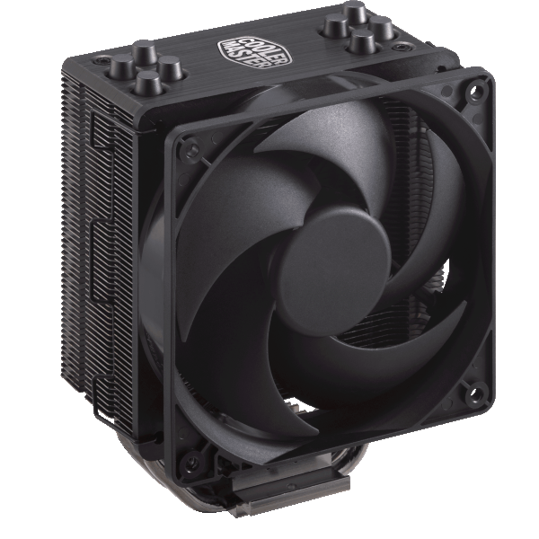

# Hardware {#hardware}

Como ya se ha comentado previamente, el **hardware** es todo lo que forma parte del ordenador, que **puede ser tocado físicamente**. Dentro de un ordenador vamos a poder diferenciar distintos componentes que cumplirán una función distinta que detallaremos más adelante.

Es posible que ya conozcamos alguno de estos componentes, pero debemos conocer el origen y cómo surge la arquitectura de los ordenadores modernos.

## Arquitectura Von Neumann {#von_neumann}

Las primeras computadoras electromecánicas eran diseñadas para un único propósito, estaban "diseñadas" para realizar una tarea. Un caso conocido puede ser [**Bombe**](https://es.wikipedia.org/wiki/Bombe), una máquina electromecánica capaz de descifrar los sistemas criptográficos nazis de Enigma. [[The Imitation Game](https://www.imdb.com/title/tt2084970/)]{.movie}

Algunas se podían "reprogramar", pero a base de recablear distintos componentes tras un estudio de lo que se quería realizar. Podía tomar hasta tres semanas preparar un programa de ENIAC y conseguir que funcionara.

El concepto de máquinas de computación universal y el uso de programa almacenado ya existía a nivel teórico desde mediados de la década de 1930 (escrito por [Alan Turing](https://es.wikipedia.org/wiki/Alan_Turing)).

El matemático y físico [John von Neumann](https://es.wikipedia.org/wiki/John_von_Neumann), junto con otros compañeros, **describe en 1945 un diseño para una arquitectura de computadoras** en el que se describren los siguientes componentes que se interrelacionan entre sí a través del bus del sistema que actúa como canal de comunicación entre ellos:

](img/si/vonneumann.jpg){width=50%}

-   **Unidad Central de Proceso** (**CPU**, por sus iniciales en inglés), que a su vez, contiene:

    -   **Unidad Aritmético Lógica** (**ALU** en inglés): Es un circuito digital que realiza operaciones aritméticas (suma, resta, multiplicaciones,...) y operaciones lógicas (AND, OR, X-OR,...) entre los valores de los argumentos (uno o dos).

    -   **Registros del procesador**: Memoria de alta velocidad y poca capacidad integrada en la CPU para almacenar datos utilizados durante la ejecución de un programa:

        -   Contador de programa

        -   Acumulador

        -   Registro de instrucciones

    -   **Unidad de control**: Su función es buscar las instrucciones en la memoria principal, decodificarlas y ejecutarlas, empleando para ello la unidad de proceso.

-   La **memoria principal**: Sistema donde se almacenan las instrucciones y los datos del programa que se está ejecutando en ese instante, dividida en celdas que se identifican por medio de una única dirección.

-   Los **sistemas de Entrada/Salida**: Realizan la transferencia de información entre periféricos de entrada y/o salida para extender las capacidades del equipo.

Hoy en día, los ordenadores han evolucionado, pero la arquitectura sigue siendo la misma, aunque más compleja.

::: exercisebox
**Podemos ver una simulación de la Arquitectura Von Neumann [aquí](https://lab.xitrus.es/VonNeumann/)**
:::

## Componentes básicos {#componentes_basicos}

Un ordenador moderno se puede distinguir de distintos componentes, los cuales cumplen una función específica. Así mismo, también pueden contar con subcomponentes integrados que son necesarios para cumplir su cometido final.

A continuación se van a detallar los componentes necesarios de un ordenador moderno.

### Placa base {#placa_base}

La placa base (conocida en inglés como *motherboard*) es una tarjeta de circuito impreso que tiene elementos electrónicos (resistencias, condensadores, reguladores ...) a la que se conectan el resto de componentes que forman el ordenador. Es por eso que se puede considerar como la parte fundamental a la hora de montar un ordenador, ya que sin ella, el resto de componentes no se podrán comunicar entre sí.

#### Formatos de placa base {#formatos_placa_base}

Las placas base deben tener un tamaño compatible con las cajas en las que van a ir montadas, y es por eso que hay distintos tamaños estandarizados. Cada uno de estos tamaños determinan dónde van a ir montados algunos de los componentes y conectores, así como los agujeros donde irán los tornillos de sujeción a la caja.

Si queremos profundizar más en los distintos formatos, la [Wikipedia](https://es.wikipedia.org/wiki/Placa_base#Formatos_de_placa_base) cuenta con una sección en la que se comparan los distintos tamaños.

#### Conectores de la placa base {#conectores_de_la_placa_base}

Como ya hemos indicado, a la placa base se conectan el resto de componentes que forman el ordenador, y es por eso que va a tener distintos conectores:

::: {#socket}
:::
-   **Zócalo del microprocesador**: También llamado ***socket***. Es donde se conecta el microprocesador sin tener que soldarlo a la placa, y de esta manera puede ser sustituido. El número de conexiones que conectan la placa base al microprocesador ha ido aumentando a medida que ha ido evolucionando la tecnología, siendo hoy día de hasta 1700 conectores.

    Dependiendo del tipo de procesador, y el modelo, el socket variará en número de contactos y el tipo de los mismos. Existen distintas maneras de interconexión:

    :::::::::::::: {.columns }
    ::: {.column width="60%"}
    -   **PGA**: De *ping grid array*, o matriz de rejilla de pines. El procesador cuenta con unos pines en formato perpendicular que se conectan al socket donde estarán unos agujeros.
    
        En la imagen se puede ver un Socket AM4 con tecnología PGA que tiene 1331 contactos.
    :::
    ::: {.column width="30%" }
    {width=100%}
    :::
    ::::::::::::::

    :::::::::::::: {.columns }
    ::: {.column width="60%"}
    - **LGA**: De *land grid array*, o matriz de contactos en rejilla. En este caso el procesador **no cuenta** con pines, sino que es una matriz de contactos chapados en oro. Esta rejilla de contactos hacen contacto con el zócalo de la placa base que es la que cuenta con unos pequeños pines flexibles.
    :::
    ::: {.column width="30%" }
    {width=100%}
    :::
    ::::::::::::::

    - **BGA**: De *ball grid array*, o matriz de rejilla de bolas. El procesador cuenta con unas bolas de estaño que al calentarse se sueldan a la placa base. Hoy en día se utiliza en componentes de tamaño reducido, como en móviles, los chips de memoria en los módulos de RAM, ...

-   **Conectores de alimentación**: La placa base tendrá distintos conectores provenientes de la fuente de alimentación con diferentes voltajes, para así proveer de alimentación a los componentes conectados a ella.

-   **Ranuras de memoria RAM**: Hoy en día es habitual contar con varias ranuras donde conectar las memoria RAM. Más adelante hablaremos en profundidad sobre la memoria RAM.

-   **Chipset**: Es un conjunto de chips, o circuitos electrónicos, que gestionan la comunicación entre los distintos componentes que forman el ordenador, y que están conectados en la placa base. Hoy en día se suelen dividir en dos partes:

    -   **Northbridge**: O puente norte. Controla el tráfico de los componentes que trabajan a más alta frecuencia. Comunica el microprocesador, la memoria RAM y la GPU (la ranura PCI express).

    -   **Southbridge**: O puente sur, comunica los periféricos, los dispositivos de almacenamiento, puertos de entrada/salida como USB, ethernet, ...

    :::infobox
    **Hoy día el northbridge está integrado en el propio procesador y en algunos casos partes del Southbridge también.**
    :::

-   **Ranuras de expansión**: Vamos a identificar estas ranuras como las más modernas **PCIexpress**. Son un bus de comunicación de datos de alta velocidad que es usado principalmente para conectar tarjetas gráficas.

    Es cierto que se pueden conectar otro tipo de tarjetas de expansión, como capturadoras de vídeo, tarjetas de red, controladoras RAID, ...

    Hoy en día existen conectores (**M.2**) donde poder conectar discos duros que tienen un tipo de conector especial.

-   **Otros conectores de entrada/salida**: En la placa base existen otros muchos conectores de entrada y salida, que cumplirán distintas funciones dependiendo del tipo de conector, función y/o protocolo de comunicación que utilicen.

    Algunos de estos conectores tendrán conector exterior (al que se podrá conectar directamente el dispositivo), mientras que otros necesitarán de un adaptador (como sucede hoy día con conectores extra USB o el conector "serie"). Algunos ejemplos son:

    -   **USB**: Donde poder conectar distintos dispositivos como teclados, ratón, pendrives, mandos de juegos, impresoras, ... El USB (**Universal Serial Bus**) es un estándar de comunicación de periféricos hoy día. En las placas actuales también hay conectores de tipo **USB-C**.

    -   Conectores de **pantalla** como **VGA**, **HDMI** o **DisplayPort**. Dependiendo de lo moderna que sea la placa base, contará con uno o varios de estos conectores.

    -   **Red**: Hoy día el conector RJ45 es el estándar, que dependiendo de la versión ethernet, nos dará al menos 1Gbit de transmisión. Dependiendo del modelo de placa base también puede tener conectores para realizar conexiones a redes inalámbricas.

    -   **Audio**: Tanto de entrada como de salida. Normalmente se hace uso de conectores de tipo **jack**, pero también puede haber conectores de salida digital.

    -   **Pila**: Las placa base cuentan con una pila para mantener la alimentación para guardar la información de la RAM-CMOS, que es una pequeña memoria que usa la BIOS durante el arranque del sistema.

    -   **Conectores para ventiladores**: Para regular la temperatura del microprocesador y del interior de la caja, la placa tiene varios conectores que se conectarán a distintos ventiladores que se regularán en intensidad.

    -   **Otros conectores**: Existen otros conectores para otros puertos que hoy en día no se usan tanto (serie, paralelo, ...) y también los conectores para encender el ordenador, realizar el reset, comprobar el funcionamiento del disco...

A continuación un diagrama simplificado de una placa base. Fuente: [Wikipedia](https://es.wikipedia.org/wiki/Placa_base).

{width="55%"}

#### Ejemplo de placa base {#ejemplo_de_placa_base}

A continuación se van a diferenciar los componentes vistos anteriormente en una placa base real, utilizada para crear un equipo de escritorio moderno:

::: center
 ](img/si/placa_base.jpg){width="100%"}
:::

1.  Zócalo (socket) del procesador.

2.  Ranuras para la memoria RAM.

3.  ATX de alimentación.

4.  Conectores de alimentación extra necesarios por la CPU.

5.  M.2 para discos duros.

6.  SATA para discos duros.

7.  Conectores exteriores (se verán a continuación)

8.  Pila.

9.  Ranuras PCIexpress de distintas velocidades.

A.  Audio

B.  Conectores frontales.

C.  USB 3.0

Los conectores exteriores de esta placa tienen el siguiente aspecto:

](img/si/placa_base_frontal.png){width="100%"}

De izquierda a derecha, y de arriba abajo:

-   Pulsador para actualizar la BIOS.

-   Conector PS2 y USB para actualizar la BIOS.

-   DisplayPort y HDMI

-   Usb 2.0 y 3.2

-   Conector LAN, USB y USB-C

-   Conectores de audio

### BIOS/UEFI {#bios_uefi}

La BIOS/UEFI es un interfaz de firmware que está incorporado en un chip en la placa base.

La función principal es la de iniciar el ordenador, realizar una comprobación del *hardware* del sistema y se encarga de arrancar el gestor de arranque.

Se ha unificado en esta sección BIOS y UEFI ya que cumplen de manera similar la misma función, pero la segunda es una evolución de la primera.

#### BIOS {#bios}

El sistema básico de entrada-salida (del inglés *Basic Input/Output System*, o BIOS) lo creó IBM para sus ordenadores "**Personal Computer**". Posteriormente se obtuvo por ingeniería inversa las funciones que realizaba tratando de buscar equipos que fueran compatibles (denominados "PC-compatible") y de esta manera convirtiéndose en un estándar de facto.

::: center
](img/si/bios.png){width="70%"}
:::

A través de este interfaz se podían configurar algunos aspectos del hardware como las interrupciones de teclado que utilizaban los sistemas operativos antiguos (como MS-DOS), direcciones, el orden del sistema de arranque, ...

#### UEFI {#uefi}

La ***Unified Extensible Firmware Interface*** (UEFI o «interfaz unificada de firmware extensible») es una especificación pública que define un interfaz entre el sistema operativo y el firmware de la plataforma.

Se puede considerar una evolución de la BIOS que tiene las siguientes características:

-   Permite arrancar desde particiones de más de 2TB gracias a eliminar las limitaciones del MBR (*master boot record*).

-   Diseño modular y extensible.

-   Retro-compatible con BIOS.

-   Interfaz gráfica más amigable con el usuario.

{width="70%"}

### Procesador {#procesador}

El procesador (o microprocesador) es la unidad central de proceso (CPU) de la [arquitectura Von Neumann](#von_neumann), y es el circuito integrado más complejo que tiene el ordenador. Se puede considerar el "cerebro".

Es el encargado de ejecutar todos los programas y operaciones que realizamos, pero sólo sabe ejecutar instrucciones en lenguaje máquina (código binario).

El microprocesador se conecta a la placa base a través del [socket](#socket), y encima de él se añade un sistema de refrigeración para disipar el calor que genera durante su funcionamiento.

#### Características {#procesador_caracteristicas}

A la hora de determinar las características principales que cuenta un procesador podemos destacar las siguientes:

-   **Frecuencia del reloj**: Es la cantidad de veces que los transistores internos del procesador pueden conmutar eléctricamente (abrir y cerrar el flujo de corriente eléctrica). Hoy en día se mide en GHz (giga hercios), donde 1GHz es mil millones de ciclos por segundo.

    Normalmente se confunde con el número de operaciones o instrucciones que puede ejecutar en un segundo, pero eso no es del todo correcto.

    Tampoco determina que cuanta mayor frecuencia el procesador vaya a ser mejor que otro con menor frecuencia (ya existían procesadores a 4GHz hace años).

-   **Bus de direcciones**: Este tamaño determinará la cantidad máxima de memoria que podemos direccionar. Con 32 bits se pueden direccionar 2³², es decir, 4GB. Mientras que con 64 bits en los procesadores modernos llegamos hasta los 16 exabytes de memoria RAM (2⁶⁴).

-   **Bus de datos**: Es el dato más grande que es capaz de manejar en una única instrucción.

-   **Memoria caché**: Es una memoria que se encuentra internamente dentro del procesador, que es mucho más rápida, pero también de mucho menor tamaño, si la comparamos con la memoria RAM. Los procesadores actuales cuentan con unos pocos MB de tamaño dependiendo del nivel de caché. Ejemplo el [Intel Core i5-12400](https://ark.intel.com/content/www/us/en/ark/products/134586/intel-core-i512400-processor-18m-cache-up-to-4-40-ghz.html) con 7.5MB de L2 caché.

-   **Voltaje**: Para que el procesador funcione necesita ser alimentado con frecuencia eléctrica. Normalmente a mayor voltaje se consigue mayor frecuencia de reloj.

-   **Número de cores**: Los microprocesadores actuales no cuentan con una única CPU interna (como era habitual hasta el año 2006 más o menos), ya que pueden contar con varias, denominadas "***cores***".

    Actualmente también se pueden diferenciar en el tipo de *core* que tiene, ya que algunos están diseñados para más eficiencia mientras que otros para mayor carga de trabajo.

-   **Multihilo/Hyperthreading**: Consiste en simular dos procesadores lógicos dentro de un único procesador físico. Permite ejecutar programas que están preparados, y eso permite una mejora en el rendimiento.

Existen otro tipo de características más técnicas, pero que también son importantes de conocer. A nivel de cómo está diseñado el procesador, lo que se denomina la **arquitectura interna** también contamos con diferencias. Hoy día podemos encontrar dos arquitecturas diferenciadas:

-   **CISC**: Del inglés *Complex Instruction Set Computer* (conjunto de instrucciones complejas), es un conjunto de instrucciones que se caracteriza por ser muy amplio y permitir operaciones complejas entre operandos situados en la memoria o en los registros internos.

    Los CISC pertenecen a la primera corriente de construcción de procesadores. Pertenecen a esta arquitectura la mayoría de los procesadores actuales de ordenadores personales: AMD, X86_64.

-   **RISC**: Del inglés *Reduced Instruction Set Computer* (computador con conjunto de instrucciones reducido) es una filosofía de diseño de CPU para computadora que está a favor de conjuntos de instrucciones pequeñas y simples que toman menor tiempo para ejecutarse.

    Hoy en día podemos encontrar esta arquitectura sobre todo en [ARM](https://es.wikipedia.org/wiki/Arquitectura_ARM) que se utiliza en procesadores de móviles como los A15 de Apple (pero también en los procesadores de escritorio M1 y M2), Qualcomm Snapdragon, ...

#### Rendimiento {#procesador_rendimiento}

Dadas todas las características que hemos visto previamente, no podemos determinar si un procesador es mejor a otro sólo mirando sus características y determinando que "cuanto más mejor". Por ejemplo:

-   **Intel Pentium 4**: 2.80GHz de frecuencia de reloj

-   **Intel Core 2 Duo E8200**: 2.66GHz de frecuencia de reloj

-   **Intel i5-11400**: Frecuencia de reloj base 2.60GHz.

-   [Comparativa entre los dos primeros](https://cpu.userbenchmark.com/Compare/Intel-Pentium-4-280GHz-vs-Intel-Core2-Duo-E8200/m3163vsm3200)

-   Comparativa entre los dos últimos: [1](https://cpu.userbenchmark.com/Compare/Intel-Core-i5-11400-vs-Intel-Core2-Duo-E8200/4112vsm3200) y [2](https://www.cpu-monkey.com/es/compare_cpu-intel_core_i5_11400-vs-intel_core2_duo_e8200).

::: errorbox
**No nos podemos quedar con la idea de que “cuanto más mejor” cuando nos referimos a cantidades en las características del procesador**
:::

Es por eso que existen las **pruebas de rendimiento**, también conocido en inglés como **benchmark**.

Estas pruebas de rendimiento se ejecutan a través de un programa que va a ejecutar un conjunto de operaciones (que siempre serán las mismas) y determinará el tiempo llevado a cabo, y junto con otras especificaciones terminará dando una puntuación al resultado obtenido.

De esta manera, si utilizamos el mismo programa de benchmark en dos procesadores distintos, obtendremos puntuaciones distintas. Por ejemplo, [Geekbench](https://www.geekbench.com/) es un programa multiplataforma muy popular hoy día:

{width="70%"}

### Sistema de refrigeración {#sistema_refrigeracion}

Debido a que el procesador genera calor durante su funcionamiento, y que esto repercute en su funcionamiento, se debe de mantener a una temperatura acorde. Es por ello que debemos hacer uso de un sistema de refrigeración.

El sistema de refrigeración cuenta con dos partes:

-   **Disipador**: Está en contacto con el procesador y por el [principio cero de la termodinámica](https://es.wikipedia.org/wiki/Principio_cero_de_la_termodin%C3%A1mica) le traspasa el calor.

-   **Sistema de reducción de temperatura**: Trata de reducir el calor que recibe el disipador para que el procesador se enfríe. Podemos diferenciar los siguientes sistemas:

    -   **Por aire**: Usando ventiladores.

    -   **De agua autocontenida y aire**: Es un circuito cerrado de agua que pasa a través de un radiador refrigerado por ventiladores. Venden el sistema cerrado, por lo que no hay que hacer nada con el líquido.

    -   **Refrigeración líquida**: Se utilizan componentes especiales para realizar el contacto con la CPU (y la GPU), y se debe hacer un circuito cerrado por el que pasará el líquido refrigerante, y una bomba que moverá el líquido.

        :::::::::::::: {.columns }
        ::: {.column width="30%"}
        {width="100%"}
        :::
        ::: {.column width="50%" }
        {width="100%"}
        :::
        ::::::::::::::

        ::: center
        [Disipador con ventilador y refrigeración líquida autocontenida.]{.footnotesize}
        :::

### Memoria RAM {#memoria_ram}

:::::::::::::: {.columns }
::: {.column width="60%"}
La memoria de acceso aleatorio (en inglés *Random Access Memory*) es una memoria a corto plazo para almacenar los programas que están siendo ejecutados.

Cuando un programa se ejecuta se cargan todas sus instrucciones en RAM, así como todos los datos que va a manipular.

Es una memoria **volátil**, esto quiere decir que cuando deja de recibir electricidad, se pierde la información, por ejemplo al apagarse el ordenador o al reiniciarlo.

Se denominan "de acceso aleatorio" porque se puede leer o escribir en cualquier posición tardando lo mismo, no siendo necesario seguir un orden para acceder.

A lo largo de la [historia](https://es.wikipedia.org/wiki/Memoria_de_acceso_aleatorio#M%C3%B3dulos_de_RAM) la memoria RAM ha tomado distintas formas:
:::
::: {.column width="35%" }
](img/si/ram_evolution.jpg){width="100%"}
:::
::::::::::::::

-   Antes de los circuitos integrados era una matriz metálica que funcionaba por electromagnetismo. [Foto](https://es.wikipedia.org/wiki/Memoria_de_acceso_aleatorio#/media/Archivo:Electronic_Memory.jpg).

-   Con la llegada de los circuitos integrados se instalaban en la placa soldandolos o sobre pequeños zócalos.

-   Para hacer el sistema modular, se pasó al formato SIPP (*Single In-line Pin Package*). En una sola tarjeta se integraban varios módulos de memoria, pero los pines eran frágiles.

-   Como evolución llegó el formato SIMM (*single In-line Memory Module*), que en lugar de pines tenía contactos en ambas caras del módulo.

-   Hoy en día hacemos uso del formato DIMM (*Dual In-line Memory Module*) y su versión reducida SO-DIMM utilizada en portátiles.

Hoy en día hacemos uso de memoria dinámica de acceso aleatorio que tiene un interfaz síncrona (SDRAM) y que tienen la capacidad de transferir simultáneamente datos por dos canales distintos en un mismo ciclo de reloj (DDR, de *double data rate*).

A continuación se pueden diferenciar cómo ha variado el formato físico.

:::::::::::::: {.columns }
::: {.column width="45%"}
](img/si/ddr.png){width="100%"}
:::
::: {.column width="30%" }
](img/si/ddr_sodimm.png){width="100%"}
:::
::::::::::::::

En la [Wikipedia](https://en.wikipedia.org/wiki/DDR_SDRAM#Generations) podemos ver una tabla con la evolución desde DDR hasta DDR5, con todos los datos técnicos como: voltaje utilizado, número de pines, ancho de banda en MB/s...

### Dispositivos de almacenamiento de datos {#dispositivos_almacenamiento}

Los dispositivo de almacenamiento de datos nos permiten leer o grabar datos de forma temporal o permanente. Existen distintos tipos de dispositivos que se pueden diferenciar por formato, tamaño, tecnología, tipo de acceso, ...

Si diferenciamos por el tipo de tecnología utilizada para realizar el almacenamiento podemos distinguir:

-   **Dispositivos magnéticos**: Se utilizan las propiedades magnéticas de materiales para realizar el almacenamiento de datos digitales sobre el soporte de datos. En este apartado podemos poner como ejemplo:

    -   [Unidades de cinta magnética](https://es.wikipedia.org/wiki/Cinta_magn%C3%A9tica_de_almacenamiento_de_datos): No sólo utilizadas para almacenar datos en informática, también se ha utilizado en formato casete para la música.
        []{#disquete}

    -   [Disquete](https://es.wikipedia.org/wiki/Disquete): O floppy disk, es un formato formado por una fina lamina circular dentro de una caja de plástico. Los tamaños más utilizados fueron de 8\", 5 ¼\" y 3½\".

    -   [Discos duros](https://es.wikipedia.org/wiki/Unidad_de_disco_duro): Luego profundizaremos sobre ellos.

-   **Dispositivos ópticos**: Es un tipo de unidad de disco que utiliza un láser para realizar la lectura y escritura de datos. Los formatos más habituales en informática han sido los CDs, DVDs y Blu-Ray.

-   **Unidad de estado sólido**: Conocidos como SSD (*solid state drive*), hacen uso de memoria flash para almacenar datos de manera persistente.

Si diferenciamos por el acceso a los datos podemos diferenciar por:

-   **Acceso secuencial**: Para realizar la lectura del dato que nos interesa debemos leer registro a registro desde el inicio hasta llegar al dato que deseamos encontrar.

-   **Acceso aleatorio**: Para realizar la lectura de un dato concreto, podemos acceder de manera directa, sin tener que pasar por el resto de datos.

Vamos a centrarnos en los denominados "discos duros" y que son más utilizados a día de hoy:

#### Discos duros HDD {#discos_duros_hdd}

Las [unidades de discos duros](https://es.wikipedia.org/wiki/Unidad_de_disco_duro) (también conocidos como HDD, de *hard disk drive*) emplean un sistema de grabación magnética para almacenar y recuperar archivos digitales.

Están compuestos por varios **platos** de aluminio que giran todos a la vez sobre el mismo eje y que son recorridos por unos **cabezales** que están montados sobre unos brazos que recorren la superficie.

Estos cabezales son los encargados de magnetizar la superficie del plato al realizar las escrituras o leyendo la superficie para determinar cuál es el estado magnético y de esta manera conocer los datos guardados.

:::::::::::::: {.columns }
::: {.column width="57%"}
{width="100%"}
:::
::: {.column width="42%" }
{width="100%"}
:::
::::::::::::::

<!-- FIXME: corregir este enlace por el size-->
::: center
[Fuente: [Wikipedia](https://es.wikipedia.org/wiki/Unidad_de_disco_duro)]{.footnotesize}
:::

A la hora de guardar la información en los platos se sigue la estructura de la imagen superior, donde:

A.  Es una pista del disco.

B.  Es un sector geométrico.

C.  Es un sector de una pista.

D.  Es un grupo de sectores.

Si tenemos en cuenta las características de un HDD, podemos destacar:

-   **Tiempo medio de acceso**: tiempo medio que tarda el cabezal en situarse en la pista y el sector deseado.

-   **Tiempo de lectura/escritura**: tiempo medio que tarda el disco en leer o escribir nueva información: Depende de la cantidad de información que se quiere leer o escribir, el tamaño de bloque, el número de cabezales, el tiempo por vuelta y la cantidad de sectores por pista.

-   **Velocidad de rotación**: Es la velocidad de giro de los platos. Por norma general a mayor velocidad de rotación, más alta será la transferencia de datos, pero también el ruido generado y el calor producido. Se mide en RPM (revoluciones por minuto). Dependiendo del tipo de disco puede variar entre 5.400RPM en equipos portátiles a 15.000RPM para servidores.

Debido a que los discos duros utilizan partes mecánicas hay que tener cuidado al transportarlos (aunque estén parados) y con el movimiento, ya que un golpe puede romper algún componente interno.

::: errorbox
**Los discos duros HDD son propensos a golpes, debido a los componentes móviles internos**
:::

#### SSD {#discos_duros_ssd}

Conocidos como *solid state drive*, hace uso de memorias [flash](https://es.wikipedia.org/wiki/Memoria_flash) para el almacenamiento de datos en lugar de platos, y debido a que no tiene componentes móviles, son menos propensos a daños por golpes.

Debido a la mejora en la tecnología de guardado de datos, y por no poseer partes móviles, no generan ruido, son más ligeros, el tiempo de acceso a los datos es menor, y todo ello hace que la transferencia de datos aumente en comparación con los HDD.

:::::::::::::: {.columns }
::: {.column width="48%"}
{width="100%"}
:::
::: {.column width="48%" }
{width="100%"}
:::
::::::::::::::

`\vspace{-12pt}`{=latex}

::: center
[Izquierda: Interior de SSD de 2,5". Derecha: SSD conector m.2]{.footnotesize}
:::

Hoy en día la manera más habitual de usar este tipo de unidades es con el factor de forma de 2,5" o en conocido como mSATA o m.2.

#### NVMe {#nvme}

La especificación de interfaz de controlador de host de memoria no volátil (NVMHCIS, en inglés *non-volatile memory host controller interface specification*) que está conectado a través del bus PCI Express (PCIe). Normalmente se llama NVMe para abreviar.

Este tipo de dispositivos, al igual que el anterior, hacen uso de tecnología FLASH para el almacenamiento de datos. Debido a que están conectados al bus PCI Express, y que la especificación de acceso se creó desde cero (para aprovechar la tecnología moderna de memorias FLASH, el paralelismo de las CPUs...), consiguen un rendimiento muy superior a las generaciones anteriores.

:::::::::::::: {.columns }
::: {.column width="47%"}
{width="100%"}
:::
::: {.column width="35%" }
{width="100%"}
:::
::::::::::::::

`\vspace{-12pt}`{=latex}

::: center
[Izquierda: NVMe en formato tarjeta PCIe. Derecha: NVMe con conector m.2]{.footnotesize}
:::

Las primeras unidades tenían un formato de tarjeta de expansión que se conectaba directamente a la ranura PCIexpress, mientras que hoy día existen los conectores M.2 para instalarlos.

#### Comparativa HDD, SSD y NVMe {#comparativa_hdd_sdd_nvme}

En la siguiente tabla se puede comparar algunas características básicas de los distintos tipos de unidades de almacenamiento vistas.

<!-- FIXME: estaría bien poner al lado de los NVMe un `\linebreak`{=latex} para el PDF -->

|                     | HDD      | SSD      | SSD (M.2)| NVMe (PCIe 3.0) | NVMe (PCIe 4.0) |
|:-------------------:|:--------:|:--------:|:--------:|:---------:|:----------:|
| Conector            | SATA     | SATA     | M.2      | M.2       | M.2        |
| Velocidad Lectura   | 150MB\/s | 560 MB\/s | 560 MB\/s | 3500 MB\/s | 7000 MB\/s  |
| Velocidad Escritura | 120MB\/s | 510 MB\/s | 520 MB\/s | 3000 MB\/s | 5300 MB\/s  |
| Precio por TB       | Bajo     | Medio    | Medio    | Alto      | Alto       |

Table: {tablename=yukitblrcol colspec=XXXXXX}

Hay que tener en cuenta que las velocidades dependen de la tecnología de la unidad y también de la conexión utilizada. Son velocidades aproximadas, y por tanto habría que ver las especificaciones técnicas de cada dispositivo antes de comprarlo.

::: infobox
Con las velocidades de lectura y escritura suelen indicar si es secuencial o aleatoria. En lecturas y escrituras aleatorias la velocidad es más baja.
:::

También existen pruebas de rendimiento para sistemas de almacenamiento, por lo que es importante informarse bien antes de elegir uno.

### Fuente de alimentación {#fuente_de_alimentacion}

La fuente de alimentación en un ordenador es el componente que convierte la corriente alterna a varias corrientes continuas ya que el ordenador hace uso de diferentes voltajes.

A la hora de elegir una fuente de alimentación debemos tener en cuenta:

-   **Potencia**: Se mide en vatios (W, de *watts*), y tendremos que tener en cuenta el consumo de los distintos componentes que tienen nuestro ordenador.

-   **Factor de forma**: En los ordenadores de sobremesa hoy en día el formato es ATX, pero podemos elegir dependiendo del tipo de conexiones:

    -   **Cableado completo**: La fuente de alimentación cuenta con todo el cableado completo.

    -   **Semi-modular**: Algunos de los cables que son necesarios se pueden poner y quitar, dependiendo de las necesidades que tengamos.

    -   **Full-modular**: Todos los cables se pueden poner y quitar, lo que facilita la instalación de la fuente de alimentación y el orden dentro de la caja durante el montaje

:::::::::::::: {.columns }
::: {.column width="30%"}
{width="100%"}
:::
::: {.column width="28%" }
{width="100%"}
:::
::: {.column width="24%" }
{width="100%"}
:::
::::::::::::::

::: center
[Fuentes de alimentación con cableado completo, semi-modular y full-modular.]{.footnotesize}
:::

### GPU/Tarjeta gráfica {#gpu_tarjeta_grafica}

Hoy en día es habitual contar con una tarjeta gráfica en los ordenadores personales, cuando el desempeño de su función va a requerir realizar grandes procesamientos de gráficos como: juegos, edición de vídeo, edición fotográfica, uso de dibujo asistido por ordenador, ...

Podemos diferenciar:

-   **Gráficos integrados**: Hoy en día los procesadores pueden contar con una unidad de procesamiento gráfico interna, que para el desempeño del uso del ordenador y tareas livianas (ver vídeos, juegos antiguos o con pocas necesidades) puede ser suficiente.

    Para confirmar si nuestro procesador tiene o no, deberíamos mirar las especificaciones técnicas del mismo (por ejemplo: [Intel i7-14700KF](https://www.intel.com/content/www/us/en/products/sku/236789/intel-core-i7-processor-14700kf-33m-cache-up-to-5-60-ghz/specifications.html) no cuenta con procesador gráfico mientras que el [i7-14700](https://www.intel.la/content/www/xl/es/products/sku/236781/intel-core-i7-processor-14700-33m-cache-up-to-5-40-ghz/specifications.html) sí).

-   **Gráficos dedicados**: Este es el caso de las denominadas tarjetas gráficas, que van conectadas a una ranura PCI-express. **Nos vamos a centrar en este tipo de tarjetas**.

Las tarjetas gráficas actualmente se instalan en la ranura PCI-Express de mayor velocidad de la placa base y suele contar con los siguientes componentes:

-   **Unidad de procesamiento gráfico**: O **GPU**, es un procesador como la CPU pero diseñado para el procesamiento gráfico. Su finalidad es la de realizar operaciones con vectores, triángulos, texturas, ... lo más rápido posible.

    Las tarjetas gráficas también sirven para realizar codificación/decodificación de vídeo por hardware, lo que disminuye el tiempo en comparación a realizar esa compresión a través de la CPU.

    Actualmente la tecnología puntera trata de simular la luz de la manera más real posible haciendo uso del denominado [raytracing](https://es.wikipedia.org/wiki/Trazado_de_rayos).

-   **VRAM**: O memoria gráfica, son los chips que almacena y transporta información hacia la tarjeta gráfica. En el caso de las tarjetas gráficas dedicadas, cuentan con sus propios chips en la tarjeta, mientras que cuando hablamos de gráficos integrados suele ser RAM que se reserva para el uso de gráficos.

-   **Conectores de salida**: Para poder realizar la conexión entre la tarjeta y los monitores que tengamos conectados. Hoy en día lo más habitual es tener conectores HDMI y DisplayPort.

Si nuestro procesador cuenta con una gráfica integrada y aparte tenemos una gráfica dedicada, dependiendo del uso que queramos darle al ordenador, quizá sea conveniente desactivar la integrada a través de la [UEFI](#UEFI).

::: infobox
Si tenemos gráfica integrada y dedicada, quizá nos interese desactivar la integrada a través de UEFI
:::

Las compañías que crean las tarjetas gráficas también han creado **SDK** (*Software Development Kits*, o kits de desarrollo de software), como [Nvidia CUDA](https://en.wikipedia.org/wiki/CUDA), para poder realizar computación paralela y así aprovechar la potencia de cálculo para proyectos de *machine learning*, simulaciones científicas, cálculo de proteínas, secuencias de ADN, ...

::: infobox
**Podemos usar el procesamiento de la tarjeta gráfica para ayudar a la ciencia usando proyectos como [Folding@Home](https://es.wikipedia.org/wiki/Folding@home) gracias a la [computación distribuida](https://es.wikipedia.org/wiki/Computaci\%C3\%B3n_distribuida)**
:::

### Conectores más importantes {#conectores_mas_importantes}

Aunque ya hemos visto de manera generalizada algunos tipos de conexiones que tiene la placa base, vamos a profundizar en este apartado separándolos por secciones.

#### Conectores gráficos {#conectores_graficos}

Al igual que el resto de componentes, los conectores para dispositivos gráficos (pantallas) han sufrido una evolución, y aunque alguno de ellos tiene muchos años, hoy día se sigue utilizando.

:::::::::::::: {.columns }
::: {.column width="15%"}
{width="100%"}
:::
::: {.column width="80%" }
El conector **VGA** es un conector analógico que sólo envía la señal gráfica al dispositivo conectado. Hoy día, aunque se puede considerar obsoleto a nivel tecnológico, sigue estando presente en servidores y en proyectores de gama baja, ya que ofrece la suficiente calidad gráfica.
:::
::::::::::::::

:::::::::::::: {.columns }
::: {.column width="15%"}
{width="100%"}
:::
::: {.column width="80%" }
El conector **DVI** era el sucesor del conector anterior, y podía ser retrocompatible con VGA, aunque la idea es que este conector permitía tener señales digitales. Había diferentes tipos de conectores, dependiendo del tipo de señal que transportaba. Para portátiles también existió una versión "mini" y otra "micro", que era más delgada.
:::
::::::::::::::

:::::::::::::: {.columns }
::: {.column width="15%"}
{width="100%"}
:::
::: {.column width="80%" }
El conector **HDMI** hoy en día es un estándar muy utilizado, sobre todo en televisiones, ya que permite enviar la señal gráfica y audio. Aunque el conector se mantiene igual, existen distintas revisiones que permiten mayor transmisión de datos (para tecnologías nuevas como HDR, audio con más canales, ...)
:::
::::::::::::::

:::::::::::::: {.columns }
::: {.column width="15%"}
{width="100%"}
:::
::: {.column width="80%" }
**DisplayPort** es un interfaz digital desarrollado por la Asociación de Estándares Electrónicos de Vídeo (VESA). Es libre de licencias, y opcionalmente permite la transmisión de audio y datos (por ejemplo USB).
:::
::::::::::::::

#### Conectores de dispositivos de almacenamiento {#conectores_dispositivos_almacenamiento}

Para dispositivos de almacenamiento, como discos duros, CD-ROMs... ha habido varios tipos de conectores que es importante conocer.

:::::::::::::: {.columns }
::: {.column width="15%"}
{width="100%"}
:::
::: {.column width="80%" }
**Parallel-ATA**, o IDE, era un conector que se utilizaba en discos duros y lectores de CD-ROM, con el que a través de un único cable podían conectarse dos dispositivos. Debido a esto, los dispositivos tenían un "*jumper*" que identificaba si era el "maestro" o "esclavo".
:::
::::::::::::::

](img/si/ide_hdd.jpeg){width="60%" framed=true}

:::::::::::::: {.columns }
::: {.column width="15%"}
{width="100%"}
:::
::: {.column width="80%" }
**Serial-ATA**, o SATA, es la evolución del conector anterior. Es un conector más pequeño pero que permite más velocidad. Ha habido distintas versiones (siendo todas retrocompatibles), siendo la última SATA 3 (subversión 3.5), que admite hasta 600MB/s.
:::
::::::::::::::

:::::::::::::: {.columns }
::: {.column width="15%"}
{width="100%"}
:::
::: {.column width="80%" }
**M.2**, es el nuevo conector que incluyen los nuevos discos duros de estado sólido **[NVMe](#nvme)**.
:::
::::::::::::::

#### USB {#usb}

El USB (*Universal Serial Bus*) es un estándar que define los cables, conectores y protocolos que más se utiliza hoy en día para conectar ordenadores y una infinidad de tipos de dispositivos.

Aunque se creó a mediados de los 90, su conector más utilizado (el tipo-A) apenas ha variado (buscando ser retrocompatible), pero sí su velocidad.

](img/si/usb.png){width="40%"}

Para la nueva especificación USB-C trajo consigo un nuevo conector que es reversible (se puede conectar en ambas direcciones), con idea de reemplazar todos los conectores anteriores. La idea es que ambos dispositivos (anfitrión y huésped) se hace uso del mismo conector y el cable que los una llegue a ser universal, teniendo en cuenta la especificación que utilice.

](img/si/usb-c.png){width="25%"}

Las [placas bases](#placa_base) tienen varios conectores USB typo-A soldados para poder realizar conexiones, pero también tiene conexiones en la placa para poder tener más USB (por ejemplo, gracias a los que vienen en la caja).

Estos conectores externos tienen un cable que se conectan a unos pines en la placa base, que dependiendo del protocolo, tendrán una forma u otra (por eso es importante ver el manual de la placa base).

{width="35%"}

#### Conexiones de red {#conexiones_red}

Para que nuestro ordenador se pueda conectar a una red, las placas base ya tienen incorporado al menos un conector para ello.

:::::::::::::: {.columns }
::: {.column width="15%"}
{width="100%"}
:::
::: {.column width="80%" }
El conector **RJ-45** es el utilizado en redes de ordenadores que contiene cuatro pares de cables de cobre para realizar la transmisión de datos a través del protocolo **ethernet**, que veremos más adelante.
:::
::::::::::::::

:::::::::::::: {.columns }
::: {.column width="15%"}
{width="100%"}
:::
::: {.column width="80%" }
El conector **SMA** se utiliza en algunos tipos de antenas WiFi desmontables que nos podemos encontrar en algunos routers, placas base, tarjetas PCI... Es un conector enroscable y fácilmente desmontable.
:::
::::::::::::::

#### Otros conectores {#otros_conectores}

:::::::::::::: {.columns }
::: {.column width="15%"}
{width="100%"}
:::
::: {.column width="80%" }
**PS2** era el conector utilizado para realizar la conexión de teclados y ratones antes de la llegada del USB. Normalmente venía con dos colores, violeta para el teclado y verde para el ratón, ya que aunque el conector era el mismo, el teclado requiere en ambos lados un colector abierto para permitir la comunicación bidireccional.
:::
::::::::::::::

:::::::::::::: {.columns }
::: {.column width="15%"}
{width="100%"}
:::
::: {.column width="80%" }
El **jack** de 3,5mm es el conector más utilizado para audio analógico desde hace muchos años en el ordenador, a pesar de que su aparición (en distinto tamaño) es del año 1878. Hoy en día las placas base tienen distintos conectores para introducir estos jacks dependiendo de si es para altavoces, micrófono, sonido envolvente...
:::
::::::::::::::

:::::::::::::: {.columns }
::: {.column width="15%"}
{width="100%"}
:::
::: {.column width="80%" }
El conector **RS232** (también conocido como "puerto serie"), es un interfaz que permite el intercambio de datos binarios entre dos equipos. Originalmente para mandar información a un terminal de datos, y posteriormente muy utilizado en switches. Aunque hoy en día las placas base no tienen el conector externo, suelen tener los pines de conexión para añadir un adaptador.
:::
::::::::::::::

Desde que los ordenadores se hicieron populares en la década de los 80 hasta ahora ha habido muchos otros tipos de conectores que han llegado a los ordenadores de consumo personal.

También ha habido otros muchos tipos de conectores que se han quedado en el ámbito más profesional ([transceiver SFP](https://es.wikipedia.org/wiki/Transceptor_SFP), conectores [SAS](https://es.wikipedia.org/wiki/Serial_Attached_SCSI) para discos duros, ...) por lo que es imposible abarcarlos a todos.

#### Conector, protocolo y cables: errores frecuentes {#conector_protocolo_cables}

Hemos visto distintos conectores que durante años su forma física no ha variado, buscando ser retrocompatible con versiones anteriores, pero que la transmisión de velocidad sí se ha ido incrementando a lo largo de los años.

Algunos ejemplos:

-   PCI

-   USB

-   SATA

-   HDMI

-   DisplayPort

Es por eso que es importante entender y comprender que la forma del conector hoy en día no nos tiene por qué indicar la velocidad de transmisión máxima que acepta el dispositivo conectado, y por eso deberemos ir a las especificaciones técnicas de la placa base o el dispositivo concreto.

Por otro lado, **con los cables sucede lo mismo**. Debemos confirmar y asegurar que los cables que utilizamos van a ser capaz de transmitir la velocidad máxima que tanto dispositivo como placa base aceptan.

::: errorbox
**Es importante conocer las especificaciones técnicas de cada componente y cable que usemos, para no realizar ningún cuello de botella.**
:::

### Caja del ordenador {#caja_ordenador}

La caja del ordenador, o chasis, es la estructura metálica donde se introducen (de manera ordenada, y anclando mediante tornillos) los distintos componentes que hemos visto hasta ahora.

 ](img/si/caja.jpg){width="75%"}

Existen distintos tipos de caja, normalmente variando el tamaño, por lo que es importante adecuar la caja a los componentes que queramos albergar dentro.

::: warnbox
**Cuidado con comprar una caja demasiado pequeña y que luego la placa base, o la anchura de la tarjeta gráfica no entre**
:::

Los servidores cuentan con unas cajas de tamaño estandarizados en altura, denominado "[Unidad de Rack](https://es.wikipedia.org/wiki/Unidad_rack)" (*rack unit* en inglés, o simplemente "U"), cuya unidad equivale a 44.45 milímetros. De esta manera los servidores contarán con una altura fijada para poder ser instalados en un [bastidor *rack*](https://es.wikipedia.org/wiki/Bastidor_de_19_pulgadas).

{width="75%"}

## Arranque de un ordenador {#arranque_ordenador}

Una vez el hardware está instalado, es momento de entender cómo funciona el sistema de arranque de nuestro ordenador hasta llegar al Sistema Operativo.

Toda la secuencia de arranque se puede dividir en distintas etapas que vamos a ver a continuación:

1.  Se acciona el botón de encendido del equipo (o arranca el equipo tras un reinicio).

2.  Se carga la BIOS/UEFI y se comienza a ejecutar.

3.  Se realiza el *Power-On Self-Test* (POST), que es una secuencia que comprueba el estado de los componentes hardware. En caso de que algún componente no parezca estar correcto, la placa base emitirá sonidos. **Si este paso falla, no continuará el proceso**.

    ::: infobox
    Es habitual que si algún componente falla, la placa base emita uno o varios tonos (si tiene un pequeño altavoz) de distinta duración
    :::

    -   Comprobación del procesador

    -   Se comprueba el estado de la RAM y la cantidad instalada

    -   Comprueba el estado de la memoria de vídeo.

    -   Inicializa los sistemas de acceso a dispositivos de almacenamiento (IDE, Serial-ATA, NVMe...).

4.  La BIOS/UEFI comprueba el número de discos duros existentes. Se comprueba la tabla de particiones del disco duro indicado como primario para el arranque.

5.  Se ejecuta el gestor de arranque de la tabla de particiones marcada como arrancable.

6.  El gestor de arranque prepara todo lo que necesita el Sistema Operativo para funcionar, lo carga y le transfiere la ejecución a él.

