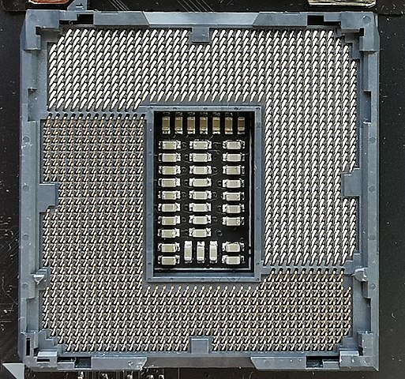

# Hardware {#hardware}

Aurreko atalean aipatu den bezala, **hardwarea** ordenagailuaren parte den guztia da, **fisikoki ukitu daitekeena**. Ordenagailu baten barruan hainbat osagai bereizi daitezke, bakoitzak funtzio desberdin bat betetzen du eta aurrerago zehaztuko ditugu.

Baliteke osagai horietako batzuk ezagutzea, baina garrantzitsua da ordenagailu modernoen arkitekturaren jatorria eta sorrera ulertzea.

## Von Neumann arkitektura {#von_neumann}

Lehen ordenagailu elektromekanikoak helburu bakarrerako diseinatzen ziren, "diseinatuta" zeuden zeregin bat egiteko. Adibide ezagun bat [**Bombe**](https://es.wikipedia.org/wiki/Bombe) izan daiteke, [Enigma](https://eu.wikipedia.org/wiki/Enigma_(kriptografia)) nazien sistema kriptografikoak deszifratzeko gai zen makina elektromekanikoa. [[The Imitation Game](https://www.imdb.com/title/tt2084970/)]{.movie}

Batzuk "berprogramatu" zitezkeen, baina horretarako osagaiak berriz konektatu behar ziren, egin nahi zenaren azterketa baten ondoren. ENIAC programatzeko eta funtzionamendua lortzeko hiru aste behar izan zitezkeen.

Konputazio unibertsaleko makinen eta programa biltegiratuaren kontzeptua jada existitzen zen maila teorikoan 1930eko hamarkadaren erdialdetik aurrera ([Alan Turing](https://es.wikipedia.org/wiki/Alan_Turing)ek idatzia).

Matematikari eta fisikari [John von Neumann](https://es.wikipedia.org/wiki/John_von_Neumann)ek, beste lankide batzuekin batera, **1945ean ordenagailu arkitektura baterako diseinua deskribatu zuen**. Bertan honako osagai hauek deskribatzen dira, guztiak elkarrekin konektatuta sistemaren *bus* baten bidez, komunikazio-kanal gisa jarduten duena:

](img/si/vonneumann.jpg){width=50%}

-   **Prozesu Unitate Zentrala** (**CPU**, ingelesezko siglak), eta honek, bere aldetik, honakoak ditu:

    -   **Unitate aritmetiko-logikoa** (**ALU**, ingelesez): Zirkuitu digital bat da, eragiketa aritmetikoak (batuketa, kenketa, biderketa,...) eta eragiketa logikoak (AND, OR, X-OR,...) egiten dituena argumentuen balioen artean.

    -   **Prozesadorearen erregistroak**: Abiadura handiko eta edukiera txikiko memoria, CPUan integratua, programaren exekuzioan erabiltzen diren datuak gordetzeko:

        -   Programa-kontagailua

        -   Akumuladorea

        -   Instrukzio-erregistroa

    -   **Kontrol-unitatea**: Bere funtzioa memoria nagusian dauden instrukzioak bilatzea da, dekodifikatzea eta exekutatzea, horretarako prozesu-unitatea erabiliz.

-   **Memoria nagusia**: Exekutatzen ari den programaren instrukzioak eta datuak gordetzen diren sistema da. Zelulatan banatuta dago, bakoitza helbide bakar batekin identifikatzen dena.

-   **Sarrera/Irteera sistemak**: Informazioa transferitzen dute sarrera eta/edo irteera periferikoen artean, ekipamenduaren gaitasunak zabaltzeko.

Gaur egun, ordenagailuak eboluzionatu egin dira, baina arkitektura bera mantentzen da, nahiz eta konplexuagoa izan.

::: exercisebox
**Von Neumann Arkitekturaren simulazio bat [hemen](https://lab.xitrus.es/VonNeumann/) ikus dezakegu**
:::

## Oinarrizko osagaiak {#oinarrizko_osagaiak}

Ordenagailu moderno bat hainbat osagaiz osatuta dago, bakoitzak funtzio zehatz bat betetzen du. Era berean, azken helburua lortzeko beharrezkoak diren azpiosagai integratuak ere izan ditzake.

Ordenagailu moderno baten beharrezko osagaiak zehaztuko ditugu.

### Txartel nagusia {#txartel_nagusia}

Txartel/Plaka nagusia (*motherboard* ingelesez ezaguna) zirkuitu inprimatuko txartela bat da, elementu elektronikoak (erresistentziak, kondentsadoreak, erregulatzaileak ...) dituena, eta bertara konektatzen dira ordenagailua osatzen duten gainerako osagaiak. Horregatik, ordenagailua muntatzeko funtsezko zatia da, plaka nagusirik gabe gainerako osagaiak ezin direlako elkarrekin komunikatu.

#### Txartel nagusiaren formatuak {#txartel_nagusia_formatuak}

Plaka nagusiek tamaina bateragarria izan behar dute muntatuko diren kutxekin, eta horregatik tamaina estandarizatu desberdinak daude. Tamaina bakoitzak zehazten du zein osagai eta konektore non muntatuko diren, baita kutxan eusteko torlojuen zuloak ere.

Formatu desberdinei buruz gehiago jakin nahi badugu, [Wikipedia](https://es.wikipedia.org/wiki/Placa_base#Formatos_de_placa_base) atalean tamaina desberdinak konparatzen dira.

#### Plaka nagusiaren konektoreak {#plaka_nagusiaren_konektoreak}

Aipatu dugun bezala, plaka nagusira konektatzen dira ordenagailua osatzen duten gainerako osagaiak, eta horregatik konektore desberdinak izango ditu:

::: {#socket}
:::
-   **Mikroprozesadorearen socket-a**: ***Socket*** izenez ere ezaguna. Mikroprozesadorea konektatzen den lekua da, soldatu gabe, eta horrela ordezkatu daiteke. Plaka nagusia eta mikroprozesadorea konektatzen dituzten konexioen kopurua teknologia aurreratu ahala handitu da. Gaur egun 1700-1800 konektore dauzka etxeko prozedoreentzat.

    Prozesadore motaren eta modeloaren arabera, socket-a kontaktu kopuruan eta motan aldatuko da. Interkonexio mota desberdinak daude:

    :::::::::::::: {.columns }
    ::: {.column width="60%"}
    -   **PGA**: *Ping Grid Array* edo pin-matrizea. Prozesadoreak pin batzuk ditu, perpendikularrean, eta socket-eko zuloetan sartzen dira.
    
        Irudian Socket AM4 ikus daiteke, PGA teknologiarekin, 1331 kontaktu dituena.
    :::
    ::: {.column width="30%" }
    {width=100%}
    :::
    ::::::::::::::

    :::::::::::::: {.columns }
    ::: {.column width="60%"}
    - **LGA**: *Land Grid Array* edo kontaktu-matrizea. Kasu honetan prozesadoreak **ez du** pinik, baizik eta urrezko kontaktu-matrizea. Kontaktuen matrize honek kontaktua egiten du plaka nagusiko socketarekin, eta socketak pin malgu txikiak ditu.
    :::
    ::: {.column width="30%" }
    {width=100%}
    :::
    ::::::::::::::

    - **BGA**: *Ball Grid Array* edo bola-matrizea. Prozesadoreak estanio bolak ditu, eta berotzean plaka nagusira soldatzen dira. Gaur egun tamaina txikiko osagaietan erabiltzen da, adibidez mugikorretan, RAM moduluetako memoria txipetan, ...

-   **Elikadura konektoreak**: Plaka nagusiak elikadura iturriaren konektore desberdinak izango ditu, **tentsio desberdinekin**, bertara konektatutako osagaiak elikatzeko.

-   **RAM memoria zirrikituak**: Gaur egun ohikoa da hainbat zirrikitu izatea RAM memoria konektatzeko. Aurrerago sakonduko dugu RAM memorian.

-   **Chipset-a**: Chip edo zirkuitu elektroniko multzoa da, ordenagailua osatzen duten osagaien arteko komunikazioa kudeatzen duena, eta plaka nagusian konektatuta daudenak. Gaur egun bi zatitan banatzen dira normalean:

    -   **Northbridge**: Edo iparraldeko zubia. Maiztasun handiagoan lan egiten duten osagaien trafikoa kontrolatzen du. Mikroprozesadorea, RAM memoria eta GPUa (PCI express zirrikitua) konektatzen ditu.

    -   **Southbridge**: Edo hegoaldeko zubia, periferikoak, biltegiratze gailuak, sarrera/irteera portuak (USB, ethernet, ...) konektatzen ditu.

    :::infobox
    **Gaur egun northbridge prozesadorean bertan integratuta dago, eta kasu batzuetan southbridge-aren zatiak ere bai.**
    :::

-   **Hedapen zirrikituak**: Hedapen zirrikitu modernoak **PCIexpress** dira. Datuen komunikaziorako abiadura handiko bus-a da, batez ere txartel grafikoak konektatzeko erabiltzen dena.

    Egia da beste hedapen-txartel batzuk ere konekta daitezkeela, hala nola bideo-harrapatzaileak, sare-txartelak, RAID kontrolatzaileak, ...

    Gaur egun konektore bereziak daude (**M.2**) disko gogorrak konektatzeko.

-   **Beste sarrera/irteera konektore batzuk**: Plaka nagusian sarrera eta irteera konektore asko daude, eta bakoitzak funtzio desberdinak izango ditu konektore motaren, funtzioaren eta/edo erabiltzen duen komunikazio-protokoloaren arabera.

    Konektore horietako batzuek kanpoko konektorea izango dute (gailua zuzenean konektatu ahal izateko), eta beste batzuek, berriz, egokigailu bat beharko dute (gaur egun USB gehigarri edo "serie" konektorearekin gertatzen den bezala). Adibide batzuk:

    -   **USB**: Gailu desberdinak konektatzeko, hala nola teklatuak, sagua, pendriveak, joko-aginteak, inprimagailuak, ... USB (***Universal Serial Bus***) gaur egun periferikoen komunikazio estandarra da. Plaka nagusietan ere badaude **USB-C** motako konektoreak.

    -   **Pantaila konektoreak**: **VGA**, **HDMI** edo **DisplayPort** bezalakoak. Plaka nagusia modernoagoa den heinean, konektore horietako bat edo gehiago izango ditu.

    -   **Sarea**: Gaur egun RJ45 konektorea da estandarra, eta ethernet bertsioaren arabera, gutxienez 1Gbit transmisioa emango digu. Plaka nagusiaren modeloaren arabera, haririk gabeko sareetarako konektoreak ere izan ditzake.

    -   **Audioa**: Bai sarrerakoa bai irteerakoa. Normalean **jack** motako konektoreak erabiltzen dira, baina irteera digitaleko konektoreak ere egon daitezke.

    -   **Pila**: Plaka nagusiek pila bat dute RAM-CMOS informazioa gordetzeko elikadura mantentzeko, hau da, BIOSek sistema abiaraztean erabiltzen duen memoria txiki bat.

    -   **Haizagailu konektoreak**: Mikroprozesadorearen eta kutxaren barruko tenperatura erregulatzeko, plakan hainbat konektore daude, eta horietara konektatzen dira intentsitatea erregulatuko duten airea-laster bat sortzeko.

    -   **Beste konektore batzuk**: Gaur egun gutxiago erabiltzen diren beste portu batzuetarako konektoreak (serie, paralelo, ...) eta baita ordenagailua pizteko, reset egiteko, diskoaren funtzionamendua egiaztatzeko konektoreak ere.

Ondoren, plaka nagusi baten diagrama sinplifikatu bat. Iturria: [Wikipedia](https://es.wikipedia.org/wiki/Placa_base).

{width="85%"}

#### Plaka nagusiaren adibidea {#plaka_nagusiaren_adibidea}

Jarraian, aurretik ikusitako osagaiak bereiziko dira benetako plaka nagusi batean, mahaigaineko ordenagailu moderno bat sortzeko erabilia:

::: center
 ](img/si/placa_base.jpg){width="100%"}
:::

1.  Prozesadorearen socket-a.

2.  RAM memoria zirrikituak.

3.  ATX elikadura konektorea.

4.  CPUk behar dituen elikadura gehigarrien konektoreak.

5.  M.2 disko gogorrentzat.

6.  SATA disko gogorrentzat.

7.  Kanpoko konektoreak (jarraian ikusiko dira)

8.  Pila.

9.  PCIexpress zirrikituak, abiadura desberdinetan.

A.  Audioa

B.  Aurreko konektoreak.

C.  USB 3.0

Plaka honen kanpoko konektoreek honako itxura dute:

](img/si/placa_base_frontal.png){width="100%"}

Ezkerretik eskuinera, eta goitik behera:

-   BIOS eguneratzeko botoia.

-   BIOS eguneratzeko PS2 eta USB konektorea.

-   DisplayPort eta HDMI

-   USB 2.0 eta 3.2

-   LAN konektorea, USB eta USB-C

-   Audio konektoreak

### BIOS/UEFI {#bios_uefi}

BIOS/UEFI firmware interfaze bat da, plaka nagusiko txip batean integratua.

Bere funtzio nagusia ordenagailua abiaraztea da, sistemaren *hardware*-a egiaztatzea eta abiarazle-kudeatzailea martxan jartzea.

Atal honetan BIOS eta UEFI bateratu dira, funtzio bera betetzen dutelako, nahiz eta bigarrena lehenaren eboluzioa izan.

