# Hardware {#hardware}

Aurreko atalean aipatu den bezala, **hardwarea** ordenagailuaren parte den guztia da, **fisikoki ukitu daitekeena**. Ordenagailu baten barruan hainbat osagai bereizi daitezke, bakoitzak funtzio desberdin bat betetzen du eta aurrerago zehaztuko ditugu.

Baliteke osagai horietako batzuk ezagutzea, baina garrantzitsua da ordenagailu modernoen arkitekturaren jatorria eta sorrera ulertzea.

## Von Neumann arkitektura {#von_neumann}

Lehen ordenagailu elektromekanikoak helburu bakarrerako diseinatzen ziren, "diseinatuta" zeuden zeregin bat egiteko. Adibide ezagun bat [**Bombe**](https://es.wikipedia.org/wiki/Bombe) izan daiteke, [Enigma](https://eu.wikipedia.org/wiki/Enigma_(kriptografia)) nazien sistema kriptografikoak deszifratzeko gai zen makina elektromekanikoa. [[The Imitation Game](https://www.imdb.com/title/tt2084970/)]{.movie}

Batzuk "berprogramatu" zitezkeen, baina horretarako osagaiak berriz konektatu behar ziren, egin nahi zenaren azterketa baten ondoren. ENIAC programatzeko eta funtzionamendua lortzeko hiru aste behar izan zitezkeen.

Konputazio unibertsaleko makinen eta programa biltegiratuaren kontzeptua jada existitzen zen maila teorikoan 1930eko hamarkadaren erdialdetik aurrera ([Alan Turing](https://es.wikipedia.org/wiki/Alan_Turing)ek idatzia).

Matematikari eta fisikari [John von Neumann](https://es.wikipedia.org/wiki/John_von_Neumann)ek, beste lankide batzuekin batera, **1945ean ordenagailu arkitektura baterako diseinua deskribatu zuen**. Bertan honako osagai hauek deskribatzen dira, guztiak elkarrekin konektatuta sistemaren *bus* baten bidez, komunikazio-kanal gisa jarduten duena:

](img/si/vonneumann.jpg){width=50%}

-   **Prozesu Unitate Zentrala** (**CPU**, ingelesezko siglak), eta honek, bere aldetik, honakoak ditu:

    -   **Unitate aritmetiko-logikoa** (**ALU**, ingelesez): Zirkuitu digital bat da, eragiketa aritmetikoak (batuketa, kenketa, biderketa,...) eta eragiketa logikoak (AND, OR, X-OR,...) egiten dituena argumentuen balioen artean.

    -   **Prozesadorearen erregistroak**: Abiadura handiko eta edukiera txikiko memoria, CPUan integratua, programaren exekuzioan erabiltzen diren datuak gordetzeko:

        -   Programa-kontagailua

        -   Akumuladorea

        -   Instrukzio-erregistroa

    -   **Kontrol-unitatea**: Bere funtzioa memoria nagusian dauden instrukzioak bilatzea da, dekodifikatzea eta exekutatzea, horretarako prozesu-unitatea erabiliz.

-   **Memoria nagusia**: Exekutatzen ari den programaren instrukzioak eta datuak gordetzen diren sistema da. Zelulatan banatuta dago, bakoitza helbide bakar batekin identifikatzen dena.

-   **Sarrera/Irteera sistemak**: Informazioa transferitzen dute sarrera eta/edo irteera periferikoen artean, ekipamenduaren gaitasunak zabaltzeko.

Gaur egun, ordenagailuak eboluzionatu egin dira, baina arkitektura bera mantentzen da, nahiz eta konplexuagoa izan.

::: exercisebox
**Von Neumann Arkitekturaren simulazio bat [hemen](https://lab.xitrus.es/VonNeumann/) ikus dezakegu**
:::

## Oinarrizko osagaiak {#oinarrizko_osagaiak}

Ordenagailu moderno bat hainbat osagaiz osatuta dago, bakoitzak funtzio zehatz bat betetzen du. Era berean, azken helburua lortzeko beharrezkoak diren azpiosagai integratuak ere izan ditzake.

Ordenagailu moderno baten beharrezko osagaiak zehaztuko ditugu.

### Txartel nagusia {#txartel_nagusia}

Txartel/Plaka nagusia (*motherboard* ingelesez ezaguna) zirkuitu inprimatuko txartela bat da, elementu elektronikoak (erresistentziak, kondentsadoreak, erregulatzaileak ...) dituena, eta bertara konektatzen dira ordenagailua osatzen duten gainerako osagaiak. Horregatik, ordenagailua muntatzeko funtsezko zatia da, plaka nagusirik gabe gainerako osagaiak ezin direlako elkarrekin komunikatu.

#### Txartel nagusiaren formatuak {#txartel_nagusia_formatuak}

Plaka nagusiek tamaina bateragarria izan behar dute muntatuko diren kutxekin, eta horregatik tamaina estandarizatu desberdinak daude. Tamaina bakoitzak zehazten du zein osagai eta konektore non muntatuko diren, baita kutxan eusteko torlojuen zuloak ere.

Formatu desberdinei buruz gehiago jakin nahi badugu, [Wikipedia](https://es.wikipedia.org/wiki/Placa_base#Formatos_de_placa_base) atalean tamaina desberdinak konparatzen dira.

#### Plaka nagusiaren konektoreak {#plaka_nagusiaren_konektoreak}

Aipatu dugun bezala, plaka nagusira konektatzen dira ordenagailua osatzen duten gainerako osagaiak, eta horregatik konektore desberdinak izango ditu:

::: {#socket}
:::
-   **Mikroprozesadorearen socket-a**: ***Socket*** izenez ere ezaguna. Mikroprozesadorea konektatzen den lekua da, soldatu gabe, eta horrela ordezkatu daiteke. Plaka nagusia eta mikroprozesadorea konektatzen dituzten konexioen kopurua teknologia aurreratu ahala handitu da. Gaur egun 1700-1800 konektore dauzka etxeko prozedoreentzat.

    Prozesadore motaren eta modeloaren arabera, socket-a kontaktu kopuruan eta motan aldatuko da. Interkonexio mota desberdinak daude:

    :::::::::::::: {.columns }
    ::: {.column width="60%"}
    -   **PGA**: *Ping Grid Array* edo pin-matrizea. Prozesadoreak pin batzuk ditu, perpendikularrean, eta socket-eko zuloetan sartzen dira.
    
        Irudian Socket AM4 ikus daiteke, PGA teknologiarekin, 1331 kontaktu dituena.
    :::
    ::: {.column width="30%" }
    {width=100%}
    :::
    ::::::::::::::

    :::::::::::::: {.columns }
    ::: {.column width="60%"}
    - **LGA**: *Land Grid Array* edo kontaktu-matrizea. Kasu honetan prozesadoreak **ez du** pinik, baizik eta urrezko kontaktu-matrizea. Kontaktuen matrize honek kontaktua egiten du plaka nagusiko socketarekin, eta socketak pin malgu txikiak ditu.
    :::
    ::: {.column width="30%" }
    {width=100%}
    :::
    ::::::::::::::

    - **BGA**: *Ball Grid Array* edo bola-matrizea. Prozesadoreak estanio bolak ditu, eta berotzean plaka nagusira soldatzen dira. Gaur egun tamaina txikiko osagaietan erabiltzen da, adibidez mugikorretan, RAM moduluetako memoria txipetan, ...

-   **Elikadura konektoreak**: Plaka nagusiak elikadura iturriaren konektore desberdinak izango ditu, **tentsio desberdinekin**, bertara konektatutako osagaiak elikatzeko.

-   **RAM memoria zirrikituak**: Gaur egun ohikoa da hainbat zirrikitu izatea RAM memoria konektatzeko. Aurrerago sakonduko dugu RAM memorian.

-   **Chipset-a**: Chip edo zirkuitu elektroniko multzoa da, ordenagailua osatzen duten osagaien arteko komunikazioa kudeatzen duena, eta plaka nagusian konektatuta daudenak. Gaur egun bi zatitan banatzen dira normalean:

    -   **Northbridge**: Edo iparraldeko zubia. Maiztasun handiagoan lan egiten duten osagaien trafikoa kontrolatzen du. Mikroprozesadorea, RAM memoria eta GPUa (PCI express zirrikitua) konektatzen ditu.

    -   **Southbridge**: Edo hegoaldeko zubia, periferikoak, biltegiratze gailuak, sarrera/irteera portuak (USB, ethernet, ...) konektatzen ditu.

    ::: warnbox
    **Gaur egun northbridge prozesadorean bertan integratuta dago, eta kasu batzuetan southbridge-aren zatiak ere bai.**
    :::

-   **Hedapen zirrikituak**: Hedapen zirrikitu modernoak **PCIexpress** dira. Datuen komunikaziorako abiadura handiko bus-a da, batez ere txartel grafikoak konektatzeko erabiltzen dena.

    Egia da beste hedapen-txartel batzuk ere konekta daitezkeela, hala nola bideo-harrapatzaileak, sare-txartelak, RAID kontrolatzaileak, ...

    Gaur egun konektore bereziak daude (**M.2**) disko gogorrak konektatzeko.

-   **Beste sarrera/irteera konektore batzuk**: Plaka nagusian sarrera eta irteera konektore asko daude, eta bakoitzak funtzio desberdinak izango ditu konektore motaren, funtzioaren eta/edo erabiltzen duen komunikazio-protokoloaren arabera.

    Konektore horietako batzuek kanpoko konektorea izango dute (gailua zuzenean konektatu ahal izateko), eta beste batzuek, berriz, egokigailu bat beharko dute (gaur egun USB gehigarri edo "serie" konektorearekin gertatzen den bezala). Adibide batzuk:

    -   **USB**: Gailu desberdinak konektatzeko, hala nola teklatuak, sagua, pendriveak, joko-aginteak, inprimagailuak, ... USB (***Universal Serial Bus***) gaur egun periferikoen komunikazio estandarra da. Plaka nagusietan ere badaude **USB-C** motako konektoreak.

    -   **Pantaila konektoreak**: **VGA**, **HDMI** edo **DisplayPort** bezalakoak. Plaka nagusia modernoagoa den heinean, konektore horietako bat edo gehiago izango ditu.

    -   **Sarea**: Gaur egun RJ45 konektorea da estandarra, eta ethernet bertsioaren arabera, gutxienez 1Gbit transmisioa emango digu. Plaka nagusiaren modeloaren arabera, haririk gabeko sareetarako konektoreak ere izan ditzake.

    -   **Audioa**: Bai sarrerakoa bai irteerakoa. Normalean **jack** motako konektoreak erabiltzen dira, baina irteera digitaleko konektoreak ere egon daitezke.

    -   **Pila**: Plaka nagusiek pila bat dute RAM-CMOS informazioa gordetzeko elikadura mantentzeko, hau da, BIOSek sistema abiaraztean erabiltzen duen memoria txiki bat.

    -   **Haizagailu konektoreak**: Mikroprozesadorearen eta kutxaren barruko tenperatura erregulatzeko, plakan hainbat konektore daude, eta horietara konektatzen dira intentsitatea erregulatuko duten airea-laster bat sortzeko.

    -   **Beste konektore batzuk**: Gaur egun gutxiago erabiltzen diren beste portu batzuetarako konektoreak (serie, paralelo, ...) eta baita ordenagailua pizteko, reset egiteko, diskoaren funtzionamendua egiaztatzeko konektoreak ere.

Ondoren, plaka nagusi baten diagrama sinplifikatu bat. Iturria: [Wikipedia](https://es.wikipedia.org/wiki/Placa_base).

{width="85%"}

#### Plaka nagusiaren adibidea {#plaka_nagusiaren_adibidea}

Jarraian, aurretik ikusitako osagaiak bereiziko dira benetako plaka nagusi batean, mahaigaineko ordenagailu moderno bat sortzeko erabilia:

::: center
 ](img/si/placa_base.jpg){width="100%"}
:::

1.  Prozesadorearen socket-a.

2.  RAM memoria zirrikituak.

3.  ATX elikadura konektorea.

4.  CPUk behar dituen elikadura gehigarrien konektoreak.

5.  M.2 disko gogorrentzat.

6.  SATA disko gogorrentzat.

7.  Kanpoko konektoreak (jarraian ikusiko dira)

8.  Pila.

9.  PCIexpress zirrikituak, abiadura desberdinetan.

A.  Audioa

B.  Aurreko konektoreak.

C.  USB 3.0

Plaka honen kanpoko konektoreek honako itxura dute:

](img/si/placa_base_frontal.png){width="100%"}

Ezkerretik eskuinera, eta goitik behera:

-   BIOS eguneratzeko botoia.

-   BIOS eguneratzeko PS2 eta USB konektorea.

-   DisplayPort eta HDMI

-   USB 2.0 eta 3.2

-   LAN konektorea, USB eta USB-C

-   Audio konektoreak

### BIOS/UEFI {#bios_uefi}

BIOS/UEFI firmware interfaze bat da, plaka nagusiko txip batean integratua.

Bere funtzio nagusia ordenagailua abiaraztea da, sistemaren *hardware*-a egiaztatzea eta abiarazle-kudeatzailea martxan jartzea.

Atal honetan BIOS eta UEFI bateratu dira, funtzio bera betetzen dutelako, nahiz eta bigarrena lehenaren eboluzioa izan.

#### BIOS {#bios}

Sarrera-irteera sistema basikoa (*Basic Input/Output System*, edo BIOS, ingelesez) IBMk sortu zuen bere "**Personal Computer**" ordenagailuetarako. Ondoren, alderantzizko ingeniaritza erabiliz, egiten zituen funtzioak lortu ziren, ekipo bateragarriak bilatuz (PC-compatible deiturikoak), eta horrela *de facto* estandar bihurtu zen.

::: center
](img/si/bios.png){width="70%"}
:::

Interfaze honen bidez hardwarearen hainbat alderdi konfigura zitezkeen, hala nola sistema eragile zaharrek (MS-DOS bezalakoek) erabiltzen zituzten teklatuaren etenak, helbideak, sistema abiarazteko ordena, ...

#### UEFI {#uefi}

***Unified Extensible Firmware Interface*** (UEFI edo «firmware interfaz unifikatu eta hedagarria») sistema eragilearen eta plataformaren firmwarearen arteko interfaz publikoa definitzen duen zehaztapena da.

BIOSaren bilakaera gisa har daiteke, eta honako ezaugarri hauek ditu:

-   2TB baino handiagoak diren partizioetatik abiarazteko aukera ematen du, MBR (*master boot record*) mugak ezabatuz.
-   Diseinu modularra eta hedagarria.
-   BIOSarekin atzerako bateragarritasuna.
-   Erabiltzailearentzat interfaz grafiko atseginagoa.

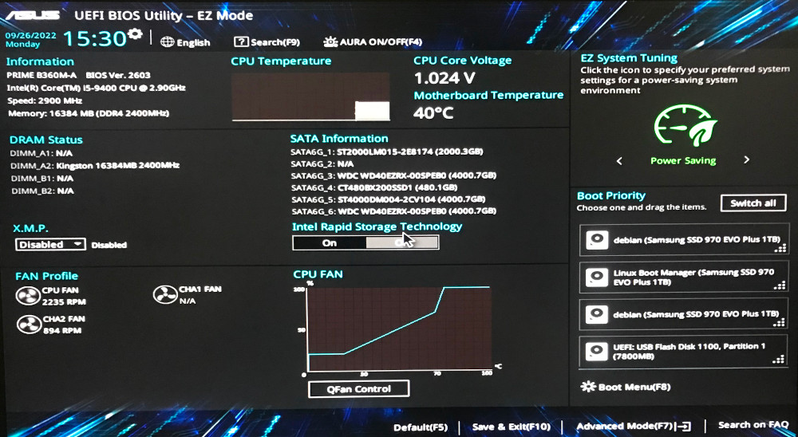{width="70%"}

### Prozesadorea {#prozesadorea}

Prozesadorea (edo mikroprozesadorea) [Von Neumann arkitekturako](#von_neumann) prozesu unitate zentrala (CPU) da, eta ordenagailuak dituen zirkuitu integratu konplexuena da. "Garuna" bezala har daiteke.

Egiten ditugun programa eta eragiketa guztiak exekutatzeaz arduratzen da, baina soilik makina-hizkuntzako (kode bitarra) instrukzioak exekutatzeko gai da.

Mikroprozesadorea plaka nagusira konektatzen da [socket](#socket) bidez, eta gainetik hozte-sistema bat jartzen zaio, funtzionamenduan sortzen duen beroa xahutzeko.

#### Ezaugarriak {#prozesadore_ezaugarriak}

Prozesadore baten ezaugarri nagusiak zehazterakoan, honako hauek nabarmendu ditzakegu:

-   **Erlojuaren maiztasuna**: Prozesadorearen barruko transistoreek elektrizitate-fluxua ireki eta ixteko (konmutatzeko) gai diren aldien kopurua da. Gaur egun GHz-etan (giga hertz) neurtzen da, non 1GHz = 1.000 milioi ziklo segundoko.

    Normalean, maiztasuna nahasten da segundo bakoitzean exekutatu daitezkeen eragiketa edo instrukzioen kopuruarekin, baina hori ez da guztiz zuzena.

    Era berean, maiztasun handiagoa izateak ez du esan nahi prozesadorea beste bat baino hobea izango denik (duela urte batzuk 4GHz-ko prozesadoreak bazeuden).

-   **Helbide-busa**: Honek zehazten du zuzenean zenbat memoria helbidera dezakegun. 32 bitekin 2³², hau da, 4GB helbidera daitezke. 64 bitekin, prozesadore modernoetan, 16 exabyte RAM-era irits gaitezke (2⁶⁴).

-   **Datu-busa**: Instrukzio bakar batean kudeatu dezakeen datu handiena da.

-   **Cache memoria**: Prozesadorearen barruan dagoen memoria da, askoz azkarragoa baina askoz txikiagoa RAMarekin alderatuta. Gaur egungo prozesadoreek cache mailaren arabera MB gutxi batzuk dituzte. Adibidez, [Intel Core i5-12400](https://ark.intel.com/content/www/us/en/ark/products/134586/intel-core-i512400-processor-18m-cache-up-to-4-40-ghz.html) modeloak 7,5MB L2 cache dauka.

-   **Tentsioa**: Prozesadoreak funtzionatzeko elikadura elektrikoa behar du. Normalean, tentsio handiagoarekin erlojuaren maiztasun handiagoa lor daiteke.

-   **Core kopurua**: Gaur egungo mikroprozesadoreek ez dute CPU bakarra barruan (2006ra arte ohikoa zen bezala), baizik eta hainbat izan ditzakete, "***core***" izenekoak.

    Gaur egun, core motaren arabera ere bereiz daitezke, batzuk eraginkortasun handiagoa lortzeko diseinatuta baitaude eta beste batzuk lan-karga handiagoa jasateko.

-   **Multiharia/Hyperthreading**: Prozesadore fisiko bakar batean bi prozesadore logiko simulatzea da. Horri esker, prestatuta dauden programak exekutatu daitezke eta errendimendua hobetu.

Beste ezaugarri tekniko batzuk ere badaude, eta horiek ere garrantzitsuak dira. Prozesadorea nola diseinatuta dagoen, hau da, **barne-arkitektura** deritzona, ere desberdina izan daiteke. Gaur egun bi arkitektura nagusi aurki ditzakegu:

-   **CISC**: *Complex Instruction Set Computer* (instrukzio multzo konplexua duen ordenagailua), instrukzio multzo zabala du eta memoria edo erregistroetako operandoen arteko eragiketa konplexuak egiteko aukera ematen du.

    CISC arkitektura lehen prozesadore-lerroari dagokio. Arkitektura honetan oinarritzen dira gaur egungo ordenagailu pertsonalen prozesadore gehienak: AMD, X86_64.

-   **RISC**: *Reduced Instruction Set Computer* (instrukzio multzo murriztua duen ordenagailua), CPU diseinuaren filosofia bat da, instrukzio multzo txiki eta sinpleak erabiltzea lehenesten duena, exekutatzeko denbora gutxiago behar dutelako.

    Gaur egun, arkitektura hau batez ere [ARM](https://es.wikipedia.org/wiki/Arquitectura_ARM) prozesadoreetan aurki daiteke, mugikorretan erabiltzen direnak (Apple A15, baita mahaigaineko Apple Sillicon prozesadoreetan ere), Qualcomm Snapdragon, ...

#### Errendimendua {#prozesadore_errendimendua}

Aurreko ezaugarri guztiak ikusita, ezin dugu prozesadore bat bestea baino hobea den ala ez zehaztu soilik bere ezaugarriei begiratuta eta "zenbat eta gehiago, orduan eta hobe" pentsatuta. Adibidez:

-   **Intel Pentium 4**: 2,80GHz erloju-maiztasuna

-   **Intel Core 2 Duo E8200**: 2,66GHz erloju-maiztasuna

-   **Intel i5-11400**: Oinarrizko erloju-maiztasuna 2,60GHz

-   [Lehen bien arteko konparaketa](https://cpu.userbenchmark.com/Compare/Intel-Pentium-4-280GHz-vs-Intel-Core2-Duo-E8200/m3163vsm3200)

-   Azken bien arteko konparaketa: [1](https://cpu.userbenchmark.com/Compare/Intel-Core-i5-11400-vs-Intel-Core2-Duo-E8200/4112vsm3200) eta [2](https://www.cpu-monkey.com/es/compare_cpu-intel_core_i5_11400-vs-intel_core2_duo_e8200).

::: errorbox
**"Zenbat eta gehiago, orduan eta hobe" ideiarekin ez da beti eia prozesadorearen ezaugarriei dagokienez**
:::

Horregatik daude **errendimendu-probak**, ingelesez ***benchmark*** izenez ezagunak.

Errendimendu-proba hauek programa baten bidez exekutatzen dira, beti eragiketa berdinak egingo dituena, eta behar duen denbora neurtuko du, beste zehaztapen batzuekin batera lortutako emaitzari puntuazio bat emanez.

Horrela, benchmark programa bera bi prozesadore desberdinetan erabiltzen badugu, puntuazio desberdinak lortuko ditugu. Adibidez, [Geekbench](https://www.geekbench.com/) gaur egun oso ezaguna da plataforma anitzetan:

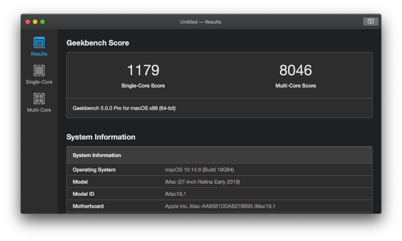{width="70%"}

### Hozte-sistema {#hozte_sistema}

Prozesadoreak beroa sortzen du funtzionamenduan, eta horrek bere funtzionamenduan eragiten duenez, tenperatura egokian mantendu behar da. Horregatik, hozte-sistema bat erabili behar da.

Hozte-sistemak bi atal ditu:

-   **Disipagailua**: Prozesadorearekin kontaktuan dago eta [termodinamikaren zero printzipioaren](https://es.wikipedia.org/wiki/Principio_cero_de_la_termodin%C3%A1mica) arabera beroa transferitzen dio.

-   **Tenperatura-jaitsiera sistema**: Disipagailuak jasotzen duen beroa murrizten saiatzen da, prozesadorea hoztu dadin. Honako sistemak bereiz ditzakegu:

    -   **Airezkoa**: Haizagailuak erabiliz.

    -   **Ur-autokontainatua eta airezkoa**: Itxita dagoen ur-zirkuitu bat da, erradiadore batetik igarotzen dena eta haizagailuek hozten dutena. Sistema itxia saltzen dute, beraz ez da ezer egin behar likidoarekin.

    -   **Hoztze likidoa**: Osagai bereziak erabiltzen dira CPUarekin (eta GPUarekin) kontaktua egiteko, eta zirkuitu itxi bat egin behar da, likido hozgarri bat eta ponpa batekin.

        :::::::::::::: {.columns }
        ::: {.column width="30%"}
        {width="100%"}
        :::
        ::: {.column width="50%" }
        {width="100%"}
        :::
        ::::::::::::::

        ::: center
        [Disipagailua haizagailuarekin eta ur-autokontainatutako hozte-sistemarekin.]{.footnotesize}
        :::

### RAM memoria {#memoria_ram}

:::::::::::::: {.columns }
::: {.column width="60%"}
Ausazko sarbideko memoria (*Random Access Memory*, RAM) epe laburreko memoria da, exekutatzen ari diren programak gordetzeko.

Programa bat exekutatzen denean, bere instrukzio guztiak RAM-era kargatzen dira, baita manipulatuko dituen datu guztiak ere.

Memoria **lastergarria** (volátil) da, hau da, elektrizitatea jasotzeari uzten dionean informazioa galtzen da, adibidez ordenagailua itzaltzean edo berrabiaraztean.

"Ausazko sarbideko" deitzen zaie, edozein posiziotan irakurri edo idatzi daitekeelako denbora berdinean, ez da beharrezkoa ordena jakin bat jarraitzea.

[Historiaren](https://es.wikipedia.org/wiki/Memoria_de_acceso_aleatorio#M%C3%B3dulos_de_RAM) zehar, RAM memoriak hainbat forma hartu ditu:
:::
::: {.column width="35%" }
](img/si/ram_evolution.jpg){width="100%"}
:::
::::::::::::::

-   Zirkuitu integratuak baino lehen, matrize metaliko bat zen, elektromagnetismoz funtzionatzen zuena. [Argazkia](https://es.wikipedia.org/wiki/Memoria_de_acceso_aleatorio#/media/Archivo:Electronic_Memory.jpg).

-   Zirkuitu integratuak iritsi zirenean, plakan soldatzen ziren edo oinarri txikietan jartzen ziren.

-   Sistema modularra egiteko, SIPP (*Single In-line Pin Package*) formatura pasa zen. Txartel bakarrean memoria-modulu batzuk integratzen ziren, baina pinak hauskor ziren.

-   Eboluzio gisa, SIMM (*single In-line Memory Module*) formatua iritsi zen, pinak izan beharrean, moduluko bi aldeetan kontaktuak zituen.

-   Gaur egun DIMM (*Dual In-line Memory Module*) formatua erabiltzen dugu eta bere bertsio txikitua SO-DIMM ordenagailu eramangarrietarako.

Gaur egun, ausazko sarbideko memoria dinamikoa erabiltzen dugu, interfaze sinkronoa duena (SDRAM), eta datuak bi kanal desberdinetatik transferitzeko gai dena ziklo bakar batean (DDR, *double data rate*).

Ondoren, formatu fisikoak nola aldatu diren ikus daiteke.

:::::::::::::: {.columns }
::: {.column width="45%"}
](img/si/ddr.png){width="100%"}
:::
::: {.column width="30%" }
](img/si/ddr_sodimm.png){width="100%"}
:::
::::::::::::::

[Wikipedia](https://en.wikipedia.org/wiki/DDR_SDRAM#Generations)n DDR-tik DDR5-era arteko eboluzioa ikus daiteke, datu tekniko guztiekin: erabilitako tentsioa, pin kopurua, banda-zabalera MB/s-etan...

### Datuen biltegiratze-gailuak {#biltegiratze_gailuak}

Datuen biltegiratze-gailuek datuak aldi baterako edo betiko irakurri edo grabatzeko aukera ematen digute. Formatu, tamaina, teknologia, sarbide mota, ... arabera bereiz daitezke.

Biltegiratze-teknologiaren arabera, honako hauek bereiz ditzakegu:

-   **Gailu magnetikoak**: Materialen propietate magnetikoak erabiltzen dira datu digitalak euskarrian grabatzeko. Adibideak:

    -   [Zinta magnetikoko unitateak](https://es.wikipedia.org/wiki/Cinta_magn%C3%A9tica_de_almacenamiento_de_datos): Informatikan ez ezik, musika kaseteetan ere erabili izan dira.
        []{#disquete}

    -   [Disketea](https://es.wikipedia.org/wiki/Disquete): Floppy disk izenez ere ezaguna, plastikozko kutxa batean disko mehe bat du. Gehien erabilitako tamainak 8", 5 ¼" eta 3½" izan ziren.

    -   [Disko gogorrak](https://es.wikipedia.org/wiki/Unidad_de_disco_duro): Geroago sakonduko dugu horietan.

-   **Gailu optikoak**: Laser baten bidez datuak irakurtzeko eta idazteko erabiltzen den disko mota bat da. Informatikan ohikoenak CD, DVD eta Blu-Ray izan dira.

-   **Egoera solidoko unitatea**: SSD (*solid state drive*) izenez ezagunak, memoria flash erabiltzen dute datuak modu iraunkorrean gordetzeko.

Datuen sarbidearen arabera, honako hauek bereiz daitezke:

-   **Sarbide jarraia**: Datu jakin bat irakurtzeko, hasieratik erregistroz erregistro irakurri behar da nahi dugun datura iritsi arte.

-   **Sarbide ausazkoa** (aleatorio): Datu jakin bat irakurtzeko, zuzenean sar daiteke, gainerako datuetatik pasatu gabe.

"Disko gogor" izenekoetan zentratuko gara, gaur egun gehien erabiltzen direnak:

#### HDD disko gogorrak {#disko_gogorrak_hdd}

[Disko gogorren unitateek](https://es.wikipedia.org/wiki/Unidad_de_disco_duro) (HDD, *hard disk drive*) grabazio magnetikoko sistema erabiltzen dute fitxategi digitalak gordetzeko eta berreskuratzeko.

**Plater** batzuk dituzte, guztiak ardatz berean biratzen diren aluminiozkoak, eta **buru** batzuek gainazala zeharkatzen dute beso batzuen gainean.

Buru horiek arduratzen dira plateraren gainazala magnetizatzeaz idazketan, edo gainazala irakurtzeaz egoera magnetikoa zein den jakiteko eta horrela gordetako datuak ezagutzeko.

:::::::::::::: {.columns }
::: {.column width="57%"}
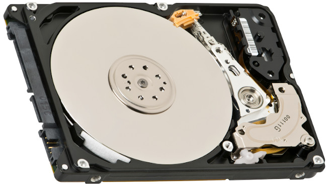{width="100%"}
:::
::: {.column width="42%" }
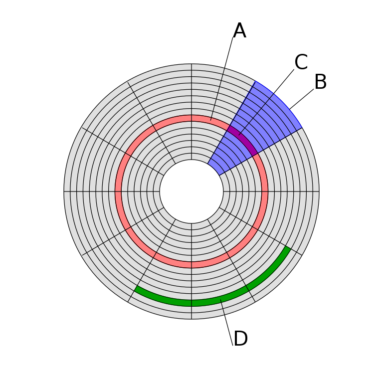{width="100%"}
:::
::::::::::::::

<!-- FIXME: corregir este enlace por el size-->
::: center
[Iturria: [Wikipedia](https://es.wikipedia.org/wiki/Unidad_de_disco_duro)]{.footnotesize}
:::

Informazioa plateretan gordetzean, goiko irudian agertzen den egitura jarraitzen da, non:

A.  Diskoaren pista bat da.

B.  Sektore geometriko bat da.

C.  Pista bateko sektore bat da.

D.  Sektoreen multzo bat da.

HDD batean kontuan hartu beharreko ezaugarriak:

-   **Sarbide-denbora ertaina**: Burua nahi den pista eta sektorean kokatzeko behar duen batez besteko denbora.

-   **Irakurketa/idazketa-denbora**: Diskoak informazioa irakurri edo idazteko behar duen batez besteko denbora: irakurri edo idatzi nahi den informazioaren kantitatearen, bloke-tamaina, buru kopurua, bira-denbora eta pista bakoitzeko sektore kopuruaren araberakoa da.

-   **Biraketa-abiadura**: Plateren biraketa-abiadura. Oro har, abiadura handiagoa izanik, datu-transferentzia handiagoa izango da, baina baita zarata eta bero gehiago ere. RPM-etan neurtzen da (birak/minutu). Disko motaren arabera, 5.400RPM (eramangarrietan) eta 15.000RPM (zerbitzarietan) artean egon daiteke.

Disko gogorrek zati mekanikoak dituztenez, kontuz ibili behar da garraiatzean (geldituta egon arren) eta mugimenduarekin, kolpe batek barneko osagairen bat hautsi baitezake.

::: errorbox
**HDD disko gogorrak kolpeen aurrean ahulak dira, barneko osagai mugikorren ondorioz**
:::

#### SSD {#discos_duros_ssd}

*Solid state drive* izenez ezagunak, [flash memoriak](https://es.wikipedia.org/wiki/Memoria_flash) erabiltzen dituzte datuak gordetzeko, plateren ordez, eta ez dutenez zati mugikorrik, kolpeen aurrean erresistenteagoak dira.

Datuak gordetzeko teknologiaren hobekuntzari eta zati mugikorrik ez izateari esker, ez dute zaratarik sortzen, arinagoak dira, datuetarako sarbide-denbora txikiagoa da, eta horrek guztiak datu-transferentzia handiagoa ematen du HDDekin alderatuta.

:::::::::::::: {.columns }
::: {.column width="48%"}
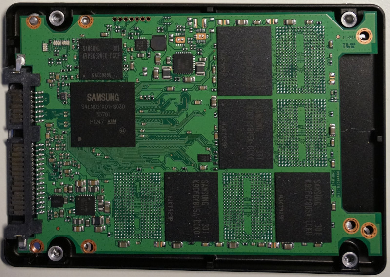{width="100%"}
:::
::: {.column width="48%" }
{width="100%"}
:::
::::::::::::::

`\vspace{-12pt}`{=latex}

::: center
[Ezkerraldean: 2,5" SSD baten barrualdea. Eskubian: M.2 konektorea duen SSD.]{.footnotesize}
:::

Gaur egun, unitate mota hau erabiltzeko modurik ohikoena 2,5" formatuan edo mSATA edo m.2 izenarekin ezagutzen den formatuan da.

#### NVMe {#nvme}

Memoria ez-lastergarriko host kontrolatzailearen interfazaren zehaztapena (NVMHCIS, ingelesez *non-volatile memory host controller interface specification*) PCI Express (PCIe) busaren bidez konektatzen da. Normalean NVMe izenez ezagutzen da.

Gailu mota hauek, aurrekoak bezala, FLASH teknologia erabiltzen dute datuak gordetzeko. PCI Express busera konektatuta daudenez eta sarbidearen zehaztapena hutsetik sortu zenez (FLASH memoriaren teknologia modernoa eta CPUen paralelismoa aprobetxatzeko), aurreko belaunaldiek baino errendimendu askoz handiagoa lortzen dute.

:::::::::::::: {.columns }
::: {.column width="47%"}
{width="100%"}
:::
::: {.column width="35%" }
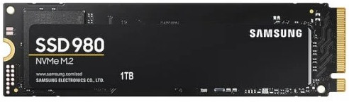{width="100%"}
:::
::::::::::::::

`\vspace{-12pt}`{=latex}

::: center
[Ezkerraldean: PCIe txartel formatuan NVMe. Eskubian: M.2 konektorea duen NVMe.]{.footnotesize}
:::

Lehen unitateek hedapen-txartel formatuan zuten eta zuzenean PCIexpress zirrikituan konektatzen ziren, baina gaur egun M.2 konektoreak daude instalatzeko.

#### HDD, SSD eta NVMe konparaketa {#comparativa_hdd_sdd_nvme}

Hurrengo taulan ikus daitezke biltegiratze-unitate mota desberdinen oinarrizko ezaugarri batzuk.

<!-- FIXME: estaría bien poner al lado de los NVMe un `\linebreak`{=latex} para el PDF -->

|                     | HDD      | SSD       | NVMe (PCIe 3.0) | NVMe (PCIe 4.0) | NVMe (PCIe 5.0) |
|:-------------------:|:--------:|:---------:|:----------:|:-----------:|:-----------:|
| Konektorea          | SATA     | SATA      | M.2        | M.2         | M.2         |
| Irakurketa abiadura | 150MB\/s | 560 MB\/s | 3500 MB\/s | 7000 MB\/s  | 14000 MB\/s |
| Idazketa abiadura   | 120MB\/s | 510 MB\/s | 3000 MB\/s | 5300 MB\/s  | 10000 MB\/s |
| Prezioa TB-ko       | Bajo     | Medio     | Alto       | Alto        | Alto        |

Table: {tablename=yukitblrcol colspec=XXXXXX}

Kontuan izan abiadurak unitatearen teknologiaren eta erabilitako konexioaren araberakoak direla. Gutxi gorabeherako abiadurak dira, eta beraz, gailu bakoitza erosi aurretik bere zehaztapen teknikoak ikusi behar dira.

::: infobox
Irakurketa eta idazketa abiaduretan normalean adierazten dute sekuentziala edo ausazkoa (aleatoria) den. Irakurketa eta idazketa ausazkoetan abiadura txikiagoa da.
:::

Biltegiratze-sistemetarako ere badaude errendimendu-probak, beraz, garrantzitsua da ondo informatzea bat aukeratu aurretik.

### Elikadura iturria {#elikadura_iturria}

Ordenagailu batean elikadura iturria da korronte alternoa hainbat korronte jarraitan bihurtzen duen osagaia, ordenagailuak tentsio desberdinak erabiltzen baititu.

Elikadura iturria aukeratzerakoan kontuan hartu behar dugu:

-   **Potentzia**: *Watt*-etan (W) neurtzen da, eta gure ordenagailuko osagaiek duten kontsumoa kontuan hartu behar dugu.

-   **Formatu-faktorea**: Mahaigaineko ordenagailuetan gaur egun ATX formatua da ohikoena, baina konexio motaren arabera aukeratu daiteke:

    -   **Kableatu osoa**: Elikadura iturriak kable guztiak ditu.

    -   **Erdi-modularra**: Beharrezko kable batzuk jarri edo kendu daitezke, gure beharren arabera.

    -   **Full-modularra**: Kable guztiak jarri edo kendu daitezke, elikadura iturria instalatzea eta kaxa barruko ordena errazteko.

:::::::::::::: {.columns }
::: {.column width="30%"}
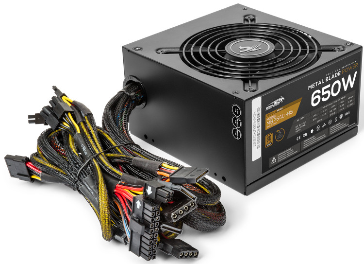{width="100%"}
:::
::: {.column width="28%" }
{width="100%"}
:::
::: {.column width="24%" }
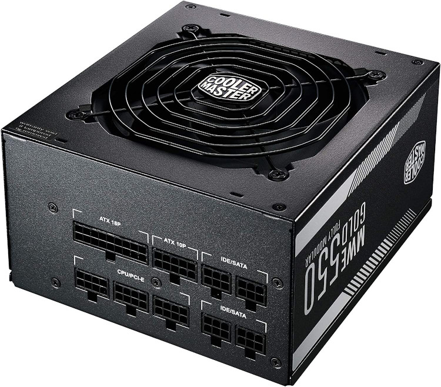{width="100%"}
:::
::::::::::::::

::: center
[Kableatu osoa, erdi-modularra eta full-modularra duten elikadura iturriak.]{.footnotesize}
:::

### GPU/Txartel grafikoa {#gpu_txartel_grafikoa}

Gaur egun ohikoa da ordenagailu pertsonaletan txartel grafiko bat izatea, batez ere grafikoen prozesamendu handia behar duten funtzioak egiteko: jokoak, bideo-edizioa, argazki-edizioa, CAD erabilera, ...

Bereiz daitezke:

-   **Grafiko integratuak**: Gaur egun prozesadoreek barneko grafiko-unitate bat izan dezakete, eta ordenagailuaren erabilera eta lan arinetarako (bideoak ikusi, joko zaharrak edo eskakizun gutxikoak) nahikoa izan daiteke.

    Gure prozesadoreak baduen edo ez jakiteko, bere zehaztapen teknikoak begiratu behar dira (adibidez: [Intel i7-14700KF](https://www.intel.com/content/www/us/en/products/sku/236789/intel-core-i7-processor-14700kf-33m-cache-up-to-5-60-ghz/specifications.html) ez dauka grafiko-prozesadorerik, baina [i7-14700](https://www.intel.la/content/www/xl/es/products/sku/236781/intel-core-i7-processor-14700-33m-cache-up-to-5-40-ghz/specifications.html) bai).

-   **Grafiko dedikatuak**: Hauek dira txartel grafiko izenez ezagutzen direnak, PCI-express zirrikitu batean konektatzen direnak. **Honetan zentratuko gara**.

Txartel grafikoak gaur egun PCI-Express zirrikitu azkarrenean instalatzen dira eta honako osagaiak dituzte:

-   **Grafiko-prozesatzeko unitatea**: Edo **GPU**, CPUaren antzeko prozesadorea da baina grafikoak prozesatzeko diseinatua. Bere helburua da bektore, triangelu, testura, ... ahalik eta azkarren prozesatzea.

    Txartel grafikoek bideoaren hardware bidezko kodetze/deskodetzea ere egiten dute, eta horrek denbora murrizten du CPU bidez egitearekin alderatuta.

    Gaur egun, punta-puntako teknologiak argia ahalik eta errealistena simulatzen saiatzen dira, [raytracing](https://es.wikipedia.org/wiki/Trazado_de_rayos) izeneko teknikaren bidez.

-   **VRAM**: Edo memoria grafikoa, txipak dira eta informazioa txartel grafikoan gordetzen eta garraiatzen dute. Txartel grafiko dedikatuetan, bere txip propioak dituzte, eta integratuetan, RAM memoria erabiltzen da grafikoetarako.

-   **Irteera konektoreak**: Txartelaren eta konektatutako monitoreen arteko konexioa egiteko. Gaur egun ohikoenak HDMI eta DisplayPort dira.

Gure prozesadoreak grafiko integratua badu eta aparteko grafiko dedikatua ere bai, ordenagailuaren erabileraren arabera, interesgarria izan daiteke integratua desgaitzea [UEFI](#UEFI) bidez.

::: infobox
Grafiko integratua eta dedikatua baditugu, interesgarria izan daiteke integratua desgaitzea UEFI bidez.
:::

Txartel grafikoak sortzen dituzten enpresek **SDK**ak ere sortu dituzte (*Software Development Kits*), hala nola [Nvidia CUDA](https://en.wikipedia.org/wiki/CUDA), kalkulu paraleloa egiteko eta kalkulu-potentzia proiektuetan erabiltzeko: *machine learning*, simulazio zientifikoak, proteinak kalkulatzeko, DNA sekuentziak, ...

::: infobox
**Txartel grafikoaren prozesamendua zientziari laguntzeko erabil dezakegu, [Folding@Home](https://es.wikipedia.org/wiki/Folding@home) bezalako proiektuekin, [banatutako konputazioa](https://es.wikipedia.org/wiki/Computaci\%C3\%B3n_distribuida) erabiliz**
:::

### Konektore garrantzitsuenak {#conectores_mas_importantes}

Plaka baseak dituen konexio mota batzuk orokorrean ikusi baditugu ere, atal honetan sakonduko dugu, atalez atal bereiziz.

#### Konektore grafikoak {#conectores_graficos}

Gainerako osagaiekin bezala, gailu grafikoetarako (pantailak) konektoreek ere eboluzioa izan dute, eta batzuk aspalditik dauden arren, gaur egun oraindik erabiltzen dira.

:::::::::::::: {.columns }
::: {.column width="15%"}
{width="100%"}
:::
::: {.column width="80%" }
**VGA** konektorea analogikoa da eta soilik seinale grafikoa bidaltzen du konektatutako gailura. Gaur egun, teknologikoki zaharkitua dela esan daitekeen arren, oraindik ere zerbitzarietan eta gama baxuko proiektoreetan erabiltzen da, kalitate grafiko nahikoa eskaintzen duelako.
:::
::::::::::::::

:::::::::::::: {.columns }
::: {.column width="15%"}
{width="100%"}
:::
::: {.column width="80%" }
**DVI** konektorea aurrekoaren ordezkoa izan zen, eta VGA-rekin bateragarria izan zitekeen, baina helburua seinale digitalak izatea zen. Konektore mota desberdinak zeuden, garraiatzen zuen seinalearen arabera. Ordenagailu eramangarrietarako "mini" eta "micro" bertsio meheagoak ere egon ziren.
:::
::::::::::::::

:::::::::::::: {.columns }
::: {.column width="15%"}
{width="100%"}
:::
::: {.column width="80%" }
**HDMI** konektorea gaur egun oso estandarizatua dago, batez ere telebistetan, seinale grafikoa eta audioa bidaltzeko aukera ematen duelako. Konektorea berdina izaten jarraitzen duen arren, bertsio desberdinak daude, datu-transmisio handiagoa ahalbidetzen dutenak (teknologia berrietarako, hala nola HDR, kanal gehiagoko audioa, ...).
:::
::::::::::::::

:::::::::::::: {.columns }
::: {.column width="15%"}
{width="100%"}
:::
::: {.column width="80%" }
**DisplayPort** bideo-estandar elektronikoen elkarteak (VESA) garatutako interfaz digitala da. Lizentziarik gabea da, eta aukeran audio eta datuak (adibidez USB) transmititzeko aukera ematen du.
:::
::::::::::::::

#### Biltegiratze-gailuen konektoreak {#conectores_dispositivos_almacenamiento}

Biltegiratze-gailuetarako, hala nola disko gogorrak, CD-ROMak..., hainbat konektore mota egon dira eta garrantzitsua da ezagutzea.

:::::::::::::: {.columns }
::: {.column width="15%"}
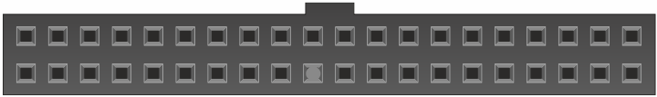{width="100%"}
:::
::: {.column width="80%" }
**Parallel-ATA**, edo IDE, disko gogorretan eta CD-ROM irakurgailuetan erabiltzen zen konektorea zen, eta kable bakar baten bidez bi gailu konektatu zitezkeen. Horregatik, gailuek "*jumper*" bat zuten "maisu" edo "esklabo" zela adierazteko.
:::
::::::::::::::

](img/si/ide_hdd.jpeg){width="60%" framed=true}

:::::::::::::: {.columns }
::: {.column width="15%"}
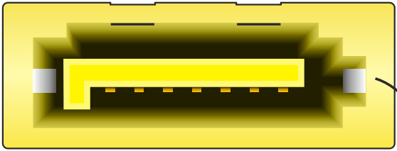{width="100%"}
:::
::: {.column width="80%" }
**Serial-ATA**, edo SATA, aurreko konektorearen eboluzioa da. Konektore txikiagoa da baina abiadura handiagoa ahalbidetzen du. Bertsio desberdinak egon dira (guztiak bateragarriak dira), azkena SATA 3 (3.5 azpibertsioa) izanik, 600MB/s arteko abiadura onartzen duena.
:::
::::::::::::::

:::::::::::::: {.columns }
::: {.column width="15%"}
{width="100%"}
:::
::: {.column width="80%" }
**M.2**, biltegiratze-unitate berriek duten konektorea da, **[NVMe](#nvme)** motako SSDetan batez ere.
:::
::::::::::::::

#### USB {#usb}

USB (*Universal Serial Bus*) gaur egun ordenagailuak eta mota guztietako gailuak konektatzeko erabiltzen den kable, konektore eta protokoloen estandarra da.

90eko hamarkadaren erdialdean sortu zen arren, gehien erabiltzen den konektorea (A motakoa) ia ez da aldatu (atzerako bateragarritasuna bilatuz), baina abiadura bai.

](img/si/usb.png){width="40%"}

USB-C espezifikazio berriak konektore berria ekarri zuen, alderantzizkoa (bi norabidetan konekta daiteke), aurreko guztiak ordezkatzeko asmoz. Bi gailuek (*host* eta *guest*) konektore bera erabiltzen dute eta kableak unibertsala izatea bilatzen da, erabilitako espezifikazioa kontuan hartuta.

](img/si/usb-c.png){width="25%"}

[Txartel nagusiak](#txartel_nagusia) hainbat USB A motako konektore soldatuta dituzte, baina plakan bertan ere badira konektore gehiago izateko konexioak (adibidez, kutxak ekartzen dituenak).

Kanpoko konektore hauek kable baten bidez konektatzen dira plaka baseko pinekin, eta protokoloaren arabera forma desberdina izango dute (horregatik garrantzitsua da plaka basearen eskuliburua ikustea).

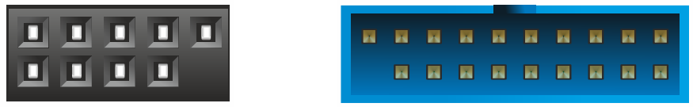{width="35%"}

#### Sare-konexioak {#sare_konexioak}

Ordenagailua sare batera konektatzeko, txartel nagusiek gutxienez konektore bat izaten dute horretarako.

:::::::::::::: {.columns }
::: {.column width="15%"}
{width="100%"}
:::
::: {.column width="80%" }
**RJ-45** konektorea ordenagailu-sareetan erabiltzen da, kobrezko lau bikote ditu datuak **ethernet** protokoloaren bidez transmititzeko, geroago ikusiko duguna.
:::
::::::::::::::

:::::::::::::: {.columns }
::: {.column width="15%"}
{width="100%"}
:::
::: {.column width="80%" }
**SMA** konektorea WiFi antena desmuntagarri batzuetan erabiltzen da, router, plaka base edo PCI txarteletan aurki daitekeena. Konektore hariztatua eta erraz desmuntagarria da.
:::
::::::::::::::

#### Beste konektore batzuk {#beste_konektore}

:::::::::::::: {.columns }
::: {.column width="15%"}
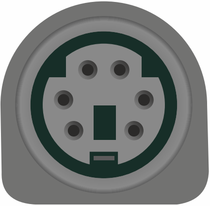{width="100%"}
:::
::: {.column width="80%" }
**PS2** teklatu eta saguak konektatzeko erabiltzen zen USB iritsi aurretik. Normalean bi kolore zituen, morea teklaturako eta berdea saguarentzat, konektorea berdina izan arren, teklatuak alde bietan kolektore irekia behar duelako komunikazio bidirekzionala ahalbidetzeko.
:::
::::::::::::::

:::::::::::::: {.columns }
::: {.column width="15%"}
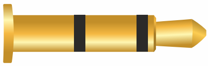{width="100%"}
:::
::: {.column width="80%" }
El **jack** de 3,5mm es el conector más utilizado para audio analógico desde hace muchos años en el ordenador, a pesar de que su aparición (en distinto tamaño) es del año 1878. Hoy en día las placas base tienen distintos conectores para introducir estos jacks dependiendo de si es para altavoces, micrófono, sonido envolvente...
:::
::::::::::::::

:::::::::::::: {.columns }
::: {.column width="15%"}
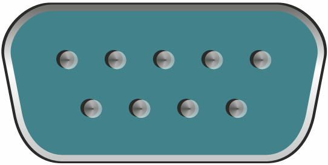{width="100%"}
:::
::: {.column width="80%" }
**RS232** konektorea ("serie portua" ere deitua), bi ekipoen artean datu bitarrak trukatzeko interfazea da. Hasieran datuak terminal batera bidaltzeko erabiltzen zen, eta gaur egun switch-etan asko erabiltzen da. Gaur egun plaka baseek ez dute kanpoko konektorerik, baina pinak izaten dituzte egokigailu bat gehitzeko.
:::
::::::::::::::

80ko hamarkadan ordenagailuak ezagun bihurtu zirenetik gaur arte, beste konektore mota asko ere egon dira kontsumorako ordenagailuetan.

Era berean, beste konektore asko ere profesionalen arloan geratu dira ([transceiver SFP](https://es.wikipedia.org/wiki/Transceptor_SFP), [SAS](https://es.wikipedia.org/wiki/Serial_Attached_SCSI) disko gogorrentzako konektoreak, ...) eta ezinezkoa da guztiak jasotzea.

#### Konektorea, protokoloa eta kableak: ohiko akatsak {#konectore_protokoloa_kableak}

Urteetan zehar konektoreen forma fisikoa ia aldatu ez bada ere, atzerako bateragarritasuna bilatuz, transmisio-abiadura handitu egin da.

Adibide batzuk:

-   PCI

-   USB

-   SATA

-   HDMI

-   DisplayPort

Horregatik, garrantzitsua da ulertzea konektorearen formak ez digula beti adierazten zein den gehienezko transmisio-abiadura, eta horregatik plaka basearen edo gailuaren zehaztapen teknikoetara jo behar dugu.

Bestalde, **kableekin gauza bera gertatzen da**. Ziurtatu behar dugu erabiltzen ditugun kableak gailuak eta plaka baseak onartzen duten gehienezko abiadura transmititzeko gai direla.

::: errorbox
**Garrantzitsua da erabiltzen dugun osagai eta kable bakoitzaren zehaztapen teknikoak ezagutzea, estuguneak (*bottleneck*) saihesteko.**
:::

### Ordenagailuaren kutxa {#ordenagailuaren_kutxa}

Ordenagailuaren kutxa, edo txasia, metalezko egitura da, eta bertan sartzen dira (modu ordenatuan, eta torloju bidez finkatuz) orain arte ikusi ditugun osagaiak.

 ](img/si/caja.jpg){width="75%"}

Kutxa mota desberdinak daude, normalean tamainaren arabera aldatzen direnak, beraz, garrantzitsua da kutxa barruan sartu nahi ditugun osagaien arabera egokitzea.

::: warnbox
**Kontuz kutxa txikiegia erosten baduzu, baliteke plaka basea edo txartel grafikoaren zabalera ez sartzea**
:::

Zerbitzariek altuera estandarizatutako kutxak dituzte, "[Rack unitatea](https://es.wikipedia.org/wiki/Unidad_rack)" (*rack unit* ingelesez, edo **U** soilik), eta unitate bakoitza 44,45 milimetrokoa da. Horrela, zerbitzariek altuera finkoa izango dute [rack bastidorean](https://es.wikipedia.org/wiki/Bastidor_de_19_pulgadas) instalatzeko.

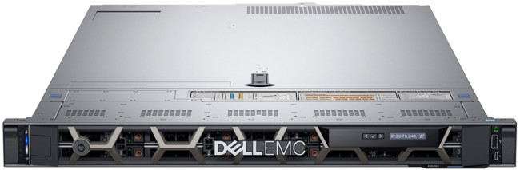{width="75%"}

## Ordenagailu baten abiaraztea {#ordenagailuaren_abiaraztea}

Hardwarea instalatuta dagoenean, gure ordenagailuaren abiarazte-sistema nola funtzionatzen duen ulertzea da hurrengo pausoa, Sistema Eragilera iritsi arte.

Abiarazte-sekuentzia hainbat etapatan bana daiteke:

1.  Ekipoko pizteko botoia sakatzen da (edo berrabiaraztu ondoren ekipoa abiarazten da).

2.  BIOS/UEFI kargatzen da eta exekutatzen hasten da.

3.  *Power-On Self-Test* (POST) exekutatzen da, hardware osagaien egoera egiaztatzen duen sekuentzia. Osagai bat ez badago ondo, plaka baseak soinuak igorriko ditu. **Urrats hau huts egiten badu, prozesuak ez du jarraituko**.

    ::: infobox
    Osagai bat huts egiten badu, ohikoa da txartel nagusia tonu bat edo batzuk igortzea (bozgorailu/altavoz txiki bat badu) iraupen desberdinekin
    :::

    -   Prozesadorea egiaztatzea

    -   RAMaren egoera eta instalatutako kantitatea egiaztatzea

    -   Bideo-memoriaren egoera egiaztatzea

    -   Biltegiratze-gailuetarako sarbide-sistemak hasieratzea (IDE, Serial-ATA, NVMe...).

4.  BIOS/UEFI-k disko gogorren kopurua egiaztatzen du. Abiarazteko lehenetsitako diskoaren partizio-taula egiaztatzen da.

5.  Abiarazle-kudeatzailea exekutatzen da, abiarazgarri gisa markatutako partizio-taulan.

6.  Abiarazle-kudeatzaileak Sistema Eragilea funtzionatzeko behar duen guztia prestatzen du, kargatu eta exekuzioa hari transferitzen dio.

