# Introducción {#introducción}

Una **interfaz** (en plural: interfaces) se utiliza en informática para nombrar a la conexión funcional entre dos sistemas, programas, dispositivos o componentes de cualquier tipo, que proporciona una comunicación de distintos niveles, permitiendo el intercambio de información.

Ejemplos:

-   **Interfaces de usuario**: a la hora de hacer uso de un programa.

-   **Dispositivo de interfaz humana**: de las siglas en inglés **HID** (*human interface device*), cuando hacemos referencia al interfaz *hardware* que utilizamos los humanos para interactuar con el ordenador.

-   **Interfaz física**: un componente que se conecta a otro (puerto USB o puerto SATA).

# Evolución de las interfaces de usuario {#evolución-de-interfaces-de-usuario}

La **interfaz de usuario**, IU (del inglés *User Interface*, **UI**), es el medio que permite la comunicación entre un usuario y una máquina. Normalmente suelen ser fáciles de entender y fáciles de utilizar, aunque en el ámbito de la informática es preferible referirse a que suelen ser "usables, amigables e intuitivas".

Hoy en día podemos diferenciar entre 3 tipos:

-   **Interfaz de línea de comandos** (Command-Line Interface, **CLI**): Interfaces alfanuméricas (intérpretes de comandos) que solo presentan texto o interfaces simples generadas con texto y caracteres especiales.

-   **Interfaz gráfica de usuario** (Graphic User Interface, **GUI**): Permiten comunicarse con la computadora de forma rápida e intuitiva representando gráficamente los elementos de control y medida.

-   **Interfaz natural de usuario** (Natural User Interface, **NUI**): Pueden ser táctiles, representando gráficamente un "panel de control" en una pantalla sensible al tacto que permite interactuar con el dedo de forma similar a si se accionara un control físico; pueden funcionar mediante reconocimiento del habla, como por ejemplo Siri; o mediante movimientos corporales (como es el caso del antiguo [Kinect](https://es.wikipedia.org/wiki/Kinect) o las actuales [Vision Pro](https://www.apple.com/apple-vision-pro/) de Apple).

En la [Wikipedia](https://en.wikipedia.org/wiki/History_of_the_graphical_user_interface) está la historia de las interfaces gráficas de las que aquí se va a hacer un resumen.

## Interfaz de línea de comandos {#interfaz-de-línea-de-comandos}

La interfaz de línea de comandos o interfaz de línea de órdenes (en inglés: *command-line interface*, **CLI**) es un tipo de interfaz de usuario de ordenador que permite a los usuarios dar instrucciones a algún programa informático o al sistema operativo por medio de una línea de texto simple.

Las CLI pueden emplearse interactivamente, escribiendo instrucciones en alguna especie de entrada de texto, o pueden utilizarse de una forma mucho más automatizada (archivo batch), leyendo órdenes desde un archivo de scripts.

Esta interfaz existe casi desde los comienzos de la computación, superada en antigüedad solo por las tarjetas perforadas y mecanismos similares. Los ordenadores tenían conectadas "terminales tontas" que permitían enviar comandos al ordenador.

](img/di/tema_1/RT-11_help.jpg){width="40%" framed=true}

Hoy en día la línea de comandos se utiliza a través de programas denominados "emulador de terminales" que ejecutan un intérprete de comandos (llamado "shell"). Estos intérpretes, dependiendo del sistema operativo se pueden elegir, por ejemplo:

-   En **Windows** se puede hacer uso del antiguo **cmd** o el más nuevo y mejorado **PowerShell**. También se puede utilizar otros, pero no vienen de serie instalados (como **bash**)

-   En sistemas **GNU/Linux** el intérprete más utilizado y que está instalado en la gran mayoría de distribuciones es **bash**. En los últimos años ha ganado mucho mercado **zsh** gracias al *framework* [Oh-my-zsh](https://ohmyz.sh/).

-   En sistemas MacOS el intérprete por defecto es **zsh**.

](img/di/tema_1/bash.png){width="45%"}

Los conceptos de CLI, shell y emulador de terminal **no son lo mismo** ya que CLI se refiere al paradigma, mientras que un shell o un emulador de terminal son programas informáticos específicos, que usualmente en conjunto implementan la CLI. **Sin embargo, los tres suelen utilizarse como sinónimos**.

## Interfaz gráfica de usuario {#interfaz-gráfica-de-usuario}

La interfaz gráfica de usuario, conocida también como **GUI** (del inglés *graphical user interface*), es un programa informático que actúa de interfaz de usuario, en la que hoy en día utilizando un conjunto de imágenes y objetos gráficos para representar la información y acciones disponibles en la interfaz.

Su función principal es proporcionar un entorno visual sencillo para permitir la comunicación con el sistema operativo de un ordenador.

### Interfaz en modo texto {#interfaz-en-modo-texto}

Las interfaces gráficas no nacen con los escritorios, si no que ya en pasos anteriores existen librerías que simulan ventanas o entornos haciendo uso de caracteres de texto y colores.

:::::::::::::: {.columns }
::: {.column width="48%"}
](img/di/tema_1/Fdedit.png){width="100%" framed=true}
:::
::: {.column width="48%" }
_en.png)](img/di/tema_1/mc.png){width="100%" framed=true}
:::
::::::::::::::

Hay que tener en cuenta que estos interfaces se solían utilizar en máquinas con muy pocos recursos y con sistemas operativos en los que no existía un interfaz gráfica.

### Primeras investigaciones y desarrollos {#primeras-investigaciones-y-desarrollos}

El proyecto de "Aumento del Intelecto Humano" de Doug Engelbart en el Stanford Research Institute (en Menlo Park, EE. UU.) en la década de los 60 desarrolló el oN-Line System, que incorporaba un cursor manejado con un ratón y múltiples ventanas usadas para trabajar con hipertexto.

Mucha de la investigación inicial estuvo basada en como los niños pequeños aprenden. Por lo que el diseño se basó en las primitivas infantiles de coordinación mano-ojo, en lugar de usar lenguajes de comandos.

](img/di/tema_1/mouse.jpg){width="50%" framed=true}

El GUI fue inicialmente desarrollado en [Xerox PARC](https://es.wikipedia.org/wiki/PARC) (*Palo Alto Research Center*) por Alan Kay, Larry Tesler, Dan Ingalls y algunos investigadores más. Usaba ventanas, iconos y menús, incluyendo el primer menú desplegable fijo, para dar soporte a comandos como abrir ficheros, borrar y mover ficheros, etc.

En 1981 Xerox presentó un producto innovador, el Star, incorporando muchas de las innovaciones de PARC. Aunque no fue un éxito comercial, el Star influenció de manera importante los futuros desarrollos, por ejemplo en Apple, Microsoft y Sun Microsystems.

En 1979, el equipo encabezado por Steve Wozniak, Steve Jobs y Jef Raskin (junto con antiguos trabajadores de Xerox) continuaron con las ideas vistas en Xerox PARC para lanzar en 1983 el ordenador "Apple Lisa", el primer ordenador con interfaz gráfico. No fue un éxito en ventas, pero inició la era de lo que se podrían denominar "los sistemas operativos con escritorio".

](img/di/tema_1/lisaos10.png){width="80%" framed=true}

En 1984 Apple lanzó el Macintosh, el cual presentó una evolución del sistema operativo de Lisa, llamado "System", en el que se puede apreciar partes que apenas han cambiado desde entonces.

](img/di/tema_1/macos11.png){width="70%" framed=true}

Al año siguiente Microsoft sacaría Windows 1.0, que era un GUI para su sistema operativo MS-DOS, pero no sería hasta la versión de Windows 3.0 de 1990 en la que su popularidad explotó.

](img/di/tema_1/win30.png){width="70%" framed=true}

## Uso masivo del escritorio {#uso-masivo-del-escritorio}

Con la llegada de la década de 1990, en la que los ordenadores personales (PC, del inglés *personal computer*) se popularizan y empiezan a llegar a las casas y negocios, hizo que se creara un mercado de usuarios sin conocimientos avanzados que requerían de facilidades de uso.

El "boom" comenzó con el Windows 3.11, pero sobre todo con Windows 95, que consiguió ocultar el núcleo del sistema operativo subyacente (MS-DOS) para mostrar directamente el interfaz gráfico desde el inicio.

](img/di/tema_1/win95.png){width="67%" framed=true}

Apple compra a NeXT (empresa fundada por Steve Jobs) y utiliza su sistema operativo como los cimientos de Mac OS 8. Posteriormente cambiarían la arquitectura del sistema operativo para ser de estilo UNIX y así presentar Mac OS X en 2001.

](img/di/tema_1/macosx101.png){width="70%" framed=true}

Durante estos años y principios de los 2000, los interfaces de usuario van evolucionando a medida que evoluciona la potencia de los ordenadores, pero siguiendo la misma tónica de simular un escritorio real en el ordenador.

Se anuncian entornos de escritorio libres como Gnome y KDE, que evolucionan en paralelo dentro de mundo de GNU/Linux llegando a crearse casi una guerra entre ellos y entre los usuarios ([Enlace 1](https://www.zdnet.com/article/gnome-vs-kde-this-means-war/), [Enlace 2](https://www.linux.com/news/kde-and-gnome-war/)).

Cada sistema operativo y cada sistema de escritorio realizaba sus propias evoluciones que si tenían calado eran "copiadas" en los otros, generando también ciertas "modas" en colores, iconos o efectos de ventanas.

:::::::::::::: {.columns }
::: {.column width="30%"}
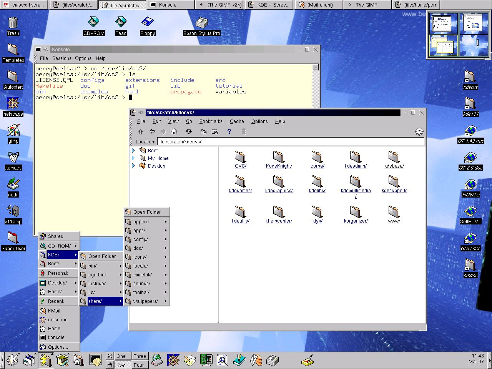{width="100%" framed=true}
:::
::: {.column width="30%"}
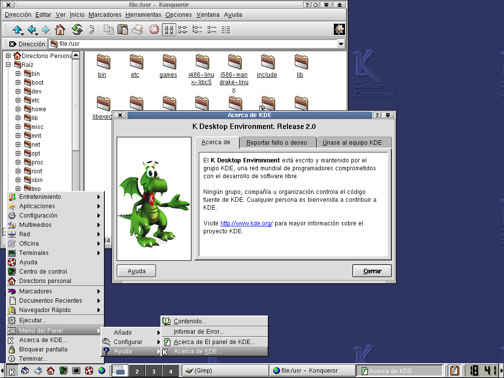{width="100%" framed=true}
:::
::: {.column width="30%"}
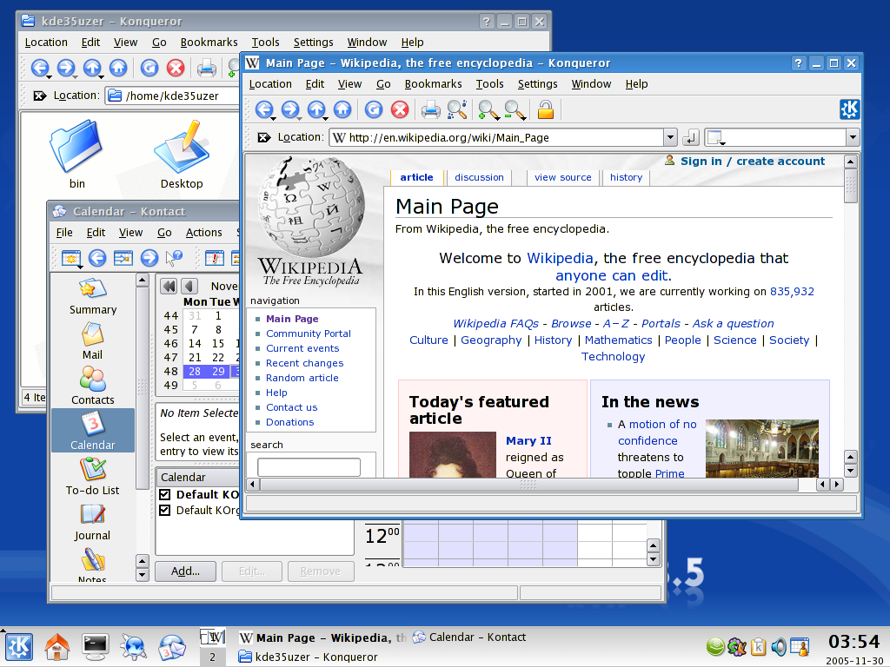{width="100%" framed=true}
:::
::::::::::::::

::: center
[Evolución de KDE en 1998, 2000 y 2005 1. Fuente: [Wikipedia](https://es.wikipedia.org/wiki/KDE)]{.footnotesize}
:::

## Interfaces web {#interfaces-web}

Entre finales de los 90 y principios de los 2000, el auge de internet en todo el mundo hace que los portales web también sufran una gran evolución en sus interfaces.

::: center
{height="4.2cm" framed=true inline=true} `\hfill`{=latex}
{height="4.2cm" framed=true inline=true} `\hfill`{=latex}
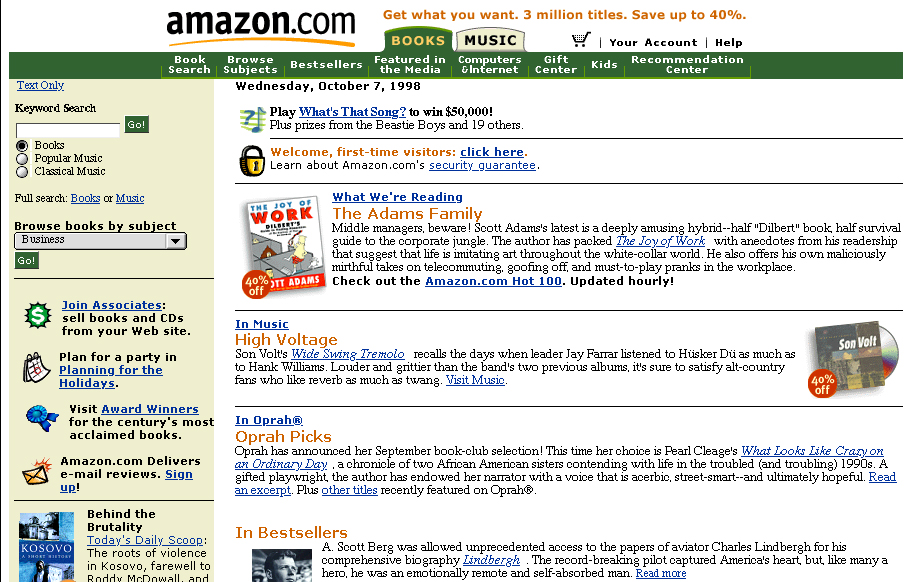{height="4.2cm" framed=true inline=true}
:::

::: center
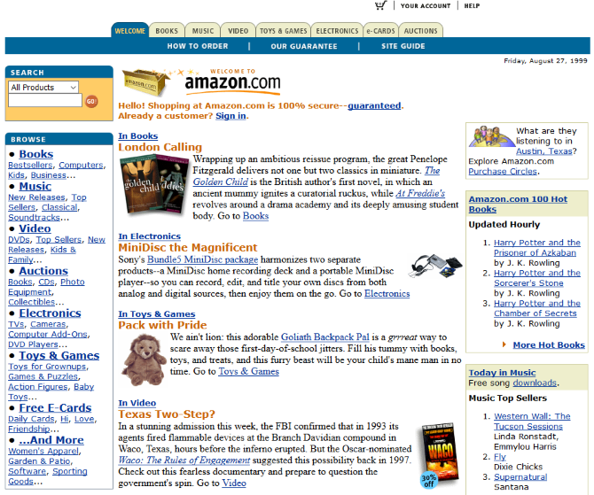{height="3.7cm" framed=true  inline=true} `\hfill`{=latex}
{height="3.7cm" framed=true  inline=true} `\hfill`{=latex}
{height="3.7cm" framed=true  inline=true}
:::

::: center
[Evolución de la web de Amazon. Fuente: [VersionMuseum](https://www.versionmuseum.com/history-of/amazon-website)]{.footnotesize}
:::

También hay que tener en cuenta que las versiones HTML y CSS de la época no era tan avanzado como lo son hoy, y que las posibilidades de ejecución de javascript tampoco era tan potente como lo es hoy en día. **Las interfaces pueden verse limitadas por la propia tecnología**

::: infobox
**Las interfaces pueden verse limitadas por las tecnologías del momento**
:::

Por otro lado, es habitual que la imagen de la compañía cambie, ya sea por cambios de logotipo, colores corporativos, moda en el tono de los colores\... y todo eso también hace que los interfaces sufran modificaciones.

::: center
{width="70%" inline=true}
{width="15%" inline=true}
:::

::: center
[Evolución del logotipo de Twitter/[X](https://x.com/).]{.footnotesize}
:::

## Interfaces móviles {#interfaces-móviles}

En el caso de los teléfonos móviles, debido a que no existía un sistema estándar de visualización, cada fabricante iba creando su propio interfaz a medida que las pantallas iban creciendo en tamaño, resolución, colores\...

Los primeros móviles carecían de pantalla, posteriormente comenzaron a tener pequeñas pantallas LCD monocromas, en algunos casos con una única línea de texto.

:::::::::::::: {.columns }
::: {.column width="20%"}
:::
::: {.column width="20%"}
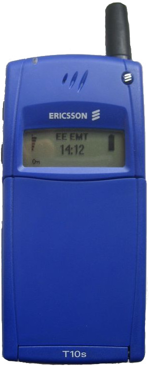{width="100%" }
:::
::: {.column width="10%"}
:::
::: {.column width="20%" }
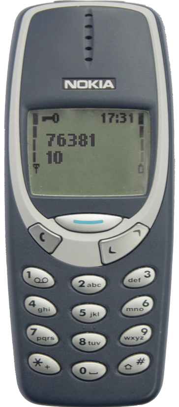{width="100%"}
:::
::: {.column width="20%"}
:::
::::::::::::::

::: center
[Ericsson T10 y Nokia 3310]{.footnotesize}
:::

Posteriormente comenzaron a tener pantallas a color y cada compañía crea su propio sistema operativo. Existe un intento de crear un sistema operativo entre varias compañías llamado [Symbian](https://es.wikipedia.org/wiki/Symbian), pero al final es Nokia la desarrolladora y la que más uso le da.

Durante los primeros años de la década de los 2000 también se ponen de moda las PDA (*personal digital assistant*, asistente digital personal u ordenadores de bolsillo), que normalmente hacían uso de un lapiz para hacer funcionar la pantalla táctil (resistiva) que tenían.

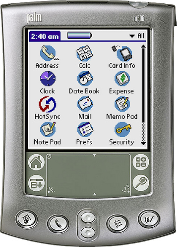{width="30%"}

Todo cambió con la llegada del iPhone en el 2007 y los primeros *smartphones*, donde las pantallas táctiles capacitativas (se manejan con el dedo) cobran protagonismo. Estas pantallas aparte de ser táctiles también permiten gestos con varios dedos, dando lugar a nuevos efectos de interactuar con el interfaz.

:::::::::::::: {.columns }
::: {.column width="10%"}
:::
::: {.column width="35%"}
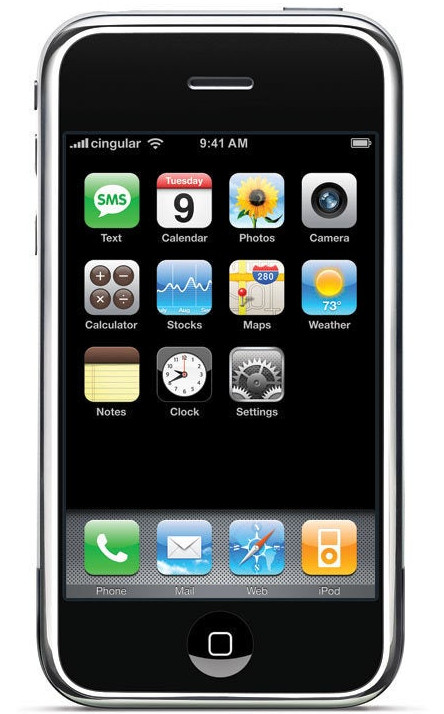{width="100%"}
:::
::: {.column width="10%"}
:::
::: {.column width="27%" }
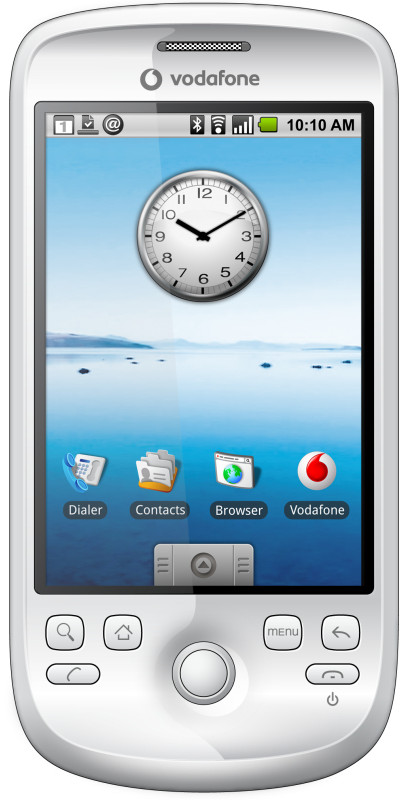{width="100%"}
:::
::: {.column width="10%"}
:::
::::::::::::::

::: center
[iPhone 1ª generación y HTC Desire.]{.footnotesize}
:::

Apple se decanta por un único botón mientras que los sistemas operativos Android (como el HTC Desire del 2009) tienen al menos cuatro para manejar ciertas tareas del sistema y de la aplicación que se está usando en el momento.

Con estos cambios, los sistemas operativos y las interfaces sufren un cambio radical, donde buscan la facilidad del usuario y aparecen los "[gestos](https://en.wikipedia.org/wiki/Pointing_device_gesture#Touchpad_and_touchscreen_gestures)" como nueva manera de interactuar con el interfaz:

-   **Tap**: tocar la pantalla (similar al "click" con el ratón)

-   **Double tap**: doble toque, que dependiendo de la aplicación puede hacer un zoom específico.

-   **Scroll**: presionando con el dedo y subiendo para arriba o para abajo se hace scroll sobre el interfaz.

-   **Flick**: si se hace un gesto rápido hacía arriba o hacia abajo se hace scroll, mientras que si es a izquierda o derecha el movimiento dependerá de si hay más pantalla.

-   **Pinch in**: hacer zoom acercando lo que se quiere ver.

-   **Pinch out**: hacer zoom alejando el objeto.

Con todo ello, surge un nuevo "problema" que hasta este momento no se había planteado en los interfaces, que es **la rotación del dispositivo**. Esta rotación debe hacer que la aplicación que se está ejecutando se adapte a la nueva posición del terminal, pasando de vertical a horizontal o viceversa.

:::::::::::::: {.columns }
::: {.column width="20%"}
:::
::: {.column width="30%"}
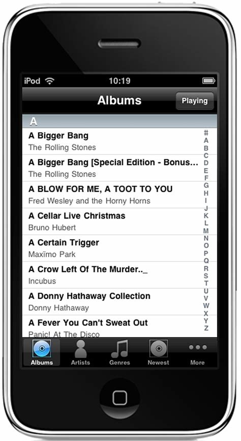{width="100%"}
:::
::: {.column width="50%" }
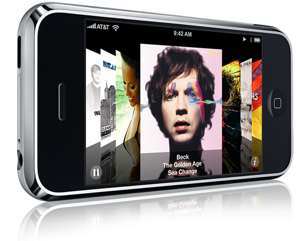{width="100%"}
:::
::: {.column width="20%"}
:::
::::::::::::::

::: center
[Vista vertical y horizontal de la app Music de iOS]{.footnotesize}
:::

Como evolución de estos dispositivos surgen las *tablets* en donde se sigue la misma filosofía de gestos, pero las pantallas táctiles de mayor tamaño permiten tener más espacio para información. En lugar de usar los interfaces de escritorio, evolucionan los interfaces de los móviles.

Al tener más espacio, no se utilizan las aplicaciones de móviles y se "escalan", si no que surgen nuevas posibilidades para que los interfaces dispongan de nuevos menús o lugares donde añadir más información.

<!-- FIXME: hay que corregir estas alturas -->

:::center
`{ \hfill`{=latex}
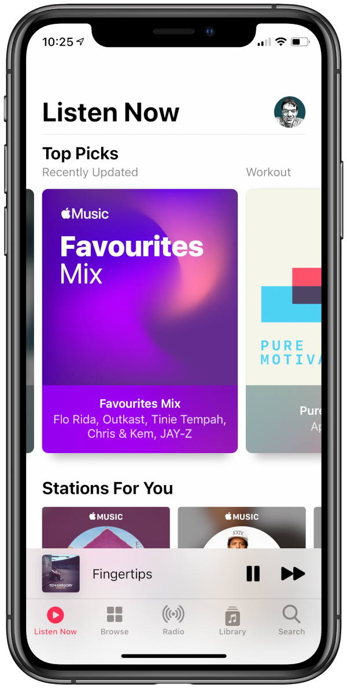{height="8cm" inline=true} `\hfill`{=latex}
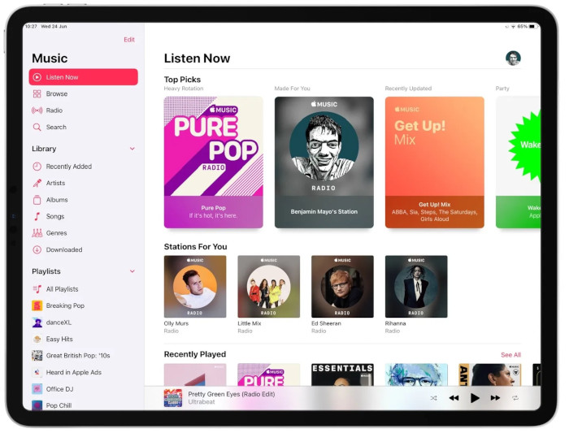{height="8cm" inline=true}
`\hfill }`{=latex}
:::

::: center
[Vista de la app Music de iOS en iPhone e iPad. Fuente: [9to5mac](https://9to5mac.com/2020/06/24/ios-14-apple-music/)]{.footnotesize}
:::

:::warnbox
**Al diseñar un interfaz tenemos que tener en cuenta el dispositivo, las dimensiones y el uso que se le va a dar para mejorar la experiencia de usuario.**
:::

## Realidad virtual y realidad aumentada {#realidad-virtual-y-realidad-aumentada}

El siguiente paso en el desarrollo de interfaces se encuentra en la conocida como realidad aumentada y en la realidad virtual. Aunque puedan parecer términos que están ahora de moda, su estudio y evolución lleva décadas fraguándose.

Los primeros pasos que se dieron en este sentido son los denominados "head-up display", que son pantallas transparentes que presentan información al usuario dejando ver lo que está en la parte trasera de la pantalla. De esta manera, el usuario no tiene que girar la cabeza para obtener la información.

](img/di/tema_1/head-up.jpg){width="50%"}

En algunos casos esta pantalla puede estar entre el usuario y el salpicadero, integrada en el salpicadero o también como una pantalla puesta en el casco del piloto y cerca del ojo.

Por otro lado, tenemos **la realidad virtual, que es un entorno simulado que da una sensación de inmersión al usuario ofreciéndole la posibilidad de moverse en él**, y en algunos casos interactuar con elementos del entorno.

Para ello, suele ser habitual contar con unas gafas que nos mostrarán el entorno virtual, y también dispondremos de unos mandos para poder interactuar con el entorno.

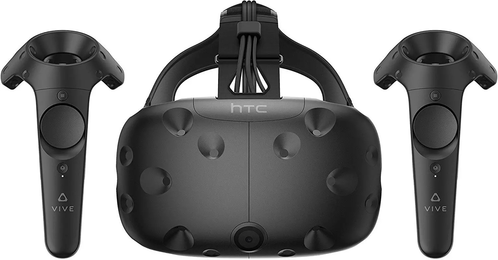{width="60%"}

Para poder movernos por el entorno, algunos de estos sistemas hacen uso de *[trackers](https://www.vive.com/us/accessory/tracker3/)*, de esta manera nos podremos desplazar por el entorno virtual sin tener que usar los mandos.

El siguiente paso es la conocida como **realidad aumentada**, en el que se trata de integrar elementos virtuales en la vida real. No es algo nuevo, ya que lleva años existiendo en juegos y aplicaciones.

:::::::::::::: {.columns }
::: {.column width="10%"}
:::
::: {.column width="25%"}
{width="100%"}
:::
::: {.column width="10%"}
:::
::: {.column width="25%" }
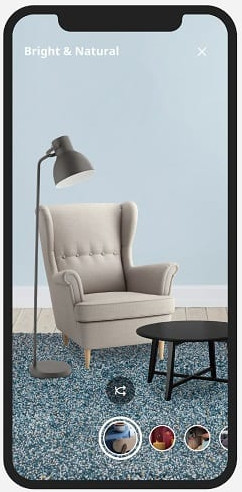{width="100%"}
:::
::: {.column width="10%"}
:::
::::::::::::::

::: center
[Ejemplos de realidad aumentada con el móvil]{.footnotesize}
:::

Cn la idea de que la realidad aumentada sea de uso cotidiano han empezado a evolucionar los sistemas para que poco a poco esto vaya fraguando, aunque el coste todavía sigue siendo elevado. A día de hoy, tampoco está claro cuál será el beneficio y el rendimiento que tendrá.

En el caso de las Apple Vision Pro prometen una experiencia de realidad aumentada utilizando únicamente gestos de las manos para moverse a través de su interfaz.

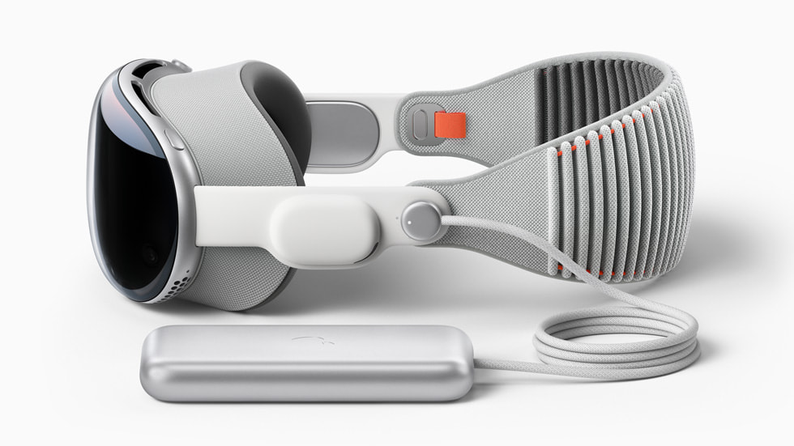{width="70%"}

# Curiosidades, prototipos y ciencia ficción {#curiosidades-prototipos-y-ciencia-ficción}

En este apartado se van a añadir algunos ejemplos de interfaces que son reales, pero que no dejan de ser meras curiosidades, ejemplos de prototipos de interfaces que de momento no han llegado a nada, y la visión en algunos casos que nos da las películas de ciencia ficción.

-   Demonstración de 1982 de posibles usos de tecnología táctil en pantallas. Realmente la pantalla no es táctil, tiene sensores alrededor de ella. [Vídeo](https://www.youtube.com/watch?v=JAcZpQCLb4E).

-   En [Jurassic Park](https://www.imdb.com/title/tt0107290/) aparece un interfaz para navegar un sistema de ficheros en 3D. [It's UNIX!](https://www.youtube.com/watch?v=JOeY07qKU9c).

-   La película [Minority Report](https://www.imdb.com/title/tt0181689/) del 2002 muestra un interfaz que se utiliza con las manos. [Vídeo](https://www.youtube.com/watch?v=33Raqx9sFbo).

-   En 2003 Microsoft muestra un [vídeo](https://www.youtube.com/watch?v=b9ifQvQCO7Y) de lo que será su próximo Windows, llamado Longhorn. Este interfaz nunca llegó a la versión final, aunque sí que hubo versiones de [demonstración](https://www.youtube.com/watch?v=pjExyeyLBG0) que se parecían un poco, pero la versión final que se llamó Vista nunca llegó a ser como los primeros conceptos.

-   En 2006, con la aceleración de OpenGL por *hardware* en las tarjetas gráficas, en las distribuciones GNU/Linux nacen los gestores de ventanas con diseños 3D real. Hubo varias alternativas, ya que surgieron varios "forks" de distintos proyectos, pero los más conocidos fueron Compiz y Beryl. [Vídeo](https://www.youtube.com/watch?v=4QokOwvPxrE).

-   En 2006 en una charla TED [Jefferson Han](https://en.wikipedia.org/wiki/Jefferson_Han) realiza una demonstración de pantalla multitáctil con muchos gestos que posteriormente se volverían el día a día con los *smartphones*. [Charla TED](https://www.youtube.com/watch?v=ac0E6deG4AU) y [Vídeo de demonstración](https://www.youtube.com/watch?v=wHfKrk8QMM0).

-   En 2009 Microsoft presenta un vídeo con el concepto de una tablet plegable llamada [Courier](https://en.wikipedia.org/wiki/Microsoft_Courier). [Vídeo 1](https://www.youtube.com/watch?v=_hzcs43CD_Y), [Vídeo 2](https://www.youtube.com/watch?v=pFQWc79TYcU). El iPad todavía no se había presentado.

    -   Microsoft tiene varias páginas con conceptos de interfaces para tablets plegables en su web. [Enlace 1](https://learn.microsoft.com/en-us/dual-screen/android/test-kit/foldable-concepts), [Enlace 2](https://devblogs.microsoft.com/surface-duo/design-foldable-large-screens/).

-   Las películas de [Iron Man](https://www.youtube.com/watch?v=P5k-4-OEuTk) han ofrecido muchas escenas donde aparecen interfaces muy espectaculares, a nivel holográfico y de realidad aumentada. [Vídeo](https://www.youtube.com/watch?v=P5k-4-OEuTk).

