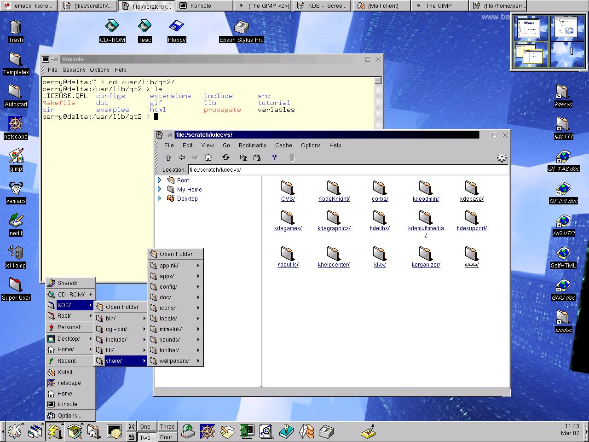
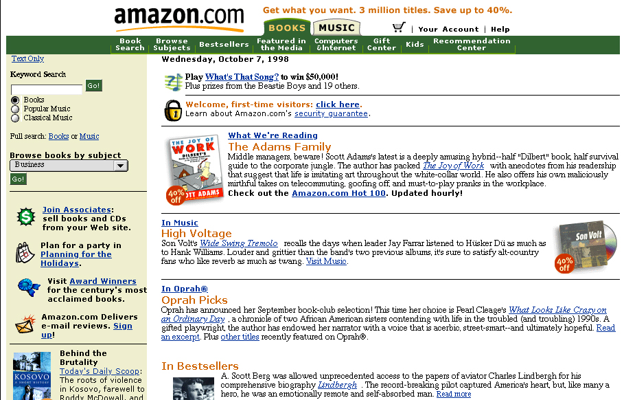
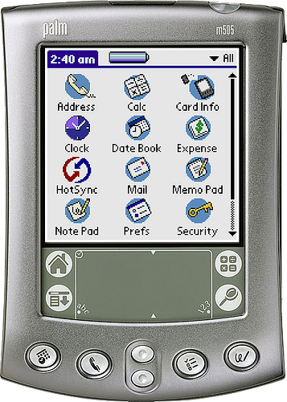
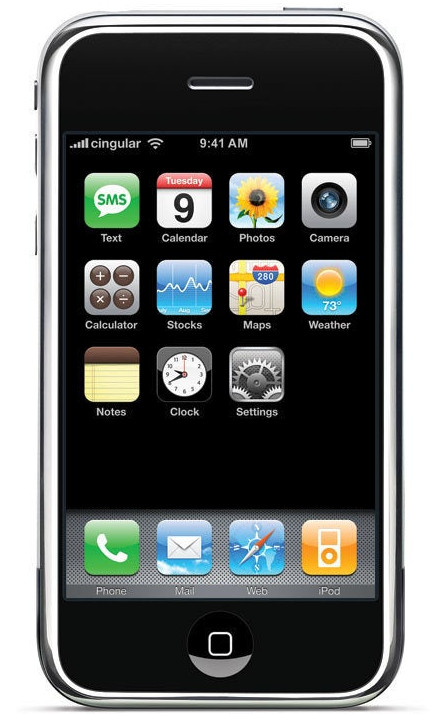
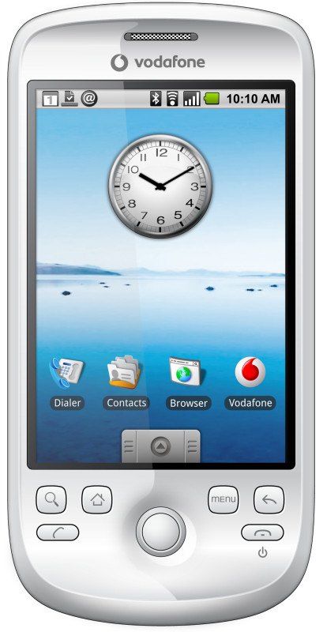
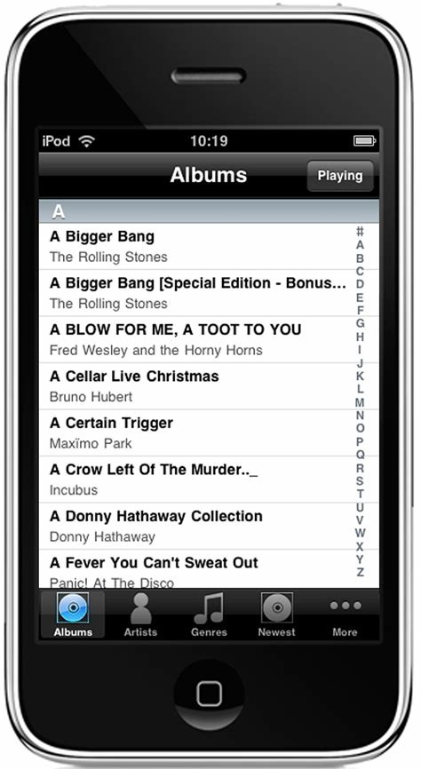
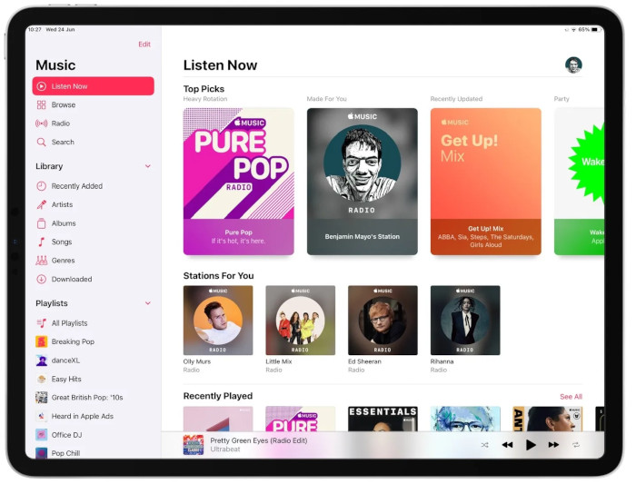

# Sarrera {#sarrera}

**Interfaze** bat (pluralean: interfazeak) informatikan erabiltzen da bi sistema, programa, gailu edo edozein motatako osagaien arteko konexio funtzionalari izena emateko, maila desberdinetako komunikazioa ahalbidetzen duena, informazioa trukatzeko aukera emanez.

Adibideak:

-   **Erabiltzaile-interfazeak**: programa bat erabiltzerakoan.

-   **Giza interfaze gailua**: ingelesezko sigletan **HID** (*human interface device*), hardware interfaze bati egiten dio erreferentzia, gizakiok ordenagailuarekin elkarreragiteko erabiltzen duguna.

-   **Interfaze fisikoa**: osagai bat beste batera konektatzen denean (USB ataka edo SATA ataka).

# Erabiltzaile-interfazeen bilakaera {#erabiltzaile-interfazeen-bilakaera}

**Erabiltzaile-interfazea**, EI (ingelesez *User Interface*, **UI**), erabiltzaile baten eta makina baten arteko komunikazioa ahalbidetzen duen bitartekoa da. Normalean ulertzeko eta erabiltzeko errazak izaten dira, nahiz eta informatikan hobea den "erabilgarriak, atseginak eta intuitiboak" direla esatea.

Gaur egun 3 mota bereiz ditzakegu:

-   **Komando-lerroko interfazea** (*Command-Line Interface*, **CLI**): Interfaze alfanumerikoak (komando-interpretea) testua edo karaktere bereziekin sortutako interfaze sinpleak soilik erakusten dituztenak.

-   **Erabiltzaile-interfaze grafikoa** (*Graphic User Interface*, **GUI**): Ordenagailuarekin modu azkar eta intuitiboan komunikatzeko aukera ematen dute, kontrol- eta neurketa-elementuak grafikoki irudikatuz.

-   **Erabiltzaile-interfaze naturala** (*Natural User Interface*, **NUI**): Ukigarriak izan daitezke, pantaila ukigarri batean "kontrol panela" grafikoki irudikatuz eta hatzarekin elkarreragiteko aukera emanez; ahots-ezagutza bidez funtziona dezakete (adibidez Siri); edo gorputz-mugimenduen bidez (antzinako [Kinect](https://es.wikipedia.org/wiki/Kinect) edo egungo [Vision Pro](https://www.apple.com/apple-vision-pro/) bezalako Apple-ren gailuak).

[Wikipedia](https://en.wikipedia.org/wiki/History_of_the_graphical_user_interface)n interfaze grafikoen historia dago, eta hemen laburpen bat egingo da.

## Komando-lerroko interfazea {#interfaz-de-línea-de-comandos}

Komando-lerroko interfazea edo komando-lerroko aginte-interfazea (ingelesez: *command-line interface*, **CLI**) ordenagailu baten erabiltzaile-interfaze mota bat da, erabiltzaileei programa informatiko bati edo sistema eragileari aginduak emateko aukera ematen diona testu-lerro sinple baten bidez.

CLIak modu interaktiboan erabil daitezke, testu-sarrera motaren batean aginduak idatziz, edo askoz modu automatizatuagoan (batch fitxategia), script-fitxategi batetik aginduak irakurriz.

Interfaze hau ia konputazioaren hasieratik existitzen da, antzinatasunean soilik txartel zulatuak eta antzeko mekanismoek gaindituta. Ordenagailuek "terminal tontoak" konektatuta zituzten, eta horien bidez aginduak bidaltzen zitzaizkien ordenagailuari.

](img/di/tema_1/RT-11_help.jpg){width="40%" framed=true}

Gaur egun, komando-lerroa "terminal emulatzaile" izeneko programekin erabiltzen da, eta horiek komando-interprete bat (shell izenekoa) exekutatzen dute. Interprete hauek, sistema eragilearen arabera, aukera desberdinak izan ditzakete, adibidez:

-   **Windows**-en **cmd** zaharra edo berriagoa eta hobetua den **PowerShell** erabil daitezke. Beste batzuk ere erabil daitezke, baina ez daude lehenetsita instalatuta (adibidez **bash**).

-   **GNU/Linux** sistemetan gehien erabiltzen den interpretea eta banaketa gehienetan instalatuta dagoena **bash** da. Azken urteetan **zsh**-k merkatu asko irabazi du [Oh-my-zsh](https://ohmyz.sh/) *framework*ari esker.

-   MacOS sistemetan interprete lehenetsia **zsh** da.

](img/di/tema_1/bash.png){width="45%"}

CLI, shell eta terminal emulatzaile kontzeptuak **ez dira gauza bera**. CLI paradigma bati egiten dio erreferentzia, eta shell edo terminal emulatzaileak programa informatiko espezifikoak dira, normalean elkarrekin CLIa inplementatzen dutenak. **Hala ere, hirurak sinonimo gisa erabiltzen dira askotan**.

## Erabiltzaile-interfaze grafikoa {#interfaz-gráfica-de-usuario}

Erabiltzaile-interfaze grafikoa, **GUI** izenez ere ezaguna (ingelesez *graphical user interface*), erabiltzaile-interfaze gisa jarduten duen programa informatiko bat da, gaur egun irudi eta objektu grafiko multzo bat erabiliz interfazean eskuragarri dauden informazioa eta ekintzak irudikatzeko.

Bere funtzio nagusia ingurune bisual erraza eskaintzea da, ordenagailu baten sistema eragilearekin komunikazioa ahalbidetzeko.

### Testu moduko interfazea {#interfaz-en-modo-texto}

Interfaze grafikoak ez dira mahaigaineko inguruneekin jaio, baizik eta aurreko urratsetan ere badaude leihoak edo inguruneak simulatzen dituzten liburutegiak, testu-karaktereak eta koloreak erabiliz.

:::::::::::::: {.columns }
::: {.column width="48%"}
](img/di/tema_1/Fdedit.png){width="100%" framed=true}
:::
::: {.column width="48%" }
_en.png)](img/di/tema_1/mc.png){width="100%" framed=true}
:::
::::::::::::::

Kontuan izan behar da interfaze hauek baliabide oso gutxiko makinetan eta interfaze grafikorik ez zuten sistema eragileetan erabiltzen zirela normalean.

### Lehen ikerketak eta garapenak {#primeras-investigaciones-y-desarrollos}

Doug Engelbartek Stanford Research Institute-n (Menlo Park, AEB) 60ko hamarkadan egindako "Giza Adimenaren Handitzea" proiektuak oN-Line System garatu zuen, saguarekin kontrolatutako kurtsorea eta hipertextuarekin lan egiteko hainbat leiho zituen sistema.

Hasierako ikerketa asko ume txikiek nola ikasten duten aztertzean oinarritu zen. Horregatik, diseinua eskuko eta begiaren arteko koordinazioaren oinarrizko mugimenduetan oinarritu zen, komando-hizkuntzak erabili ordez.

](img/di/tema_1/mouse.jpg){width="50%" framed=true}

GUIa hasieran [Xerox PARC](https://es.wikipedia.org/wiki/PARC)en (*Palo Alto Research Center*) garatu zuten Alan Kay, Larry Tesler, Dan Ingalls eta beste ikertzaile batzuek. Leihoak, ikonoak eta menuak erabiltzen zituen, lehen menu desplegable finkoa barne, fitxategiak ireki, ezabatu eta mugitzeko aginduak onartzeko.

1981ean Xeroxek produktu berritzaile bat aurkeztu zuen, Star izenekoa, PARCen berrikuntza asko txertatuz. Ez zen arrakasta komertziala izan, baina Star-ek etorkizuneko garapenetan eragin handia izan zuen, adibidez Apple, Microsoft eta Sun Microsystems-en.

1979an, Steve Wozniak, Steve Jobs eta Jef Raskin buru zituen taldeak (Xeroxeko langile ohiekin batera) Xerox PARCen ikusitako ideiekin jarraitu zuten eta 1983an "Apple Lisa" ordenagailua merkaturatu zuten, interfaze grafikoa zuen lehen ordenagailua. Ez zen salmentetan arrakastatsua izan, baina "mahaigaineko sistema eragileak" deitu daitezkeen garaiaren hasiera izan zen.

](img/di/tema_1/lisaos10.png){width="80%" framed=true}

1984an Applek Macintosh kaleratu zuen, Lisa sistemaren eboluzioa zuen sistema eragilearekin, "System" izenekoa, eta bertan gaur egun arte ia aldatu ez diren atal batzuk ikus daitezke.

](img/di/tema_1/macos11.png){width="70%" framed=true}

Hurrengo urtean, Microsoftek Windows 1.0 kaleratu zuen, MS-DOS sistema eragilerako GUI bat, baina ez zen 1990eko Windows 3.0 bertsiora arte bere ospea lehertu.

](img/di/tema_1/win30.png){width="70%" framed=true}

## Mahaigaineko erabilera masiboa {#uso-masivo-del-escritorio}

1990eko hamarkadaren etorrerarekin, ordenagailu pertsonalak (PC, *personal computer* ingelesez) ezagun bihurtu ziren eta etxeetara eta enpresetara iristen hasi ziren, eta horrek ezagutza aurreraturik ez zuten erabiltzaileen merkatua sortu zuen, erabilera erraztasuna behar zutenak.

"Boom"a Windows 3.11-rekin hasi zen, baina batez ere Windows 95-ekin, sistema eragilearen nukleoa (MS-DOS) ezkutatzea lortu zuen eta hasieratik interfaze grafikoa zuzenean erakusten zuen.

](img/di/tema_1/win95.png){width="67%" framed=true}

Applek NeXT (Steve Jobsek sortutako enpresa) erosi zuen eta bere sistema eragilea Mac OS 8-ren oinarri gisa erabili zuen. Ondoren, sistema eragilearen arkitektura UNIX estilokoa bihurtu zuten eta horrela Mac OS X aurkeztu zuten 2001ean.

](img/di/tema_1/macosx101.png){width="70%" framed=true}

Urte hauetan eta 2000ko hamarkadaren hasieran, erabiltzaile-interfazeak eboluzionatzen joan ziren ordenagailuen potentzia handitzen zen heinean, baina beti mahaigaineko benetako ingurunea simulatzen jarraituz.

GNU/Linux munduan Gnome eta KDE bezalako mahaigaineko ingurune libreak iragarri ziren, paraleloan eboluzionatu zutenak eta ia "gerra" bat sortu zuten haien artean eta erabiltzaileen artean ([1. esteka](https://www.zdnet.com/article/gnome-vs-kde-this-means-war/), [2. esteka](https://www.linux.com/news/kde-and-gnome-war/)).

Sistema eragile bakoitzak eta mahaigaineko sistema bakoitzak bere eboluzio propioak egiten zituen, eta arrakasta izanez gero, besteetan "kopiatzen" ziren, kolore, ikono edo leiho-efektuetan "modak" sortuz ere.

:::::::::::::: {.columns }
::: {.column width="30%"}
{width="100%" framed=true}
:::
::: {.column width="30%"}
{width="100%" framed=true}
:::
::: {.column width="30%"}
{width="100%" framed=true}
:::
::::::::::::::

::: center
[KDE-ren eboluzioa 1998, 2000 eta 2005ean. Iturria: [Wikipedia](https://es.wikipedia.org/wiki/KDE)]{.footnotesize}
:::

## Web-interfazeak {#interfaces-web}

90eko hamarkadaren amaieran eta 2000ko hasieran, interneten gorakadak web atariek ere euren interfazeetan eboluzio handia izatea ekarri zuen.

::: center
{height="4.2cm" framed=true inline=true} `\hfill`{=latex}
{height="4.2cm" framed=true inline=true} `\hfill`{=latex}
{height="4.2cm" framed=true inline=true}
:::

::: center
{height="3.7cm" framed=true  inline=true} `\hfill`{=latex}
{height="3.7cm" framed=true  inline=true} `\hfill`{=latex}
{height="3.7cm" framed=true  inline=true}
:::

::: center
[Amazon webgunearen eboluzioa. Iturria: [VersionMuseum](https://www.versionmuseum.com/history-of/amazon-website)]{.footnotesize}
:::

Kontuan izan behar da garai hartako HTML eta CSS bertsioak ez zirela gaur egungoak bezain aurreratuak, eta javascript-en exekuzio-aukerak ere ez zirela gaur bezain indartsuak. **Interfazeak teknologiak berak mugatu zitzakeen**

::: infobox
**Interfazeak une horretako teknologiek mugatu ditzakete**
:::

Bestalde, ohikoa da enpresaren irudia aldatzea, logotipo, kolore korporatibo, koloreen modaren arabera... eta horrek guztiak interfazeetan aldaketak eragiten ditu.

::: center
{width="70%" inline=true}
{width="15%" inline=true}
:::

::: center
[Twitter/[X](https://x.com/) logotipoaren eboluzioa.]{.footnotesize}
:::

## Mugikor-interfazeak {#interfaces-móviles}

Telefono mugikorren kasuan, bistaratze-sistema estandarrik ez zegoenez, fabrikatzaile bakoitzak bere interfaze propioa sortzen zuen pantailak handitzen, bereizmena eta koloreak handitzen ziren heinean.

Lehen mugikorrek ez zuten pantailarik, gero pantaila txiki monokromoak izaten hasi ziren, batzuetan testu-lerro bakarrarekin.

:::::::::::::: {.columns }
::: {.column width="20%"}
:::
::: {.column width="20%"}
{width="100%" }
:::
::: {.column width="10%"}
:::
::: {.column width="20%" }
{width="100%"}
:::
::: {.column width="20%"}
:::
::::::::::::::

::: center
[Ericsson T10 eta Nokia 3310]{.footnotesize}
:::

Ondoren, koloretako pantailak izaten hasi ziren eta enpresa bakoitzak bere sistema eragilea sortu zuen. Enpresa askoren artean sistema eragile bat sortzeko saiakera bat izan zen [Symbian](https://es.wikipedia.org/wiki/Symbian), baina azkenean Nokia izan zen garatzailea eta gehien erabili zuena.

2000ko hamarkadaren lehen urteetan PDA-ak (*personal digital assistant*, poltsikoko ordenagailuak) ere modan jarri ziren, normalean pantaila ukigarri (erresistiboa) bat erabiltzen zutenak eta boligrafo batekin erabiltzen zirenak.

{width="30%"}

Dena aldatu zen 2007an iPhone-a eta lehen *smartphone*-ak iritsi zirenean, pantaila ukigarri kapazitiboek (hatzez erabiltzen direnak) protagonismoa hartu zuten. Pantaila hauek, ukigarriak izateaz gain, hainbat hatz erabiliz keinuak egiteko aukera ematen dute, interfazearekin elkarreragiteko modu berriak sortuz.

:::::::::::::: {.columns }
::: {.column width="10%"}
:::
::: {.column width="35%"}
{width="100%"}
:::
::: {.column width="10%"}
:::
::: {.column width="27%" }
{width="100%"}
:::
::: {.column width="10%"}
:::
::::::::::::::

::: center
[iPhone 1. belaunaldia eta HTC Desire.]{.footnotesize}
:::

Applek botoi bakarra aukeratu zuen, eta Android sistema eragileek (adibidez HTC Desire 2009koa) gutxienez lau botoi zituzten sistemako eta unean erabiltzen ari zen aplikazioko funtzio batzuk kudeatzeko.

Aldaketa hauekin, sistema eragileek eta interfazeek aldaketa erradikal bat jasan zuten, erabiltzailearen erraztasuna bilatuz eta interfazearekin elkarreragiteko "keinuak" agertuz:

-   **Tap**: pantaila ukitzea (saguarekin "klik" egitearen antzekoa)
-   **Double tap**: ukitu bikoitza, aplikazioaren arabera zoom bat egin dezake.
-   **Scroll**: hatzarekin gora edo behera arrastatuz interfazean mugitzea.
-   **Flick**: keinu azkarra gora edo behera eginez scroll egiten da; ezkerrera edo eskuinera eginez, mugimendua pantaila gehiagorik badago horren araberakoa izango da.
-   **Pinch in**: zooma gerturatzea.
-   **Pinch out**: zooma urruntzea.

Honekin guztiarekin, orain arte interfazeetan planteatu ez zen "arazo" berri bat sortzen da: **gailuaren biraketa**. Biraketa horrek aplikazioa egokitu behar du terminalaren posizio berrira, bertikaletik horizontala edo alderantziz pasatuz.

:::::::::::::: {.columns }
::: {.column width="20%"}
:::
::: {.column width="30%"}
{width="100%"}
:::
::: {.column width="50%" }
{width="100%"}
:::
::: {.column width="20%"}
:::
::::::::::::::

::: center
[iOS Music aplikazioaren ikuspegi bertikala eta horizontala]{.footnotesize}
:::

Gailu hauen eboluzioarekin *tablet*-ak sortu ziren, keinu filosofia bera jarraituz, baina pantaila handiagoek informazio gehiago erakusteko aukera ematen dute. Mahaigaineko interfazeak erabili ordez, mugikorretako interfazeak eboluzionatu ziren.

Leku gehiago dagoenez, ez dira mugikor-aplikazioak "eskalatzen", baizik eta interfazeek menu edo informazio gehiago gehitzeko aukera dute.

<!-- FIXME: hay que corregir estas alturas -->

:::center
`{ \hfill`{=latex}
{height="8cm" inline=true} `\hfill`{=latex}
{height="8cm" inline=true}
`\hfill }`{=latex}
:::

::: center
[iOS Music aplikazioaren ikuspegia iPhone eta iPad-en. Iturria: [9to5mac](https://9to5mac.com/2020/06/24/ios-14-apple-music/)]{.footnotesize}
:::

:::warnbox
**Interfaze bat diseinatzerakoan kontuan hartu behar dugu gailua, bere neurriak eta erabilera, erabiltzailearen esperientzia hobetzeko.**
:::

## Errealitate birtuala eta errealitate areagotua {#realidad-virtual-y-realidad-aumentada}

Interfazeen garapenaren hurrengo urratsa errealitate areagotuan (*augmented reality*) eta errealitate birtualean dago. Nahiz eta orain modan dauden terminoak diruditen, haien ikerketa eta eboluzioa hamarkadak daramatza garatzen.

Lehen urratsak "*head-up display*" izenekoetan eman ziren, erabiltzaileari informazioa aurkezten dioten pantaila gardenak, pantailaren atzean dagoena ikusten uzten dutenak. Horrela, erabiltzaileak ez du burua biratu behar informazioa lortzeko.

](img/di/tema_1/head-up.jpg){width="48%"}

Batzuetan pantaila hau erabiltzailearen eta aginte-panelaren artean egon daiteke, aginte-panelera integratuta edo pilotuaren kaskoan eta begiaren ondoan jarrita.

Bestalde, **errealitate birtuala dugu, erabiltzaileari ingurune simulatua eskaintzen diona, bertan mugi daiteke eta batzuetan inguruko elementuekin elkarreragin dezake**.

Horretarako, ohikoa da betaurreko batzuk erabiltzea ingurune birtuala erakusteko, eta aginte batzuk edukitzea ingurunearekin elkarreragiteko.

{width="58%"}

Ingurunean mugitzeko, sistema batzuek *[trackers](https://www.vive.com/us/accessory/tracker3/)* erabiltzen dituzte, horrela ingurune birtualean mugi gaitezke aginteak erabili gabe.

Hurrengo urratsa **errealitate areagotua** da, non elementu birtualak bizitza errealean integratzen saiatzen diren. Ez da berria, urteak daramatza joko eta aplikazioetan existitzen.

:::::::::::::: {.columns }
::: {.column width="10%"}
:::
::: {.column width="25%"}
{width="100%"}
:::
::: {.column width="10%"}
:::
::: {.column width="25%" }
{width="100%"}
:::
::: {.column width="10%"}
:::
::::::::::::::

::: center
[Errealitate areagotuko adibideak mugikorrean]{.footnotesize}
:::

Errealitate areagotua eguneroko erabilerarako izan dadin, sistemak pixkanaka eboluzionatzen hasi dira, nahiz eta kostua oraindik altua izan. Gaur egun, ez dago argi zein izango den bere onura eta errendimendua.

Apple Vision Pro kasuan, errealitate areagotuko esperientzia bat agintzen dute, eskuen keinuak erabiliz interfazean mugitzeko.

{width="70%"}

# Bitxikeriak, prototipoak eta zientzia fikzioa {#curiosidades-prototipos-y-ciencia-ficción}

Atal honetan benetakoak diren baina bitxikeriak diren interfaze batzuk, oraindik ezer lortu ez duten prototipoen adibideak eta zientzia fikziozko filmen ikuspegia gehituko dira.

-   1982ko ukipen-teknologiaren erabilera posibleen demostrazioa. Egia esan, pantaila ez da ukigarria, baizik eta inguruan sentsoreak ditu. [Bideoa](https://www.youtube.com/watch?v=JAcZpQCLb4E).

-   [Jurassic Park](https://www.imdb.com/title/tt0107290/) filmean 3Dn fitxategi-sistema arakatzeko interfaze bat agertzen da. [It's UNIX!](https://www.youtube.com/watch?v=JOeY07qKU9c).

-   [Minority Report](https://www.imdb.com/title/tt0181689/) (2002) filmean eskuarekin erabiltzen den interfaze bat agertzen da. [Bideoa](https://www.youtube.com/watch?v=33Raqx9sFbo).

-   2003an Microsoftek bere hurrengo Windows izango zenaren [bideoa](https://www.youtube.com/watch?v=b9ifQvQCO7Y) erakusten du, Longhorn izenekoa. Interfaze hau ez zen inoiz azken bertsiora iritsi, baina [demostrazio bertsioak](https://www.youtube.com/watch?v=pjExyeyLBG0) egon ziren. Azken bertsioa Vista izan zen, baina ez zen hasierako kontzeptuen antzekoa izan.

-   2006an, OpenGL hardware bidezko azelerazioarekin, GNU/Linux banaketetan benetako 3D diseinuko leiho-kudeatzaileak sortu ziren. Alternatiba asko egon ziren, proiektu ezberdinen "fork" asko sortu baitziren, baina ezagunenak Compiz eta Beryl izan ziren. [Bideoa](https://www.youtube.com/watch?v=4QokOwvPxrE).

-   2006an TED hitzaldi batean [Jefferson Han](https://en.wikipedia.org/wiki/Jefferson_Han)ek multitouch pantailaren demostrazioa egiten du, eta bertan gaur egun *smartphone*-ekin egunero erabiltzen ditugun keinu asko erakusten ditu. [TED hitzaldia](https://www.youtube.com/watch?v=ac0E6deG4AU) eta [demostrazio bideoa](https://www.youtube.com/watch?v=wHfKrk8QMM0).

-   2009an Microsoftek tablet tolesgarri baten kontzeptua aurkezten du, [Courier](https://en.wikipedia.org/wiki/Microsoft_Courier) izenekoa. [Bideo 1](https://www.youtube.com/watch?v=_hzcs43CD_Y), [Bideo 2](https://www.youtube.com/watch?v=pFQWc79TYcU). iPad-a oraindik ez zen aurkeztu.

    -   Microsoftek bere webgunean tablet tolesgarrientzako interfaze kontzeptuekin hainbat orri ditu. [1. esteka](https://learn.microsoft.com/en-us/dual-screen/android/test-kit/foldable-concepts), [2. esteka](https://devblogs.microsoft.com/surface-duo/design-foldable-large-screens/).

-   [Iron Man](https://www.youtube.com/watch?v=P5k-4-OEuTk) filmek interfaze ikusgarri asko erakutsi dituzte, holografiko eta errealitate areagotuko mailan. [Bideoa](https://www.youtube.com/watch?v=P5k-4-OEuTk).

