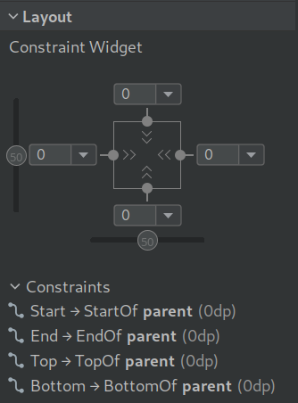
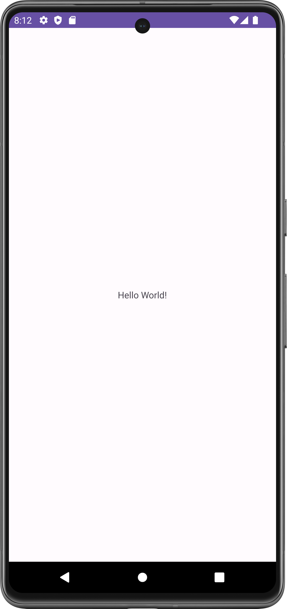
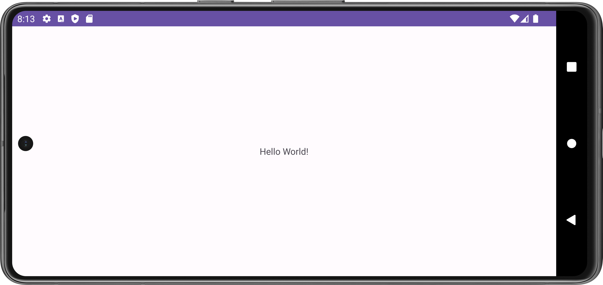
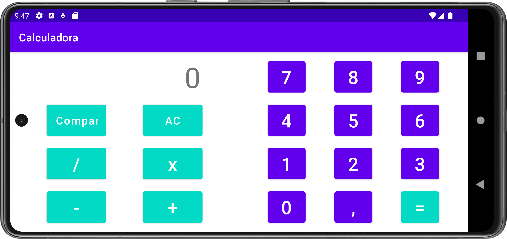
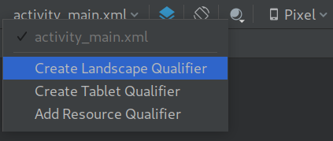

# Android UI bidezko interfazeak {#interfaces-con-android-ui}

Android Studio bidez Android gailuetarako interfazeak sortzerakoan, sortzen ari garen aplikazioaren arabera, bi modutara sor daitezke:

* **[XML bidezko ikuspegi-diseinua](https://developer.android.com/develop/ui/views/layout/declaring-layout?hl=es-419)**: [XML](https://es.wikipedia.org/wiki/Extensible_Markup_Language) fitxategien bidez sortzen dira, eta editore baten bidez elementu desberdinak, murrizketak... kokatu ahal izango ditugu. Proiektua ondo funtzionatzeko eta konpilatzeko, fitxategi hauek XML estandarra bete behar dute eta baliozko fitxategiak izan behar dute. Hau zen ikuspegiak sortzeko jatorrizko sistema.
* **[Jetpack Compose](https://developer.android.com/courses/jetpack-compose/course?hl=es-419)**: *framework* bat da, [Kotlin](https://kotlinlang.org/docs/home.html) erabiliz, erabiltzaile-interfazeak modu deklaratiboan sortzeko. Kasu honetan, interfazeak izango dituen osagaiak programatzen dira.

Proiektu berean ikuspegiak modu desberdinetan sor daitezke, beraz, XML erabiliz sortu zen proiektu zahar batean, ikuspegiak Compose formatura migratu ditzakegu Kotlin erabiltzen badugu.

## Bi ereduen arteko desberdintasunak

Zein sistema aukeratu erabakitzerakoan, bakoitzean dugun ezagutzaren araberakoa izango da, baina jarraian taula konparatibo txiki bat erakusten da:

<!-- TODO: crear una tabla con esto -->
* **XML**:
  * Abantailak:
    * **Kontzeptuen bereizketa**: Ikuspegia eta logika argi bereizten dira
    * **WYSIWYG editorea**: Android Studiok editore bisual bat du, ikuspegiaren osagaiak kokatzeko aukera ematen duena. Garatzaile batzuentzat intuitiboagoa izan daiteke. WYSIWYG = *What You See Is What You Get*.
    * **Birziklapena**: XML txantiloi/*layout*ak sor daitezke, hainbat *activity*etan erabil daitezkeenak.
  * Desabantailak:
    * **Mugatua**: Interfaze konplexuak sortzerakoan, XML formatuak muga batzuk ditu eta Java/Kotlin kodearekin konpondu behar dira.
    * ***Verbosity***: XML fitxategiak konplexuak eta errepikakorrak izan daitezke. Horrek ikuspegi konplexuak mantentzea zaildu dezake.
* **Jetpack Compose**
  * Abantailak:
    * **Sintaxi deklaratiboa** interfaze konplexuak sortzea errazten duena
    * **Tipatze segurua**: Kotlin kodea denez, tipatze-akatsak eta exekuzioan erroreak izateko aukera murrizten da.
    * **Modularitatea**: Jetpack Compose-k interfazeko osagai berrerabilgarriak sortzea sustatzen du. Honek aplikazioa mantentzea eta eskalagarritasuna errazten du.
    * **"Live preview"**: Kodean ikuspegia sortzen den heinean aurrebista ikus daiteke.
  * Desabantailak:
    * **Ikasketa-kurba** hasieran gogorra izan daiteke.
    * **Bateragarritasuna**: Gaur egun ez luke arazoa izan behar, baina soilik erabil daiteke **Android 5.0 (API level 21)** edo berriagoarekin.
    * Soilik Kotlin-ekin erabil daiteke.


# Ikuspegiak XML bidez diseinatzea {#vistas-con-xml}

Jarraian proiektu bat nola sortzen den azaltzen da, non lehenetsita ***MainActivity*** sortuko zaigun XML formatuan ikuspegi batekin, *Android View* izenez ezaguna. Hau da, ikuspegiak sortzeko sistema zaharra.

Ikuspegien fitxategiak lehenetsita [src/main/res/layout]{.configdir} rutan daude gure proiektuan. Ez da ohikoa fitxategi hauek Android Studio-tik kanpo editatzea, baina non gordetzen diren jakitea garrantzitsua da.

## Gure lehen proiektua sortzen {#creando-nuestro-primer-proyecto}

Android Studio ireki ondoren, proiektu berri bat sortuko dugu eta "Empty Views Activity" aukeratuko dugu; horrela, sortuko den proiektuak lehen ikuspegi bat izango du testu zentratua duena.

{width="75%"}

Hurrengo urratsean proiektuaren izena, bidea, programazio-lengoaia eta erabiliko dugun SDK aukeratuko ditugu. Aukeratutako aukerekin, proiektua eta beharrezko fitxategiak sortzen hasiko da aplikazioa funtziona dezan.

Ezkerreko menuan (Android aukera hautatuta) [app/res/layout]{.configdir} rutaraino zabaltzen badugu, [activity_main.xml]{.configfile} izeneko fitxategi bat dugula ikusiko dugu, eta klik eginez ikuspegi hau ikusiko dugu:

{width="100%"}

## "Diseinu", "blueprint" eta kode ikuspegia {#vista-diseño-blueprint-y-código}

Ikuspegiekin elkarreragitean hiru aukera izango ditugu:

-   **Diseinu ikuspegia**: Erabiltzaileak ikusiko duenaren antzekoena da. Horrela, interfazeak dituen elementuak eta edukia ikus ditzakegu.

-   **Blueprint ikuspegia**: "Cianotipo" edo plano ikuspegia ere deitua. Ingeniaritza planoak simulatzen ditu eta hemen elementu bakoitzaren mota bakarrik ikusiko dugu. Edukitik abstraitzeko eta diseinuan zentratzeko egokia da.

-   **XML kodea**: Ikuspegiaren XML fitxategiaren edukia da. Testua aldatuz aldaketak egin ditzakegu. Parametro zehatz bat aldatu nahi badugu, hau da ikuspegi egokiena.

## Interfazeko osagaiak {#componentes-en-el-interfaz}

:::::::::::::: {.columns }
::: {.column width="60%"}
Android Studio-k interfazeak sortzerakoan hainbat osagai eskaintzen ditu, zuzenean arrastatu eta interfazean kokatu daitezkeenak.

Argi izan behar da bakoitzak bere ezaugarriak dituela, beraz, garrantzitsua da [dokumentazio ofiziala](https://developer.android.com/reference/android/widget/EditText) kontsultatzea bakoitza erabiltzerakoan.
:::
::: {.column width="30%" }
{width="100%"}
:::
::::::::::::::

## Layout-ak eta constraints-ak {#layouts-y-constraints}

Hasierako ikuspegiarekin, "Hello World!" testua hautatzen badugu, ***Layout*** atalean honako konfigurazioa ikusiko dugu:

:::::::::::::: {.columns }
::: {.column width="60%"}
4 *constraint* identifika daitezke, osagaiaren puntu desberdinei dagozkienak:

-   ***Start***: Osagaiaren ezkerreko aldea.

-   ***End***: Osagaiaren eskuineko aldea.

-   ***Top***: Goiko aldea.

-   ***Bottom***: Beheko aldea.
:::
::: {.column width="35%" }
{width="100%"}
:::
::::::::::::::

Horrela, osagai bakoitzaren zati bakoitzak *constraint* bat izango du, kasu honetan, guraso *layout*-aren zati bati lotuta. XML fitxategiaren kodea begiratuz gero, bakoitza nola idatzita dagoen ikus daiteke:

::: mycode
[TextView baten XML kodea]{.title}
```xml
<TextView
    android:id="@+id/textView"
    android:layout_width="wrap_content"
    android:layout_height="wrap_content"
    android:text="Hello World!"
    app:layout_constraintBottom_toBottomOf="parent"
    app:layout_constraintEnd_toEndOf="parent"
    app:layout_constraintStart_toStartOf="parent"
    app:layout_constraintTop_toTopOf="parent" />
```
:::

Interfazean botoi bat gehitzen badugu, pantailaren behealdean, zentratuta eta nahi dugun posizioan, simulagailuan exekutatzean ez da agertuko nahi genuen posizioan.

::: errorbox
**XML-ko "layout_editor" atributuak editorearen ikuspegirako bakarrik dira, ez azken ikuspegirako. Elementuak behar bezala kokatzeko constraints erabili behar dira.**
:::

Horregatik, interfazean gehitu nahi dugun osagai bakoitzak bere *constraint*ak izan behar ditu beste osagai edo guraso *layout*-arekin. Ez badugu bat gehitu edo ikuspegian zerbait ez badago ondo, interfazean honako hau agertuko da:

{width="40%"}

Osagaiak beste osagai batzuei lotuta egon daitezke, baina ez dute zertan elkarri lotuta egon. Adibidez, hurrengo ikuspegian, horizontalean honako hau ikus daiteke:

:::::::::::::: {.columns }
::: {.column width="60%"}
-   "Hello World" testua guraso layout-aren bi aldeetara lotuta dago, eta horregatik agertzen da zentratuta.

-   "Hello3" testua duen osagaia testua baino zabalagoa da (***layout_width*** atributua). Ezkerrean beste osagaiari lotuta dago eta eskuinean ikuspegiari, eta horregatik bien artean agertzen da.
:::
::: {.column width="30%" }
{width="100%"}
:::
::::::::::::::

### Kateak {#cadenas}

[Kateak](https://developer.android.com/develop/ui/views/layout/constraint-layout#constrain-chain) osagai (edo ikuspegi) talde bat elkarri lotzeko balio dute, bi norabidetan. Kateak bertikalki eta horizontalki egin daitezke. Hiru elementu zentratuekin kate bertikalaren adibidea:

{width="30%" framed=true}

## Ikuspegi bertikala eta horizontala {#vista-vertical-y-horizontal}

Gure gailuek posizioa biratu dezakete, eta beraz, pantailan agertzen diren osagaiak posizio berrira egokitu beharko lirateke.

Horregatik, interfazeak diseinatzerakoan, osagaien posizioarekin zer egin pentsatu behar dugu: posizioz aldatzen diren, ezkutatzen diren, menu gisa bihurtzen diren...

Lehenetsita, gailua biratzean, osagaiak mugituko dira konfiguratutako ***layout*** eta ***constraint***-en arabera. Proiektua sortzean sortutako ikuspegian, gailua biratzean hau gertatuko da:

:::::::::::::: {.columns }
::: {.column width="30%"}
{width="100%"}
:::
::: {.column width="60%" }
{width="100%"}
:::
::::::::::::::

Ikus daitekeenez, "Hello World!" testua ikuspegiaren erdigunean mantentzen da, testuak interfazearekin dituen constraints-ak direla eta.

### Ikuspegiak bereizten {#diferenciando-las-vistas}

Gailuaren posizio desberdinetarako ikuspegi desberdinak izan nahi baditugu, baliteke elementu guztiak ez izatea interesatzen, edo ez egotea leku berean.

Adibidez, iOS kalkulagailuak gailua biratzean aukera gehiago eskaintzen ditu, kalkulagailu zientifiko bihurtuz.

:::::::::::::: {.columns }
::: {.column width="10%"}
:::
::: {.column width="20%"}
{width="100%"}
:::
::: {.column width="10%"}
:::
::: {.column width="40%" }
{width="100%"}
:::
::: {.column width="10%"}
:::
::::::::::::::

Ikuspegi bat sortzen badugu "*landscape*" modurako aldaketarik egin gabe, honako emaitza lortuko dugu:

:::::::::::::: {.columns }
::: {.column width="30%"}
{width="100%"}
:::
::: {.column width="60%" }
{width="100%"}
:::
::::::::::::::

Ikus daitekeenez, botoien kokapena berdina da bi ikuspegietan, baina modu horizontalean ez da erabilgarria. Emaitza ikusgarria izan arren, ikuspegiak ez luke zentzurik izango.

Aldiz, ikuspegi apaisaturako konposizio desberdina egiten badugu, emaitza hobea lortuko dugu, elementuak beste modu batean kokatuta, erabilgarriagoa izanik.

{width="70%"}

Ikuspegi bereiziak izateko, ikuspegi apaisatua sortu behar dugu dagoen ikuspegiaren gainean. Horretarako, ikuspegiaren editorean, desplegablean klik egin eta "*Create Landscape Qualifier*" hautatu beharko dugu.

Honek proiektuaren zuhaitzean jatorrizko ikuspegiaren izena duen karpeta bat eta bi fitxategi sortuko ditu: jatorrizkoa eta beste bat, "*land*" gehituta, apaisatuaren bertsioa dela identifikatzeko.

:::::::::::::: {.columns }
::: {.column width="35%"}
{width="100%"}
:::
::: {.column width="35%" }
{width="100%"}
:::
::::::::::::::

Honi esker, ikuspegi berri bat sortuko da, jatorrizko ikuspegiaren elementu guztiekin, constraints-ak mantenduz. **xml** fitxategi berria ikuspegi apaisatuentzako sortutako direktorioan egongo da: [app/src/main/res/layout-land]{.configdir}.

## Interfazeari funtzionalitatea ematea {#dando-funcionalidad-al-interfaz}

Android-erako programatzen nola egiten den sakondu ez arren, adibide txiki bat gehituko da botoi bat eta testu bat nola funtzionatzen duten eta elkarrekin nola elkarreragin ulertzeko.

Ideia da:

-   Botoi bat eta TextView bat dituen interfaze bat sortzea.
-   Botoia sakatzean, TextView-aren jatorrizko testua desagertzen da eta botoia zenbat aldiz sakatu den erakusten du.

Hau kontuan hartuta, **MainActivity.kt** fitxategiaren kodea honela geratuko litzateke:

::: mycode
[Botoi bat funtzionatzeko Kotlin kodea]{.title}

```kotlin
//... imports previos
import android.widget.Button
import android.widget.TextView

class MainActivity : AppCompatActivity() {

    var contador:Int = 0

    override fun onCreate(savedInstanceState: Bundle?) {
        //... código ya existente

        val button:Button = findViewById(R.id.button)
        val text:TextView = findViewById(R.id.textView)

        button.setOnClickListener {
            contador = contador+1
            text.text= (contador).toString()
        }
    }
}
```
:::

::: questionbox
**Zer gertatzen da datuekin pantaila biratuz gero?**
:::

# Jetpack Compose bidezko ikuspegiak diseinatzea {#vistas-jetpack-compose}

Kasu honetan, proiektua "Empty Activity" aukera hautatuz sortuko dugu, eta horrek proiektu bat sortuko du lehenetsita ***MainActivity*** klasearekin, ikuspegiak sortzeko sistema berria **Jetpack Compose** erabiliz, eta beraz sintaxi deklaratiboa erabiliz.

Proiektua sortzen amaitzean, ikuspegiaren *Split* sistema erabiltzen badugu, iturburu kodearen ondoan mezua ikusiko dugu, ikuspegia "eraiki" eta eguneratu behar dugula denbora errealean emaitza ikusteko. Klik eginez gero, ikuspegia eraikiko da eta ordutik aurrera denbora errealean aurrebista izango dugu, hemen agertzen den bezala:

:::::::::::::: {.columns }
::: {.column width="10%"}
:::
::: {.column width="50%"}
{width="100%"}
:::
::: {.column width="30%" }
{width="100%"}
:::
::: {.column width="10%"}
:::
::::::::::::::

## Sortutako ikuspegi lehenetsia ulertzen {#entendiendo-vista-inicial}

Proiektuak sortu digun ikuspegiak hainbat atal ditu, aldaketak egiteko eta aurrebistan zer gertatzen ari den ulertzeko.

### Ikuspegi *widget* bat sortzen duen funtzioa {#funcion-genera-widget}

Aurrean esan bezala, *Compose*-k ikuspegiak, **edo haien zatiak**, berrerabilgarriak izatea bilatzen du. Kasu honetan, proiektua sortzeko laguntzaileak `fun Greeting(...)` funtzioa sortu digu, **Text** motako osagai txiki bat sortzen eta bistaratzen duena, funtzioari pasatzen zaion parametroa eta posible den beste bat erabiliz (geroago hitz egingo dugu horiei buruz).

::: mycode
[Testua sortzen duen widget-a]{.title}

```kotlin
@Composable
fun Greeting(name: String, modifier: Modifier = Modifier) {
    Text(
        text = "Hello $name!",
        modifier = modifier
    )
}
```
:::

Funtzio honetatik interesgarria dena `@Composable` anotazioa da, "konponagarritasuna" duten funtzio guztiek izan behar dutena. `@Composable` honek Compose konpiladoreari adierazten dio funtzio hau datuak IU bihurtzeko diseinatuta dagoela.

### Compose-ren aurrebista {#vista-previa}

Compose erabiltzean dugun abantaila bat da interfazeak idazten ditugun heinean aurrebista izan dezakegula, terminalaren emuladorea erabili beharrik gabe, eta horrek **baliabide gutxiago kontsumitzea** dakar. Aurrebista sortzen duen funtzioak `@Preview` anotazioa du, eta hainbat parametro gehi dakioke.

::: mycode
[Aurrebista sortzen duen funtzioa]{.title}

```kotlin
@Preview(showBackground = true)
@Composable
fun GreetingPreview() {
    JetpackTheme {
        Greeting("Android")
    }
}
```
:::

Aurrean ikusi den bezala, "Hello Android" erakusten duen aurrebista dugu, baina ikuspegi honek **ez du interfaze erreala simulatzen**. Ez da txarra, interfazean edo sortzen ari garen widget-ean soilik zentratu gaitezkeelako.

Interesatzen zaizkigun aurrebista adina izan ditzakegu, gailu desberdinetarako, modu argi/ilunean... Aurrebista berriak sortzeko, `@Preview` anotazio berri bat gehitu behar dugu interesatzen zaizkigun parametroekin. Adibidez:

::: mycode
[Parametro desberdinekin aurrebista berriak]{.title}

```kotlin
@Preview(showBackground = true, showSystemUi = true, 
    uiMode = Configuration.UI_MODE_NIGHT_YES)
@Preview(showBackground = true, showSystemUi = true,
    device = "id:pixel_fold")
@Preview(showBackground = true, showSystemUi = true,
    device = "spec:width=411dp,height=891dp,orientation=landscape")
```
:::

Adibide hauetan hainbat parametro gehitu dira `@Preview` anotazioari:

* **showSystemUi**: gailu batean exekutatzen ari balitz bezala erakusten du interfaze osoa.
* **uiMode**: [Configuration.UI_*](https://developer.android.com/reference/android/content/res/Configuration#UI_MODE_NIGHT_YES) balioak onartzen ditu. Adibidean, gaueko modua erabiliko du.
* **device**: gailu zehatz bat adierazi dezakegu bere **id**-arekin.
  * Gure gailu mota propioa sor dezakegu **spec:** parametroarekin, orientazioa ere adierazi dezakegu.

Aukera gehiago daude [dokumentazio ofizialean](https://developer.android.com/develop/ui/compose/tooling/previews?hl=es-419).

### MainActivity-ko ikuspegia {#vista-mainactivity}

Aurreko guztia ikusita, orain gure **MainActivity** klaseko funtzio nagusian zer gertatzen den ulertzeko garaia da, aplikazioa abiaraztean exekutatuko dena, aurreko proiektuan bezala, **onCreate**.

::: {.mycode size=small}
[MainActivity Jetpack Compose kodearekin]{.title}

```kotlin
class MainActivity : ComponentActivity() {
    override fun onCreate(savedInstanceState: Bundle?) {
        super.onCreate(savedInstanceState)
        enableEdgeToEdge()
        setContent {
            JetpackTheme {
                Scaffold(modifier = Modifier.fillMaxSize()) { innerPadding ->
                    Greeting(
                        name = "Android",
                        modifier = Modifier.padding(innerPadding)
                    )
                }
            }
        }
    }
}
```
:::

Funtzio honetan **setContent** blokeak jardueraren diseinua definitzen du, eta bertan konposagarriak diren funtzioak deitzen dira. Funtzio hauek soilik mota bereko beste funtzio batzuetatik deitu daitezke.

Ondoren, dena **JetpackTheme** barruan dago, hau [ui/theme/Theme.kt]{.configfile} fitxategian deklaratuta dagoen funtzio bat da. Funtzio honek gailua modu argian edo ilunean dagoen bereizten du, sortu dugun gaia erabiliz.

## Elementuen antolamendua {#disposicion-elementos}

Interfazeak sortzerakoan, elementuen konposizioa/antolamendua (*layout* ingelesez) pentsatu behar dugu. [Dokumentazio ofizialean](https://developer.android.com/develop/ui/compose/layouts/basics) antzeko adibide bat dago, eta gomendagarria da begiratzea.

Honako interfaze sinple hau suposatuko dugu, ezkerrean interfaze finala nola geratuko litzatekeen eta eskuinean elementuen antolamendua nabarmentzen duen irudia.

:::::::::::::: {.columns }
::: {.column width="48%"}
{width="100%"}
:::
::: {.column width="48%" }
{width="100%"}
:::
::::::::::::::

::: center
[Benetako ikuspegia eta antolamendua]{.footnotesize}
:::

Diseinatutako antolamendua ikusita, programazio deklaratibora bihurtzerakoan sortu ditugun atal desberdinak eta osagaiak nola kokatuko diren ulertu behar dugu. [Komponenteak](https://developer.android.com/develop/ui/compose/components) nola kokatzen diren ulertzea garrantzitsua da.

Composer-ekin programazioan lehen iterazio bat honela geratuko litzateke. Osagaiak edukiarekin *hardcodeatuta* daude, eta sortutako funtzioak beti edukia bera erakutsiko du. Bordeak jarrita hobeto ikusiko genuke non hasten den osagai bakoitzak.

:::::::::::::: {.columns }
::: {.column width="67%"}

::: {.mycode size=scriptsize}
[Compose kodearekin funtzioa]{.title}

```kotlin
@Composable
fun Post() {
    Column {
        Column {
            Text("title")
            Text("subtitle")
        }
        Image(
            painter = painterResource(R.drawable.dragon),
            contentDescription = null
        )
        Text("Lorem ipsum dolor sit amet, conse...")
        Row {
            Column {
                Image(
                    painter = painterResource(R.drawable.goku),
                    contentDescription = null
                )
            }
            Column {
                Text("Author")
                Text("2024-09-01")
            }
        }
    }
}
```
:::

:::
::: {.column width="30%" }
{width="100%"}
:::
::::::::::::::

Kodean, elementuak kokatzeko honako funtzioak erabili dira:

* **[Column](https://developer.android.com/reference/kotlin/androidx/compose/foundation/layout/package-summary#Column(androidx.compose.ui.Modifier,androidx.compose.foundation.layout.Arrangement.Vertical,androidx.compose.ui.Alignment.Horizontal,kotlin.Function1))**: seme osagai guztiak sekuentzia bertikalean jartzen ditu.
* **[Row](https://developer.android.com/reference/kotlin/androidx/compose/foundation/layout/package-summary#Row(androidx.compose.ui.Modifier,androidx.compose.foundation.layout.Arrangement.Horizontal,androidx.compose.ui.Alignment.Vertical,kotlin.Function1))**: seme osagaiak sekuentzia horizontalean kokatzeko.

## Elementuen modifikatzaileak {#modificadores-elementos}

Aurreko funtzioak Composer-en funtzioak erabiliz elementuak kokatzen ditu, baina interfaze atsegina eta azken emaitza lortzeko, elementu bakoitzari modifikatzaileak gehitu behar dizkiogu. Hemen erabakiko dugu "nola polit egin" interfaze hori.

::: errorbox
Modifikatzaileak bloke mailan edo elementu mailan gehi daitezke. Modifikatzaileen lehentasunekin kontuz ibili behar da.
:::

[Modifikatzaileak](https://developer.android.com/develop/ui/compose/modifiers-list) bloke mailan edo elementu mailan gehi daitezke, eta erabilitako adierazpen motarekin kontuz ibili behar da, batzuk besteek baino lehentasun handiagoa dutelako.

Modifikatzaile desberdinak gehituz, kodea honela geratuko litzateke:

:::::::::::::: {.columns }
::: {.column width="53%"}

::: {.mycode size=tiny}
[Modifikatzaile desberdinak gehituta]{.title}

```kotlin
@Composable
fun Post() {
    Column (
        modifier = Modifier // FALTA CÓDIGO
    ) {
        Column (
            horizontalAlignment = Alignment.CenterHorizontally,
            modifier = Modifier
                .padding(10.dp)
                .fillMaxWidth()
                // FALTA CÓDIGO
        ) {
            Text(
                text = "title",
                modifier = Modifier.padding(bottom = 15.dp)
            )
            Text("subtitle")
        }
        Image(
            painter = painterResource(R.drawable.dragon),
            contentDescription = null
        )
        Text(
            text = "Lorem ipsum dolor sit amet, conse...",
            modifier = Modifier // FALTA CÓDIGO
        )
        Row (
            verticalAlignment = Alignment.CenterVertically,
            modifier = Modifier // FALTA CÓDIGO
        ){
            Column {
                Image(
                    painter = painterResource(R.drawable.goku),
                    contentDescription = null,
                    modifier = Modifier
                        .clip(CircleShape)
                        .background(color = Color.LightGray)
                        .size(100.dp)
                        .padding(5.dp)
                )
            }
            Column (
                Modifier.padding(start = 10.dp)
            ) {
                Text("Author")
                Text("2024-09-01")
            }
        }
    }
}
```
:::

:::
::: {.column width="44%" }
{width="100%" framed=true}
:::
::::::::::::::

Modifikatzaile desberdinak gehitu dira bai zutabe/errenkada mailan, bai azken osagai mailan. Kodea nahiko auto-azalgarria da. Adibideko kodea ez dago osorik, iruzkinak gehitu dira falta den kodea adierazteko, modifikatzaileetan ertzak marrazteko. **Ertzak elementu multzo bakoitzaren antolamendua ikustea errazten dute**

::: exercisebox
Osatu aurreko kodea ertzen modifikatzaileak gehituz, erakutsitako irudira ahalik eta gehien hurbiltzeko.
:::

::: exercisebox
Aldatu aurreko kodea, testuen edukia parametro gisa jasotzeko.
:::

### "Alfer"/lazy osagaiak {#composer-componentes-lazy}

Adibidean *Column* eta *Row* konposizio sistemak erabiltzen ari gara elementuak kokatzeko. Elementu gutxi edo seme kopuru finitua dugunean, sistema hauek erabiltzea zuzena da. Arazoa sortzen da seme kopuru zehaztugabea dugunean, adibidez elementu zerrenda bat. Kasu hauetan ***LazyColumn*** (edo errenkadentzako ***LazyRow***) erabiliko dugu, pantailan dauden elementuak bakarrik renderizatuko baititu, kasu hauetan eraginkorragoa izanik.

### Modifikatzaile berrerabilgarriak {#modificadores-reusables}

Modifikatzaile berdinak hainbat osagaitan erabiltzen baditugu, aldagaia sor dezakegu eta osagai desberdinetan esleitu.

## Ikuspegi bertikala eta horizontala {#composer-vertical-horizontal}

Orain arte sortu dugun adibidearekin gailua biratzen badugu, elementuen antolamendua ondo mantentzen da, baina **ez dugu *scroll*-ik**. *Column* osagaiak ez du scroll-a lehenetsita, beraz, modifikatzaile nagusian gehitu behar dugu:

::: mycode
[Modifikatzaile desberdinak gehituta]{.title}

```kotlin
@Composable
fun Post() {
    Column (
        modifier = Modifier // FALTA CÓDIGO
            .verticalScroll(rememberScrollState())
    ) {
        //...
    }
}
```
:::

Horrela, ikuspegi horizontalean gure aplikazioak *scroll* izango du, zutabe nagusiari ezaugarri hori gehitu diogulako.

Bestalde, ikuspegiaren konposizioa gailua bertikalean edo horizontalean dagoenaren arabera desberdindu nahi badugu, honela egin dezakegu:

::: mycode
[Konposizio desberdina bertikalean edo horizontalean]{.title}

```kotlin
// Uneko konfigurazioa hartzen dugu
val configuration = LocalConfiguration.current

// Egoeraren arabera konposizio desberdina egiten dugu
when (configuration.orientation) {
    Configuration.ORIENTATION_LANDSCAPE -> {
        LandscapeScreenComposition()
    }
    else -> {
        VerticalScreenComposition()
    }
}
```
:::

## Gai pertsonalizatuak sortzea {#composer-tema-personalizado}

Aplikazioa sortzerakoan interesgarria izan daiteke "gai" (ingelesez *theme*) pertsonalizatua izatea. "Gai" hauek aplikazioaren koloreei, tipografiari... egiten diete erreferentzia. Gai hau desberdina izango da gailua modu "argian" edo "ilunean" dagoenaren arabera.

::: infobox
Aplikazioen pertsonalizazioa "gai"/themes bidez egiten da, normalean kolore korporatiboak, letra motak, tamainak...
:::

Proiektua sortzean [ui/theme]{.configdir} izeneko direktorio bat dagoela ikusiko dugu, [MainActivity.kt]{.configfile} fitxategia dagoen bide berean. Bertan hiru fitxategi aurkituko ditugu, eta gomendagarria da haien edukia ikustea:

* **Color.kt**: Aplikazioan erabiliko diren koloreak dituen aldagaiak ditu. Koloreak hainbat modutan defini daitezke eta "Alpha" tartea (opakutasuna) izan dezakete. [Kolore sistema propioa](https://m3.material.io/styles/color/system/overview) sor dezakegu eta hainbat [rol](https://m3.material.io/styles/color/roles) erabil ditzakegu aplikazioan.

::: errorbox
Kolore sistema ona sortzeak gure marka/enpresa besteengandik bereiz dezake.
:::

* **Type.kt**: Fitxategi honetan [tipografiak](https://m3.material.io/styles/typography/overview), letra mota, mota, tamaina... definitzen dira. Lehenetsita hiru eskala daude ("**Large**", "**Medium**" eta "**Small**") hurrengo [rolentzat](https://m3.material.io/styles/typography/applying-type):
  * **Display**: Pantailako testurik handiena, testu labur edo zenbakietarako. Pantaila handietan hobe funtzionatzen dute. Normalean letra "adierazgarriak", eskuz idatzitakoak erabiltzen dira.
  * **Headline**: Pantaila txikiagoetan testu laburretarako egokiak. Testu pasarteak edo edukiko atal garrantzitsuak markatzeko erabilgarriak.
  * **Title**: Erdi-mailako garrantzia duten testu laburretarako erabili behar dira.
  * **Body**: Testu luzeetarako erabiltzen da. Letra oso adierazgarriak edo apaingarriak saihestu behar dira, irakurtzeko zailagoak izan daitezkeelako.
  * **Label**: Osagaien barruko testurako erabiltzen da. Adibidez, botoiek ***LabelLarge*** estiloa erabiltzen dute.

  Estiloen azalpena eta tipografia desberdinen adibideak [hemen](https://m3.material.io/styles/typography/applying-type) eta [Github-eko adibide proiektu honetan](https://github.com/android/codelab-android-compose/blob/main/BasicLayoutsCodelab/app/src/main/java/com/codelab/basiclayouts/ui/theme/Type.kt).
* **Theme.kt**: Gaiaren fitxategi nagusia da, eta aurreko fitxategietan zehaztutakoa erabiltzen du. Proiektu berri baten fitxategiak honako hau dauka:

::: {.mycode size=footnotesize}
  [Theme.kt fitxategia]{.title}

```kotlin
package com.example.jetpack.ui.theme    
//... 
private val DarkColorScheme = darkColorScheme(
    primary = Purple80,
    secondary = PurpleGrey80,
    tertiary = Pink80
)

private val LightColorScheme = lightColorScheme(
    primary = Purple40,
    secondary = PurpleGrey40,
    tertiary = Pink40
)

@Composable
fun JetpackTheme(
    darkTheme: Boolean = isSystemInDarkTheme(),
    // Dynamic color is available on Android 12+
    dynamicColor: Boolean = true,
    content: @Composable () -> Unit
) {
    val colorScheme = when {
        dynamicColor && Build.VERSION.SDK_INT >= Build.VERSION_CODES.S -> {
            val context = LocalContext.current
            if (darkTheme) 
                dynamicDarkColorScheme(context) 
            else
                dynamicLightColorScheme(context)
        }
        darkTheme -> DarkColorScheme
        else -> LightColorScheme
    }

    MaterialTheme(
        colorScheme = colorScheme,
        typography = Typography,
        content = content
    )
}
```
:::

* **Shapes.kt**: Proiektu berri batean ez da fitxategi hau sortzen, baina [adibide honetan](https://github.com/android/codelab-android-compose/blob/main/BasicLayoutsCodelab/app/src/main/java/com/codelab/basiclayouts/ui/theme/Shape.kt) bere edukia ikus daiteke. Fitxategi honetan aplikazioan erabil daitezkeen [formak](https://m3.material.io/styles/shape/shape-scale-tokens) alda daitezke.

::: exercisebox
Badira hainbat tutorial ([1. tutoriala](https://developer.android.com/codelabs/basic-android-kotlin-compose-material-theming?hl=es-419#0) eta [2. tutoriala](https://developer.android.com/codelabs/jetpack-compose-theming?hl=es-419)) kolore propioekin gaiak sortzeko.
:::

::: infobox
[Material Theme Builder](https://material-foundation.github.io/material-theme-builder/) tresnak gure gai pertsonalizatua sortzen laguntzen digu.
:::

## Gertaerak Compose-n

[Dokumentazio ofizialak](https://developer.android.com/develop/ui/compose/state?hl=es-419) dioen bezala, Compose deklaratiboa da eta, beraz, eguneratzeko modu bakarra konposagarritasuna duen elementuari argumentu berriak pasatzea da. Argumentu hauek IU-aren egoeraren adierazpenak dira. Egoera eguneratzen den bakoitzean, ***berrikomposizioa*** gertatzen da.

- **Konposizioa**: Jetpack Compose-k IU-aren deskribapena egiten du konposagarritasun elementuak exekutatzean.
- **Hasierako konposizioa**: Konposizio baten sorrera, konposagarritasun elementuak lehen aldiz exekutatzean.
- **Berrikomposizioa**: Konposagarritasun elementuak berriro exekutatzea, datuak aldatzen direnean konposizioa eguneratzeko.

::: errorbox
**Konposagarritasuna duen elementuari espresuki jakinarazi behar zaio egoera berria, behar bezala eguneratzeko.**
:::

**Compose-k jakin behar du zein egoerari jarraipena egin behar dion**, eguneraketa jasotzen duenean berrikomposizioa programatu ahal izateko. Compose-k soilik aldatu behar diren funtzioak berrikompilatuko ditu. Horretarako, Compose-ren [State](https://developer.android.com/reference/kotlin/androidx/compose/runtime/State) eta [MutableState](https://developer.android.com/reference/kotlin/androidx/compose/runtime/MutableState) motak erabiliko ditugu, Compose-k egoera behatu ahal izateko. `Mutablestate` funtzioak bere `value` eguneratu dezake egoera eguneratzeko.

Kontagailuaren adibidea egingo dugu, bere funtzioa honakoa izango litzateke:

::: {.mycode size=footnotesize}
  [Kontagailuaren funtzioa]{.title}

```kotlin
@Composable
fun Contador(modifier: Modifier = Modifier) {
    var contador: MutableState<Int> = remember { mutableStateOf(0) }

    Surface(modifier = Modifier.fillMaxSize()) {
        Column(
            horizontalAlignment = Alignment.CenterHorizontally
        ) {
            Text("${contador.value}")
            Button(
                onClick = {
                    contador.value++
                }
            ) {
                Text("Suma!")
            }
        }
    }
}
```
:::

"contador" aldagaia "MutableState" motakoa da, botoia sakatzean eguneratzen dena, eta Compose-k bere "value" eguneratu dela detektatzean, ikuspegiaren zati hori berrikompilatzen du, balio berria erakutsiz.

::: questionbox
**Zer gertatzen da datuekin pantaila biratuz gero?**
:::

::: exercisebox
Egoerei eta ikuspegiaren eguneratzeei buruz gehiago [dokumentazio honetako adibidean](https://developer.android.com/codelabs/jetpack-compose-state?hl=es-419#0) eta [beste honetan](https://developer.android.com/codelabs/basic-android-kotlin-compose-using-state?hl=es-419#0)
:::

# Android-eko *Activity*-aren bizi-zikloa {#ciclo-de-vida-del-activity-en-android}

Ikuspegiaren edukia berrezarri egiten da gailua biratzean. Hau da, **ikuspegian egon daitekeen edozein edukia, gordeta ez badago, galdu egiten da**. Hau ikuspegiaren ***Activity***-a suntsitu eta pantailaren egoera berrian berriro sortzen delako da.

::: errorbox
**Gailua biratzean *Activity*-ak suntsitze-sorkuntza zikloan sartzen da**
:::

Garrantzitsua da jakitea zer gertatzen den gailua biratzean, eta zer gertatzen den ikuspegiarekin eta aurreko planoan ditugun osagaiekin.

**[Activity-ren bizi-zikloan](https://developer.android.com/guide/components/activities/activity-lifecycle?hl=es-419)** hainbat funtzio daude, sistema bakoitzean egoera bakoitzean deituko dituenak:


](img/di/tema_2/activity_lifecycle.png){width="70%"}


Eskeman (eta [dokumentazioaren webgunean](https://developer.android.com/guide/components/activities/activity-lifecycle#alc)) egoerak eta haien trantsizioak ikus daitezke.

Orain, aldagaien egoera gorde nahi badugu egoera aldaketetan erabiltzeko, ikuspegi motaren arabera aldatuko da, XML edo Compose erabiltzen dugunaren arabera. [IU egoerak nola gorde](https://developer.android.com/topic/libraries/architecture/saving-states?hl=es-419#ui-dismissal-user) dokumentazioan zein metodo erabili behar diren azaltzen da.

## Egoerak XML-rekin mantentzea {#mantener-los-estados-xml}

Ikuspegiaren egoeren trantsizioak nola funtzionatzen duten jakinda, egoera gorde eta Activity berriro sortzean informazioa berreskuratzeko garaia da. Horretarako bi funtzio erabiliko dira:

-   **onSaveInstanceState** : Activity-a suntsitu aurretik deituko da.
-   **onRestoreInstanceState**: **onCreate** metodoa deitu eta berehala deituko da.

Aurreko adibidearekin jarraituz, botoia zenbat aldiz sakatu den gorde nahi badugu, honelako zerbait gehitu beharko genuke:

::: mycode
[Egoerak mantentzeko Kotlin kodea]{.kotlin}
```kotlin
override fun onResume(){
    super.onResume()
    Log.d("Debug","onResume")
    val text:TextView = findViewById(R.id.textView)
    text.text = contador.toString()
}

override fun onSaveInstanceState(outState: Bundle) {
    // Erabiltzailearen jokoaren egoera gorde.
    outState?.run {
        putInt("contador", contador)
    }
    // Beti deitu superklaseari ikuspegiaren hierarkia gorde dezan.
    super.onSaveInstanceState(outState)
}

override fun onRestoreInstanceState(savedInstanceState: Bundle) {
    // Beti deitu superklaseari ikuspegiaren hierarkia berreskuratu dezan.
    super.onRestoreInstanceState(savedInstanceState)
    // Egoera kideak berreskuratu gordetako instantziatik.
    savedInstanceState?.run {
        contador = savedInstanceState.getInt("contador")
    }
}
```
:::

::: exercisebox
Gehitu **MainActivity.kt**-n beharrezko funtzioak pantaila biratzean trantsizio guztiak ikusteko. Funtzioek **Logcat**-en exekutatu dena erakutsi dezatela.
:::

## Egoerak Compose-rekin mantentzea {#mantener-los-estados-compose}

[Konposagarritasun elementuen bizi-zikloa](https://developer.android.com/develop/ui/compose/lifecycle?hl=es-419) Jetpack Compose-n desberdina da, *berrikomposizioa* osagai mailan egiten baita, ez ikuspegi osoan.

Aldagaien egoera berrikomposizioen artean gordetzeko, "rememberSaveable" mota erabiliko dugu. Honek gailua biratzean aldagaien balioa mantentzea ahalbidetuko digu:

::: {.mycode size=footnotesize}
  [Egoera mantentzea]{.title}

```kotlin
@Composable
fun Contador(modifier: Modifier = Modifier) {
    var contador: MutableState<Int> = rememberSaveable { mutableStateOf(0) }
    // ...
}
```
:::

"rememberSaveable" erabiliz, egoera berrikomposizioan gordetzea ahalbidetzen digu, baina jardueraren bizi-zikloak beste egoera batzuk izan ditzakeenez, ez da beti erabilgarria izango.

::: errorbox
"rememberSaveable" erabiltzeak ez du jarduera berriz sortzean egoera gordetzen.
:::

Egoera konplexuagoak kudeatzeko, [IU egoerak nola gorde](https://developer.android.com/topic/libraries/architecture/saving-states?hl=es-419#ui-dismissal-user) eta [egoera eta Jetpack Compose](https://developer.android.com/develop/ui/compose/state?hl=es-419#store-state) dokumentazioan informazio gehiago

