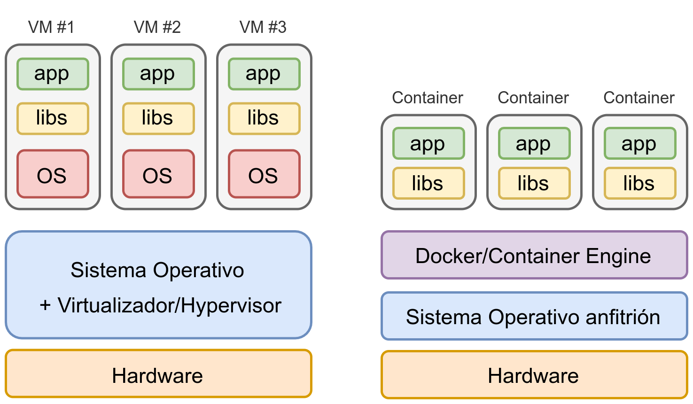

# Introducción {#introducción}

Hoy en día es muy habitual hacer uso de los sistemas de contenedores, siendo el más conocido [Docker](https://docs.docker.com/) en el mundo del desarrollo de *software*. Este sistema trae consigo una serie de ventajas que veremos más adelante, que nos permite asegurar, entre otras cosas, que las versiones utilizadas en el entorno de producción son las mismas que durante las etapas de desarrollo.

En este documento se va a explicar cómo realizar la instalación y configuración de un sistema basado en contenedores Docker para poder arrancar servicios, y ciertas configuraciones que son necesarias conocer.

# Sistemas de contenedores {#sistemas-de-contenedores}

Los sistemas de contenedores son un método de virtualización (conocido como "virtualización a nivel de sistema operativo"), en el que se permite ejecutar sobre una capa virtualizadora del núcleo del sistema operativo distintas instancias de "espacio de usuario".

Este "espacio de usuario" (donde se ejecutarán aplicaciones, servicios\...) se les denomina **contenedores**, y aunque pueden ser como un servidor real, están bajo un mecanismo de aislamiento proporcionado por el *kernel* del sistema operativo, y sobre el que se pueden aplicar límites de espacio, recursos de memoria, de acceso a disco\...

::: infobox
**Un contenedor es un espacio de ejecución de servicios al que se les puede aplicar límites de recursos (como la memoria, el acceso a disco...)**
:::

Desde el punto de vista del usuario, que un servicio se ejecute en una máquina virtual o en un contenedor es indistinguible. En cambio, desde el punto de vista de un administrador de sistemas o de un desarrollador, el uso de contenedores trae consigo una serie de ventajas que veremos en apartados posteriores.

## Un poco de historia {#un-poco-de-historia}

Aunque está muy en boga el despliegue de aplicaciones haciendo uso de contenedores, no es un concepto nuevo, ya que lleva existiendo desde la década de los 80 en sistemas UNIX con el concepto de [chroot](https://es.wikipedia.org/wiki/Chroot).

**Chroot**, también conocido como "jaulas chroot", permitían ejecutar comandos dentro de un directorio sin que, en principio, se pudiese salir de dicha ruta. Tenía muy pocas restricciones de seguridad, pero era un primer paso al sistema de contenedores.

[LXC](https://es.wikipedia.org/wiki/LXC) nace en 2008 utilizando distintas funcionalidades del kernel Linux para proveer un entorno virtual donde poder ejecutar distintos procesos y tener su propio espacio de red. Con LXC nacen distintas herramientas para controlar estos contenedores, así como para crear plantillas y una **API que permite interaccionar con LXC** desde distintos lenguajes de programación.

Ha habido otras tecnologías en Linux, como [OpenVz](https://es.wikipedia.org/wiki/OpenVZ), pero nos centraremos en Docker, ya que es lo más conocido actualmente.

## Qué es un contenedor y cómo se crea {#qué-es-un-contenedor-y-cómo-se-crea}

Para entender qué es un contenedor dentro de la infraestructura Docker y cómo se crea, tenemos que diferenciar distintos conceptos:

- **Imagen Docker**
- **Contenedor Docker**

A continuación se van a detallar en profundidad.

### Imágenes Docker {#imágenes-docker}

Para crear un contenedor necesitamos hacer uso de una **"imagen", que es un archivo inmutable (no modificable) que contiene el código de la aplicación que queremos ejecutar y todas sus dependencias necesarias**, para que pueda ser ejecutada de manera rápida y confiable independientemente del entorno en el que se encuentre.

Las imágenes, debido a su origen **sólo-lectura**, se pueden considerar como **"plantillas"**, que son la representación de una aplicación y el entorno necesario para ser ejecutada en un momento específico en el tiempo. **Esta consistencia es una de las grandes características de Docker**.

::: infobox
**Una imagen contiene el servicio que nos interesa ejecutar junto con sus dependencias, y son independientes del servidor donde se ejecuta.**
:::

Una imagen puede ser creada utilizando otras imágenes como base. Por ejemplo, la imagen de [PHPMyAdmin](https://hub.docker.com/_/phpmyadmin) empaqueta la aplicación PHPMyAdmin sobre la imagen **PHP** (versión 8.1-apache), que a su vez hace uso de la imagen **Debian** (versión 11-slim).

::: center
](img/docker/imagen1.png){width="90%"}
:::

A las imágenes creadas se les suele añadir etiquetas (**tags**) para diferenciar versiones o características internas. Cada creador determina las etiquetas que le interesa crear. Por ejemplo:

-   **latest**: Se le denomina a la última imagen creada.
-   php:**8.1-apache**: Indica que en esta imagen PHP la versión es la 8.1 y además cuenta con Apache.

Podemos utilizar imágenes públicas descargadas a través de un ***registry*** público, que no es otra cosa que un repositorio de imágenes subidas por la comunidad. El *registry* principal más utilizado es [Docker Hub](https://hub.docker.com/).

::: infobox
**Las imágenes Docker  pueden ser públicas o privadas y se almacenan en un repositorio llamado *registry*, siendo el más conocido Docker Hub**
:::

**Se pueden crear nuestras propias imágenes privadas**, que pueden ser almacenadas en nuestros equipos o a través de un **registry privado** que podemos crear (también existen servicios de pago).

### Contenedores Docker {#contenedores-docker}

Un contenedor Docker es un **entorno de tiempo de ejecución virtualizado donde los usuarios pueden aislar aplicaciones**. Estos contenedores son unidades compactas y portátiles a las que se les puede aplicar un sistema de limitación de recursos.

::: infobox
**Un contenedor se crea a través de una imagen, es la versión ejecutable de la misma que se crea en un entorno virtualizado**
:::

Un contenedor se crea a través de una imagen y es la versión ejecutable de la misma. Lo que se hace es crear una capa de escritura sobre la imagen inmutable, donde se podrán escribir datos. Se pueden crear un número ilimitados de contenedores haciendo uso de la misma imagen base.

::: center
{width="60%"}
:::

**La capa de escritura no es persistente** y se pierde al eliminar el contenedor, es decir, **los datos de un contenedor se eliminan al borrar el contendor**. Para evitar este comportamiento se puede hacer uso de un [volumen persistente de datos](#volumen-persistente-de-datos), de esta manera esos datos no se pierden.

::: errorbox
**Los datos creados dentro de un contenedor se borran al eliminar el contenedor**
:::

## Contenedores vs. Máquinas virtuales {#contenedores-vs.-máquinas-virtuales}

El uso de máquinas virtuales está muy extendido gracias a que cada vez es más sencillo crearlas. Esto no quiere decir que siempre sea la mejor opción, por lo que se va a realizar una comparativa teniendo en cuenta distintos aspectos a la hora de realizar un desarrollo con máquinas virtuales y con sistemas de contenedores.

### Infraestructura {#infraestructura}

La creación de máquinas virtuales nos permite crear entornos aislados en los que poder instalar el Sistema Operativo que más nos interese y con ello poder instalar el software y los servicios que necesitemos.

Las máquinas virtuales se virtualizan a nivel de hardware, donde debe existir un Sistema Operativo con Hypervisor que permita dicha virtualización. Por otro lado, los contenedores se virtualizan en la capa de aplicación, haciendo que este sistema sea mucho más ligero, permitiendo utilizar esos recursos en los servicios que necesitamos hacer funcionar dentro de los contenedores.

::: center
{width="85%"}
:::

En la imagen se puede apreciar una comparativa diferenciando cómo quedaría una infraestructura de 3 aplicaciones levantadas en distintas máquinas virtuales o en distintos contenedores.

Tal como se puede ver en la imagen, **al tener cada servicio en una máquina virtual separada**, se va a tener que virtualizar todo el Sistema Operativo en el que se encuentre, con el consiguiente **coste de recursos (memoria RAM y disco duro) y con el coste en tiempo de tener que realizar la configuración y securización del mismo**.

::: infobox
**Usando contenedores la infraestructura se simplifica notáblemente**
:::

Por otro lado, en un sistema de contenedores, cada contenedor es un servicio aislado, en el que sólo tendremos que preocuparnos (en principio) de configurar sus parámetros.

### Ventajas durante el desarrollo {#ventajas-durante-el-desarrollo}

A la hora de desarrollar una aplicación es habitual hacer pruebas utilizando distintas versiones de librerías, *frameworks* o versiones de un mismo lenguaje de programación. De esta manera, podremos ver si nuestra aplicación es compatible.

Cuando se hace uso de una máquina virtual dependemos de las versiones que tiene nuestra distribución y es posible que no podamos instalar nuevas versiones u otras versiones en paralelo.

Por ejemplo, la última versión de PHP actualmente es la 8.2.4 y de Apache la 2.4.56:

- En **Debian 11** sólo se puede instalar PHP 7.4 y Apache 2.4.54.
- En **Ubuntu 22.04** la versión de PHP es la 8.1 y la de Apache la 2.4.52.

Con Docker, podremos levantar contenedores con distintas versiones del servicio que nos interese en paralelo para comprobar si nuestra aplicación/servicio es compatible.

::: infobox
**Con Docker es posible levantar servicios con distintas versiones en paralelo**
:::

Por otro lado, si un desarrollador quiere utilizar un sistema operativo distinto, no se tendrá que preocupar de si su distribución tiene las mismas versiones. O en el caso de usar Windows/Mac, no tener que estar realizando instalaciones de las versiones concretas.

### Ventajas durante la puesta en producción {#ventajas-durante-la-puesta-en-producción}

Ligado al apartado anterior, durante la puesta en producción es obligatorio hacer uso de las mismas versiones utilizadas durante el desarrollo para asegurar la compatibilidad.

::: errorbox
**Para asegurar la compatibilidad en producción, siempre se debe usar la misma versión de los servicios que en desarrollo**
:::

Si tenemos un servidor que no está actualizado, o en el mismo servidor tenemos distintas aplicaciones que requieren utilizar distintas versiones de software, en un entorno de máquinas virtuales se hace muy complejo, ya que lo habitual será tener que instalar nuevas máquinas virtuales.

::: warnbox
**No siempre es posible tener distintas versiones del mismo software en un mismo servidor**
:::

En un entorno con contenedores, al igual que se ha comentado antes, esto no es problema.

### Rapidez en el despliegue {#rapidez-en-el-despliegue}

Ligado a todo lo anterior, realizar el despliegue de un entorno de desarrollo/producción es más rápido utilizando contenedores, sin importar el sistema operativo en el que nos encontremos.

::: infobox
**El despliegue con contenedores es más rápido.**
:::

Más adelante se verá cómo realizar el despliegue de distintos servicios haciendo uso de un único comando.

