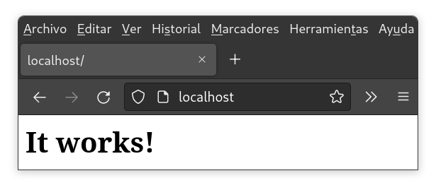
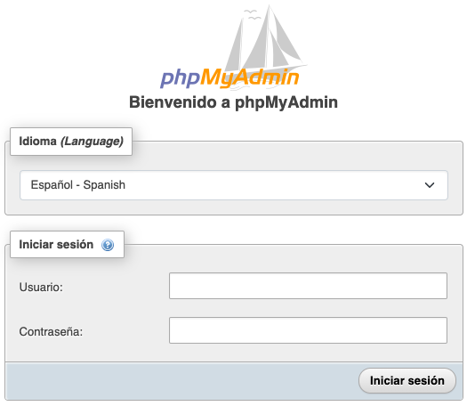
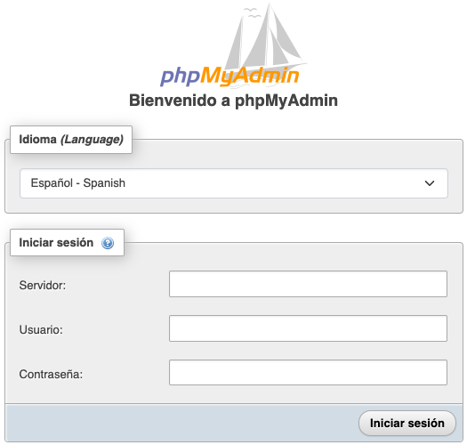
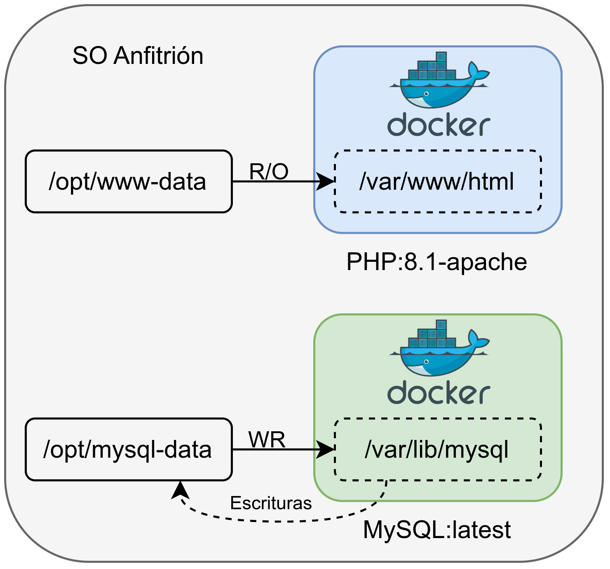
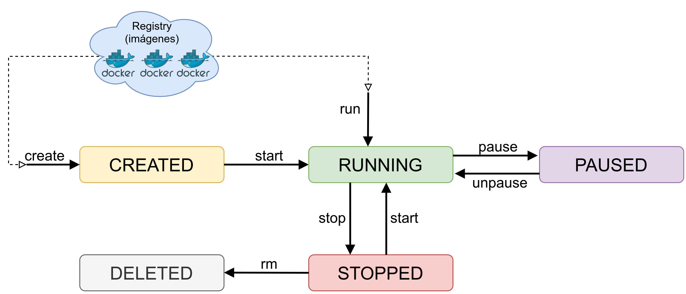

# Docker {#docker}

[Docker](https://www.docker.com/) es un proyecto de Software Libre nacido en 2013 que permite realizar el despliegue de aplicaciones y servicios a través de contenedores de manera rápida y sencilla, tal como veremos más adelante.

Estos contenedores proporcionan una capa de abstracción y permiten aislar las aplicaciones del resto del sistema operativo a través del uso de ciertas características del kernel Linux.

Dentro del contenedor, se puede destacar el aislamiento a nivel:

 - Árbol de procesos
 - Sistemas de ficheros montados
 - ID de usuario
 - Aislamiento de recursos (CPU, memoria, bloques de E/S\...)
 - Red aislada

Al igual que sucede con otro tipo de *software*, para que Docker haga uso de todas estas características, está construido haciendo uso de otras aplicaciones y servicios.

::: center
](img/docker/docker_interfaces.png){width="75%"}
:::


En el 2015 la empresa Docker creó la ***[Open Container Initiative](https://en.wikipedia.org/wiki/Open_Container_Initiative)***, proyecto actualemente bajo la Linux Foundation, con la intención de diseñar un estándar abierto para la virtualización a nivel de sistema operativo.

## Instalación {#instalación}

Dependiendo del sistema operativo en el que nos encontremos, Docker tiene la opción de instalarse de distintas maneras. En sistemas operativos GNU/Linux cada distribución tiene un paquete para poder realizar la instalación del mismo.

:::mycode
[Instalación de Docker en Ubuntu]{.title}

``` console
ruben@vega:~$ sudo apt install docker.io
```
:::

::: errorbox
El nombre del paquete en Ubuntu y Debian es "docker.io".
:::

En sistemas Windows y MacOS existe la opción de instalar [Docker Desktop](https://docs.docker.com/get-docker/), una versión que utiliza una máquina virtual para simplificar la instalación en estos sistemas.

## Configuración {#configuración}


Tras realizar la instalación veremos cómo el servicio Docker ha levantado un interfaz nuevo en nuestra máquina, cuya IP es **172.17.0.1/16**, siendo el direccionamiento por defecto.

:::mycode
[Nueva IP en el equipo]{.title}

``` console
ruben@vega:~$ ip a
...
3: docker0: <BROADCAST,MULTICAST,UP,LOWER_UP> mtu 1500 qdisc noqueue
    link/ether 02:42:9c:1f:e2:90 brd ff:ff:ff:ff:ff:ff
    inet 172.17.0.1/16 brd 172.17.255.255 scope global docker0
      valid_lft forever preferred_lft forever
```
:::

Esta IP hará de **puente** (similar a lo que sucede con las máquinas virtuales) cuando levantemos contenedores nuevos. Los contenedores estarán dentro de ese direccionamiento 172.17.0.0/16, por lo tanto, aislados de la red principal del equipo.

::: infobox
**Los contenedores que levantemos estarán en la red 172.17.0.0/16**
:::

## Usar Docker con usuario sin privilegios {#usar-docker-con-usuario-sin-privilegios}

Para evitar tener que hacer uso de Docker con usuario root, se puede añadir a los usuarios no privilegiados dentro del grupo "docker" que se ha creado durante la instalación.

Para ello, podemos editar el fichero [/etc/group]{.configfile}, y añadir el usuario al grupo, o mejor, ejecutar estos comandos que ponemos a continuación:

:::mycode
[Algunas de las opciones del comando docker]{.title}

```console
ruben@vega:~$ sudo addgroup ruben docker
[sudo] password for ruben:
Adding user `ruben' to group `docker' ...
Adding user ruben to group docker
Done.

ruben@vega:~$ newgrp docker
```
:::

A partir de ahora ya se puede hacer uso de Docker con el usuario al que hayamos añadido al grupo.

## Primeros pasos {#primeros-pasos}

El comando [docker]{.commandbox} tiene muchas opciones, por lo que es recomendable ejecutarlo sin parámetros. De esta manera se pueden ver todas las opciones y una ayuda simplificada para cada una de ellas.

:::mycode
[Algunas de las opciones del comando docker]{.title}

```console
ruben@vega:~$ docker
Usage:  docker [OPTIONS] COMMAND

Management Commands:
builder     Manage builds
completion  Generate the autocompletion script for the specified shell
config      Manage Docker configs
container   Manage containers
context     Manage contexts
image       Manage images
manifest    Manage Docker image manifests and manifest lists
network     Manage networks
node        Manage Swarm nodes
plugin      Manage plugins
secret      Manage Docker secrets
service     Manage services
stack       Manage Docker stacks
swarm       Manage Swarm
system      Manage Docker
trust       Manage trust on Docker images
volume      Manage volumes

Commands:
...
```
:::

Para cada una de estas opciones, se le puede añadir el parámetro [\-\-help]{.inlineconsole} para mostrar la ayuda. Hay un segundo apartado que se ha cortado, en el que se incluyen más comandos.

Para asegurar que el servicio Docker está funcionando, podemos hacer uso de [docker info]{.commandbox}, que nos mostrará mucha información acerca del servicio. Pero si lo que queremos es comprobar si tenemos algún contenedor corriendo, es más sencillo hacer [docker ps]{.commandbox} (que es la versión simplificada de [docker container ls]{.commandbox} ):


::: mycode
[Comprobar estado de Docker y contenedores levantados]{.title}

``` console
ruben@vega:~$ docker ps
CONTAINER ID   IMAGE     COMMAND   CREATED   STATUS    PORTS     NAMES

ruben@vega:~$ docker container ls
CONTAINER ID   IMAGE     COMMAND   CREATED   STATUS    PORTS     NAMES
```
:::

En este caso, como no hay ningún contenedor levantado, sólo muestra las cabeceras de las columnas del listado.

## Levantando nuestro primer contenedor {#levantando-nuestro-primer-contenedor}

Es momento de crear nuestro primer contenedor. Para ello, dado que se está usando la consola, hay que hacer uso del comando [docker]{.commandbox} con una serie de parámetros. En este caso se ha optado por levantar el servicio **Apache HTTPD**:

::: mycode
[Levantando el primer contenedor]{.title}

``` console
ruben@vega:~$ docker run -p 80:80 httpd
AH00558: httpd: Could not reliably determine the server's ...
AH00558: httpd: Could not reliably determine the server's ...
[Fri Mar 24 18:25:14.194246 2023] [mpm_event:notice] ...
[Fri Mar 24 18:25:14.194347 2023] [core:notice] [pid  ...
172.17.0.1 - - [24/Mar/2023:18:25:41 +0000] "GET / HTTP/1.1" 304 -
```
:::

Vemos los logs del servicio Apache al arrancar y si vamos al navegador a la dirección [http://localhost](http://localhost) muestra lo siguiente:

::: center
{width="60%"}
:::

Y para entender lo que hace el comando, los parámetros son:

- **docker**: Cliente de consola para hacer uso de Docker.
- **run**: Ejecuta un comando en un nuevo contenedor (y si no existe lo crea).
- **-p 80:80**: Publica en el puerto 80 del servidor el puerto 80 utilizado en el contenedor. Se puede pensar que es como hacer un **port-forward** en un firewall.
- **httpd**: Es la **imagen** del contenedor que se va a arrancar. En este caso, la imagen del servidor [Apache HTTPD](https://hub.docker.com/_/httpd).


Y si vemos qué muestra el estado de docker, vemos cómo aparece el contenedor levantado.

::: {.mycode size=scriptsize}
[Comprobar estado de Docker y contenedores levantados]{.title}

``` console
ruben@vega:~$ docker ps
CONTAINER ID   IMAGE     COMMAND       CREATED         STATUS         PORTS               NAMES
a1c3362b0d6c   httpd     "httpd-..."   3 seconds ago   Up 2 seconds   0.0.0.0:80->80/tcp  great
```
:::

En la columna PORTS se puede apreciar cómo aparece que se ha levantado el puerto **`0.0.0.0:80`** (escucha en el puerto 80 para cualquier IP del sistema operativo) que es una redirección al puerto **`80/TCP`** interno del contenedor.

## Contenedores en *background* y más opciones {#contenedores-en-background-y-más-opciones}

Tal como se puede ver en el ejemplo anterior, el contenedor se queda en primer plano, viendo los logs del Apache. Esto para ver qué es lo que está sucendiendo durante el desarrollo puede ser útil, pero lo ideal es que el contenedor arranque en modo ***background***, y cuando necesitemos vayamos a ver los logs.

A continuación se va a arrancar un nuevo contenedor de Apache con nuevos parámetros:

:::mycode
[Crear un contenedor Web en el puerto 8080]{.title}

``` console
ruben@vega:~$ docker run --name mi-apache -d -p 8080:80 httpd
```
:::

Los nuevos parámetros son:

- **`--name mi-apache`**: De esta manera se le da un nombre al contenedor, para poder identificarlo de manera rápida entre todos los contenedores creados.
- **`-d`**: Este parámetro es para hacer el ***detach*** del comando, y de esta manera mandar a ***background*** la ejecución del contenedor.
- **`-p 8080:80`**: Publica en el puerto 8080 del servidor el puerto 80 utilizado en el contenedor. Se puede pensar que es como hacer un **port-forward** en un firewall.


## Parar, arrancar y borrar contenedores {#parar-arrancar-y-borrar-contenedores}

Hasta ahora hemos aprendido a crear contenedores, pero en ciertos momentos nos puede interesar parar un contenedor que no estemos utilizando, o una vez haya cumplido su función, borrarlo.

### Parar contenedores {#parar-contenedores}

Para parar un contenedor, debemos conocer el nombre del mismo o su ID (que es único). Estos datos los podemos conocer a través del comando  [docker ps]{.commandbox}.

Con esto, podemos ejecutar:

::: {.mycode size=small}
[Parar un contenedor]{.title}

```console
ruben@vega:~$ docker stop mi-apache
```
:::

### Arrancar un contenedor parado {#arrancar-un-contenedor-parado}

Una vez parado un contenedor, o al reiniciar el servidor, si queremos arrancar un contenedor parado, debemos conocer también su ID o nombre.

Para visualizar todos los contenedors (tanto los arrancados como los parados), lo podemos hacer a través del comando [docker ps -a]{.commandbox}.

Gracias a ese listado, podemos volver a arrancar un contenedor que esté parado con [docker start mi-apache]{.commandbox}, siendo "mi-apache" el contenedor que queremos arrancar.

### Borrar un contenedor {#borrar-un-contenedor}

Si queremos borrar un contenedor, éste debe estar parado, ya que Docker no nos va a dejar borrar un contenedor que está en ejecución.

Es interesante borrar contenedores que hayamos creado de pruebas o contenedores que ya no se vayan a utilizar más, para de esta manera liberar recursos.

Para borrarlo, similar a los casos anteriores, se hará con [docker rm mi-apache]{.commandbox}.

# Variables de entorno {#variables-de-entorno}

Algunos contenedores tienen la opción de recibir variables de entorno al ser creados. Estas variables pueden afectar al comportamiento del contenedor, o para ser inicializado de alguna manera distinta a las opciones por defecto.

El creador de la imagen Docker puede crear las variables de entorno que necesite para después utilizarlas en su aplicación. A modo de ejemplo, se va a utilizar la imagen de la aplicación [PHPMyAdmin](https://hub.docker.com/_/phpmyadmin).

A continuación se van a crear 2 contenedores de PHPMyAdmin, diferenciados por el puerto, el nombre, y la variable de entorno **PMA_ARBITRARY**:

-   El primer contenedor va a estar en el puerto 8081, se le va a dar el nombre "myadmin-1" y no va a tener la variable de entorno incializada.
-   El segundo contenedor va a estar en el puerto 8082, se va a llamar "myadmin-2" y va a tener la variable **PMA_ARBITRARY** inicializada a "1", tal como aparece en la [documentación de la imagen de PHPMyAdmin](https://hub.docker.com/_/phpmyadmin).

Para ello, se han ejecutado los siguientes comandos:

::: {.mycode size=footnotesize }
[Creación de dos contenedores PHPMyAdmin]{.title}

``` console
ruben@vega:~$ docker run --name myadmin-1 -d -p 8081:80 phpmyadmin

ruben@vega:~$ docker run --name myadmin-2 -e PMA_ARBITRARY=1 -d -p 8082:80 phpmyadmin
```
:::

Tal como se puede ver, al segundo contenedor se le ha pasado un nuevo parámetro **`-e`**, que significa que lo que viene a continuación es una variable de entorno (en inglés **environment**). En este caso, la variable de entorno es **PMA_ARBITRARY** que se ha inicializado a **1**.

Si ahora en nuestro navegador web apuntamos al puerto 8081 y al puerto 8082 de la IP de nuestro servidor, veremos cómo existe una ligera diferencia en el formulario que nos muestra la web.

En el formulario del puerto 8081 (donde no hemos inicializado la variable) sólo podemos indicar el usuario y la contraseña. Por el contrario, en el formulario del puerto 8082, al inicializar la variable **PMA_ARBITRARY**, y tal como nos dice la documentación de la imagen, nos permite indicar la IP del servidor MySQL al que nos queremos conectar.

<!-- FIXME: TODO: arreglar esto y ver si merece la pena dejar el código de minipage o hacer una función propia-->

::: columns2
```{ \begin{minipage}{0.43\linewidth}```{=latex}
{width="100%" .column}
```\end{minipage}  \hfill  \begin{minipage}{0.43\linewidth} ```{=latex}
{width="100%" .column}
```\end{minipage} }```{=latex}
:::

::: center
[A la izquierda formulario del puerto 8081, sin variable inicializada. A la derecha, puerto 8082 con variable inicializada.]{.footnotesize}
:::


Dado que una variable puede afectar al comportamiento (o la creación) del servicio que levantemos a través de un contenedor, es importante leer la documentación e identificar las variables que tiene por si nos son de utilidad.

::: infobox
**Es recomendable leer la documentación de las imágenes Docker para identificar las posibles variables de entorno que existen y ver si nos son útiles.**
::: 


# Volumen persistente de datos {#volumen-persistente-de-datos}

Hasta ahora hemos levantado un contenedor a través de una imagen que levanta el servicio Apache, mostrando su página por defecto. Podríamos escribir en el contenedor la página HTML que nos interesase, pero hay que entender que **los datos de un contenedor desaparecen cuando el contenedor se elimina**.

Para que los cambios realizados dentro de un contenedor se mantengan, tenemos que hacer uso de los denominados **volúmenes de datos**. Esto no es más que **hacer un montaje de una ruta del disco duro del sistema operativo dentro de una ruta del contenedor**.

Estos volúmenes que le asignamos al contenedor pueden ser de dos tipos:

-   **Sólo lectura**: Nos puede interesar asignar un volumen de sólo lectura cuando le pasamos ficheros de configuración o la propia web que queremos visualizar.
-   **Lectura-Escritura**: En este caso se podrá escribir en el volumen. Por ejemplo, el directorio donde una base de datos guarda la información o una web donde deja imágenes subidas por usuarios.


De esta manera, tendremos que asignar el número de volúmenes necesarios a cada contenedor dependiendo de la imagen utilizada, el servicio que se levanta y lo que queremos hacer con los datos que le asignemos o generemos en el contenedor.

En la siguiente imagen se puede ver una infraestructura con dos contenedores y dos volúmenes:

-   **Contenedor Web**: Se le asigna un volumen en modo **sólo lectura** cuya ruta original está en [/opt/www-data]{.configdir}, que dentro del contenedor está en [/var/www/html]{.configdir}.
-   **Contenedor MySQL**: Dado que los datos de la base de datos deben ser guardados, en este caso se le asigna un volumen que permite escritura. Por lo tanto, lo que se crea dentro del contenedor en [/var/lib/mysql]{.configdir} realmente se estará guardando en el sistema operativo anfitrión en [/opt/mysql-data]{.configdir}.

::: center
{width="65%"}
:::


## Añadir volumen de escritura al crear un contenedor {#añadir-volumen-de-escritura-al-crear-un-contenedor}

Al añadir un volumen cuando creamos un contenedor hace que por defecto sea en modo lectura-escritura. Cualquier escritura realizada dentro del contenedor en la ruta especificada va a resultar en que el fichero se creará en la ruta indicada del sistema operativo anfitrión.

::: {.mycode size=small}
[Añadir volumen sólo lectura al crear un contenedor]{.title}

``` console
ruben@vega:~$ ls /opt/mysql-data
ruben@vega:~$ docker run -d -p 3306:3306 --name mi-db \
    -v /opt/mysql-data:/var/lib/mysql \
    -e MYSQL_ROOT_PASSWORD=my-secret-pw \
    mysql:latest
ruben@vega:~$ ls /opt/mysql-data
auto.cnf      client-key.pem      '#innodb_temp'      server-cert.pem   ...
```
:::

Para este ejemplo se ha creado un contenedor usando la imagen de [MySQL](https://hub.docker.com/_/mysql), al que se le ha asignado un volumen (**por defecto se asigna permitiendo la escritura**) y un parámetro necesario para realizar la posterior conexión con contraseña.

- **-v /opt/mysql-data:/var/lib/mysql**: A través del parámetro **`-v`** se le indica al contenedor que se le va a pasar un volumen. Posteriormente se le indica la ruta del sistema operativo anfitrión [/opt/mysql-data]{.configdir} que se montará dentro del contenedor en [/var/lib/mysql]{.configdir}.

- **-e MYSQL_ROOT_PASSWORD=my-secret-pw**: El parámetro "**-e**" sirve para pasarle al contenedor \textbf{variables de entorno}. En este caso, y tal como dice la [web de la imagen MySQL](https://hub.docker.com/_/mysql), esta es la manera de asignar la contraseña del usuario **root** durante la inicialización de la base de datos.


Tras crear el contenedor, y asegurarnos que está levantado haciendo uso del comando [docker ps]{.commandbox}, podemos realizar la conexión desde el sistema operativo anfitrión o desde cualquier otro lugar usando la contraseña indicada previamente.

::: {.mycode size=small}
[Añadir volumen sólo lectura al crear un contenedor]{.title}

``` console
ruben@vega:~$ mysql -h127.0.0.1 -uroot -P3306 -p
    Enter password:
    ...
    MySQL [(none)]> show databases;
    +--------------------+
    | Database           |
    +--------------------+
    | information_schema |
    | mysql              |
    | performance_schema |
    | sys                |
    +--------------------+
    4 rows in set (0,007 sec)
```
:::

## Añadir volumen en modo sólo-lectura {#añadir-volumen-en-modo-sólo-lectura}

A continuación se van a explicar los pasos para levantar un contenedor que contiene una web simple creada en PHP, que está alojada en la ruta [/opt/www-data]{.configdir} del sistema operativo anfitrión.

::: mycode
[Añadir volumen sólo lectura al crear un contenedor]{.titulo}

``` console
ruben@vega:~$ ls /opt/www-data
index.php
ruben@vega:~$ docker run -d -p 80:80 --name mi-web \
    -v /opt/www-data:/var/www/html:ro \
    php:8.2.4-apache
```
:::

El parámetro nuevo asignado en la creación de este contenedor es:

-   **`-v /opt/www-data:/var/www/html:ro`**: Para indicarle que le vamos a asignar un volumen siendo la ruta real en el sistema de ficheros del sistema operativo anfitrión [/opt/www-data]{.configdir} y la ruta destino **dentro del contenedor** y que va a ser en modo **read-only** [/var/www/html]{.configdir}.


Más adelante, cuando veamos [cómo entrar dentro de un contenedor Docker](#entrar-dentro-de-un-contenedor-docker), se podría usar el comando para ir a la ruta dentro del contenedor y comprobar que efectivamente está en modo sólo-lectura.


## Entrar dentro de un contenedor Docker {#entrar-dentro-de-un-contenedor-docker}

Normalmente no suele ser necesario entrar dentro de un contenedor, ya que, tal como se ha dicho antes, cualquier modificación realizada dentro de él se perderá (salvo que sea dentro de un volumen persistente).

Aún así, para realizar pruebas o comprobaciones del correcto funcionamiento de una imagen puede ser interesante entrar dentro de un contenedor. Para ello, el comando a ejecutar es el siguiente:

::: mycode
[Acceder a un contenedor]{.title}

``` console
ruben@vega:~$ docker exec -it mi-db /bin/bash
```
:::

Los parámetros utilizados son:

- **`exec`**: Indicamos que queremos ejecutar un comando dentro de un contenedor que está corriendo.
- **`-it`**: Son dos parámetros unidos, que sirven para mantener la entrada abierta (modo interactivo) y crear una TTY (consola)
- **`mi-db`**: Es el nombre del contenedor al que se quiere entrar. También se puede indicar el **ID** del contenedor.
- **`/bin/bash`**: el comando que queremos ejecutar. En este caso, una shell **bash**. En algunos casos esta shell no está instalada y debemos usar **`/bin/sh`**


Hay que tener en cuenta que dentro de un contenedor está el mínimo software posible para que la aplicación/servicio funcione, por lo que habrá muchos comandos que no existan.

# Otros comandos útiles {#otros-comandos-utiles}

Para obtener toda la información de un contenedor, incluido su estado, volúmenes utilizados, puertos, ...

::: mycode
[Obtener toda la información de un contenedor]{.title}

``` console
ruben@vega:~$ docker inspect mi-db
```
:::

Listar las imágenes descargadas en local. Al tener las imágenes en local, no hará falta volver a descargarlas, por lo que crear un nuevo contenedor que haga uso de una de ellas será mucho más rápido.

::: mycode
[Listado de imágenes en local]{.titulo}

``` console
ruben@vega:~$ docker image ls
REPOSITORY       TAG            IMAGE ID       CREATED        SIZE
php              8.2.4-apache   de23bf333100   3 days ago     460MB
httpd            latest         192d41583429   3 days ago     145MB
mysql            latest         483a8bc460a9   3 days ago     530MB
```
:::

Borrar una de las imágenes que no se esté utilizando en ningún contenedor.

::: mycode
[Borrar una imagen concreta]{.titulo}

``` console
ruben@vega:~$ docker image rm httpd
```
:::

Cuando un contenedor está en modo ***detached*** no aparecen los logs, por lo que para poder visualizarlos tenemos un comando especial para ello.

::: mycode
[Ver los logs de un contenedor]{.titulo}

``` console
ruben@vega:~$ docker logs mi-web -f
172.17.0.1 - - [26/Mar/2023:18:05:29 +0000] "GET / HTTP/1.1" 200 248
172.17.0.1 - - [26/Mar/2023:18:05:29 +0000] "GET / HTTP/1.1" 200 248
172.17.0.1 - - [26/Mar/2023:18:05:29 +0000] "GET / HTTP/1.1" 200 248
```
:::


Listar los volúmenes existentes en el sistema. El listado muestra los que se están utilizando en contenedores (activos o parados) o los que se han utilizado en contenedores que ya no existen.

::: {.mycode size=small}
[Listar volúmenes]{.titulo}

``` console
ruben@vega:~$ docker volume ls
DRIVER    VOLUME NAME
local     0d6c400a6407f5cdea81a2f0158222fdd87d7f3b3e2b5969ca466d743fc71f5c
local     1d2f52018e17af0689e070a55337154c1dd68517c54435ecc24d597f7509d43c
local     6b72797227ef4708ca23ee1dfcb4b651b42eeacefd4166b898407ad4aadda10c
```
:::


Si queremos realizar una limpieza de todos los recursos (contenedores, imágenes, volúmenes) que no se estén utilizando, se puede utilizar el siguiente comando.

::: mycode
[Borrar recursos que no estén activos]{.titulo}

``` console
ruben@vega:~$ docker system prune -a
WARNING! This will remove:
- all stopped containers
- all networks not used by at least one container
- all images without at least one container associated to them
- all build cache

Are you sure you want to continue? [y/N] y
```
:::

::: errorbox
**El comando anterior hace que se borren contenedores parados**
:::


Para conocer las estadísticas de uso de cada contenedor.

::: {.mycode size=scriptsize}
[Ver las estadísticas de los contenedores]{.titulo}

``` console
ruben@vega:~$ docker stats
CONTAINER ID  NAME    CPU %   MEM USAGE / LIMIT     MEM %   NET I/O          BLOCK I/O   PIDS
2fcf97530766  mi-web  0.00%   54.62MiB / 15.47GiB   0.34%   9.44MB / 172kB   0B / 0B     6
413d6e9f590f  mi-db   0.55%   357.9MiB / 15.47GiB   2.26%   319kB / 280B     0B / 0B     38
```
:::


# Ciclo de vida de un contenedor Docker {#ciclo-de-vida-de-un-contenedor-docker}

Un contenedor tiene un ciclo de vida que puede pasar por distintos estados. Para pasar entre estados se debe realizar a través de distintos comandos de Docker.

::: center
{width="100%"}
:::

En la imagen se representa los estados más básicos junto con los comandos para pasar entre ellos.

