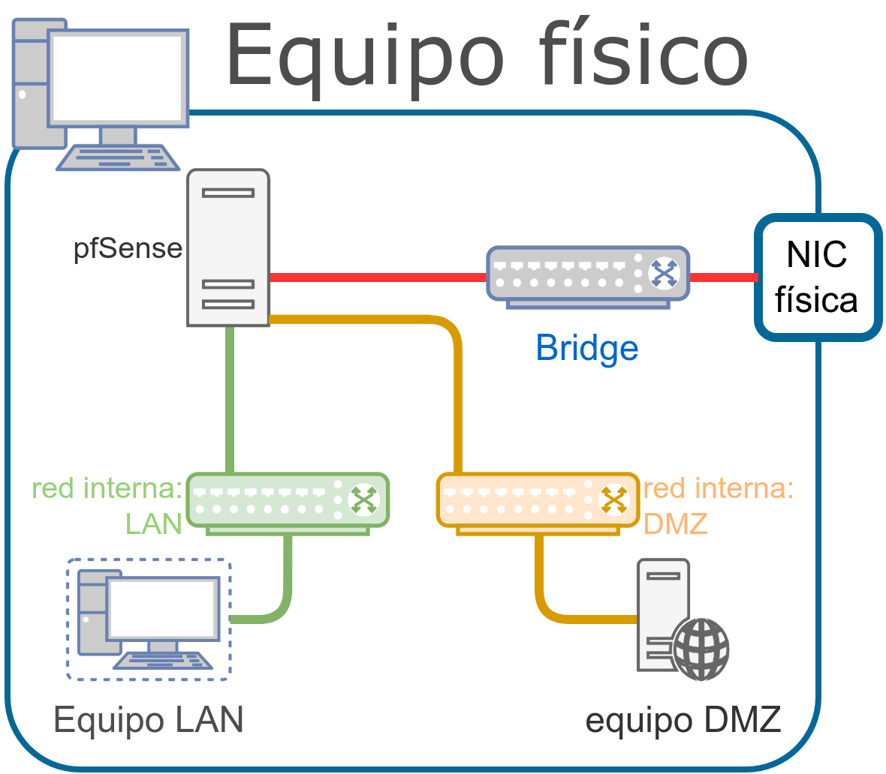

# Introducción {#introducción-pfsense}

En este documento se va a explicar cómo realizar la instalación y configuración de un servidor que hará las funciones de cortafuegos basado en la distribución [pfSense](https://www.pfsense.org/).

Para completar la simulación, se usará un equipo que va a pertenecer a la LAN de la infraestructura, y lo usaremos para poder ver cómo se bloquea el tráfico y para realizar pruebas en la configuración del pfSense recién instalado.

## Antes de empezar {#antes-de-empezar}

La idea de este documento es crear una pequeña infraestructura de red haciendo uso de un firewall (o cortafuegos) basado en pfSense. Con ello vamos a ver cómo funciona el sistema de creación de reglas de filtrado de tráfico para un equipo que estará dentro de la red LAN detrás de dicho firewall.

El esquema de infraestructura real quedaría de la siguiente manera, dependiendo de cómo realicemos la instalación y las posibilidades que tengamos con nuestro proveedor de internet:

{width="100%"}

-   **1ª opción**: el pfSense actúa como conexión directa a internet. Para ello estará conectado a un router neutro, cable-modem, ONT o lo habremos configurado como nuestro ISP nos indique. Por lo tanto pfSense tendrá IP pública a internet y actuará como firewall directo.

-   **2ª opción**: haciendo doble NAT, detrás del router de nuestro proveedor de Internet. Para que todo funcione de manera correcta, en el router del proveedor deberemos hacer una redirección de puertos para que todas las conexiones vayan a la IP del servidor pfSense.

## Requisitos {#requisitos}

Esta simulación se puede realizar de dos maneras:

-   haciendo uso de hardware dedicado.

-   usando máquinas virtuales.

La manera más sencilla es realizarlo haciendo uso de máquinas virtuales con un virtualizador como es [Virtualbox](https://www.virtualbox.org/), por lo que se explicará esta modalidad.

# PfSense {#pfsense}

[PfSense](https://www.pfsense.org/) es una distribución de [FreeBSD](https://es.wikipedia.org/wiki/FreeBSD) (no confundir con GNU/Linux, ya que FreeBSD es [Unix](https://es.wikipedia.org/wiki/Unix)) que está adaptada para que actúe como un sistema de firewall, enrutador, control de tráfico, servidor DNS, DHCP, VPN, proxy y muchos servicios más.

Tal como veremos a continuación, la instalación es sencilla y la configuración de los servicios se realiza a través de un interfaz web desde el que se puede controlar las reglas de filtrado que se pueden crear, las configuraciones que se van a realizar, ...

Hoy en día, la empresa que está detrás de pfSense, Netgate, vende unos sistemas appliance (hardware específico para realizar las funciones de firewall, con la distribución preinstalada), pero lo habitual suele ser que la instalación se realice sobre un sistema hardware de servidor o virtualizado.

A nivel de características técnicas lo único que se pide es un procesador basado en la arquitectura x86_64 (Intel o AMD) de 600MHz, 512 MB de RAM y 4GB de disco duro. Lógicamente, este es el hardware mínimo recomendado, y dependiendo de la cantidad de tráfico que tenga nuestra infraestructura deberemos tener un hardware adecuado para el mismo. En la documentación oficial hacen referencia al [hardware que podamos necesitar](https://docs.netgate.com/pfsense/en/latest/hardware/size.html) dependiendo del tráfico que vayamos a tener.

Dado que se va a optar por realizar la instalación en una máquina virtual, se va a necesitar un sistema de virtualización (Virtualbox) y el [CD de instalación](https://www.pfsense.org/download/). La instalación será idéntica si se realiza en hardware físico, o en otro sistema de virtualización.

## Detalles de la máquina virtual {#detalles-de-la-máquina-virtual}

:::::::::::::: {.columns }
::: {.column width="60%"}
No se va a detallar cómo crear una máquina virtual, pero si las características técnicas que debe tener cuando se crea en Virtualbox.

Dado que pfSense está basado en un sistema Unix FreeBSD, la máquina tiene que crearse indicando el tipo "BSD" y la versión "FreeBSD" de 64 bits, tal como aparece en la imagen.
:::
::: {.column width="33%" }
{width="100%" framed=true}
:::
::::::::::::::

Por otro lado, a la máquina virtual se le van a añadir dos interfaces de red:

-   El primer adaptador de red será de tipo "Adaptador puente", ya que en el sistema haremos que sea la interfaz que actuará como "WAN".

-   El segundo adaptador de red se creará de tipo "Red interna" y le pondremos el nombre de "LAN", que hará esas funciones en nuestra infraestructura.

Dadas las explicaciones previas, una vez creada la máquina virtual nuestra infraestructura virtual quedaría de la siguiente manera:

{width="50%"}

Visto este dibujo, la máquina virtual que actuará como PC dentro de la LAN le tendremos que modificar el adaptador virtual para que sea de tipo "Red interna" y escribiremos "**LAN**", por lo que ambas máquinas estarán conectadas mediante un "switch virtual".

El resto de parámetros de la máquina virtual, como se trata de una para pruebas, será:

-   8 GB de disco duro

-   1GB de memoria RAM

### Máquina virtual en la LAN {#máquina-virtual-en-la-lan}

Tal como se ha visto en el dibujo anterior, vamos a usar una máquina virtual dentro de la *LAN virtual* de pfSense.

Para ello necesitamos configurar el interfaz de la máquina virtual en modo "Red interna" y seleccionaremos la "**LAN**" creada previamente.

Queda por parte del lector el crear esta máquina virtual, pero se recomienda realizar la instalación de una distribución GNU/Linux en ella.

## Instalación {#instalación}

Tras poner el CD de instalación en la máquina virtual y arrancar veremos un pequeño menú como muestra la siguiente captura de pantalla:

{width="80%"}

El menú contará con un sistema de cuenta atrás y si no se selecciona nada entrará en la primera opción por defecto. Se podrá ver cómo el sistema arranca y detecta el hardware y al finalizar nos mostrará un menú con las opciones:

-   **Install**: Instalar pfSense

-   **Rescue Shell**: Lanza una terminal para poder recuperar una instalación que esté dando problemas

-   **Recover config.xml**: recupera el fichero de configuración config.xml de una instalación previa.

Tras seleccionar la opción de **instalar**, nos aparecerá un menú para seleccionar la distribución del teclado y a continuación el tipo de partición que queremos utilizar:

{width="80%"}

-   **Auto (ZFS)**: Sistema de particionado con el sistema de ficheros ZFS. Es el sistema por defecto, aunque ZFS puede consumir más RAM.

-   **Auto (UFS) BIOS**: si nuestro sistema usa BIOS.

-   **Auto (UFS) UEFI**: si nuestro sistema usa UEFI.

-   **Manual**: Nos permite particionar de manera manual, para expertos.

-   **Shell**: Abre una consola y podremos realizar el particionado a mano.

Al seleccionar la opción "Auto (ZFS)", el sistema nos permitirá crear un particionado en modo:

-   **stripe**: sin redundancia, usando el disco duro instalado.

-   **mirror**: haciendo uso del sistema RAID1

-   **raid10**: hacer uso de un sistema RAID1+0

-   **raidz1**: redundancia con un disco de paridad

-   **raidz2**: redundancia con dos disco de paridad

-   **raidz3**: redundancia con tres disco de paridad

Tras terminar, nos preguntará si queremos abrir una terminal en el sistema recién instalado. Le diremos que no y que reinicie el sistema. Nos tendremos que asegurar de quitar la ISO de la máquina virtual para que arranque desde el disco duro en lugar del CD.

# Configuración básica {#configuración-básica}

En este apartado se va a detallar cómo realizar una configuración básica de pfSense para que actúe como firewall dentro de la red simulada que hemos creado.

## Primer arranque {#primer-arranque}

Tras realizar la instalación y reiniciar, en el primer arranque desde el disco duro aparecerá un pequeño asistente que comprobará el hardware, detectará los interfaces de red que tenemos y nos realizará una serie de preguntas:

-   Si es necesario configurar VLANs.

-   De los interfaces existentes, cuál es el WAN.

-   De los interfaces existentes, cuál es el LAN.

Dependiendo del direccionamiento de red en el que nos encontremos, es posible que haya que configurar la LAN virtual de nuestra infraestructura de red virtualizada.

### A tener en cuenta en redes 192.168.1.0 /24 {#a-tener-en-cuenta-en-redes-192-168-1-0-24}

Dado que pfSense por defecto hace uso de una red LAN 192.168.1.0/24, en caso de que nuestra LAN física contenga ese direccionamiento, el interfaz LAN de pfSense no será configurado. Tendremos un menú como el siguiente:

{width="80%"}

Tal como se puede ver en la imagen, el asistente ha cogido IP por DHCP para el interfaz WAN, pero el interfaz LAN no se ha configurado ya que la WAN ya tiene el direccionamiento 192.168.1.0/24.

### Configurar LAN virtual {#configurar-lan-virtual}

En las situaciones mencionadas en el paso anterior, o en casos de que queramos modificar la red LAN, podremos cambiarla desde el menú seleccionando la opción 2.

{width="80%"}

Tal como se puede ver en la imagen anterior, al elegir la opción 2 el asistente nos pregunta por el interfaz que queremos configurar. Durante el proceso nos realiza las siguientes preguntas:

-   **Interfaces disponibles**: En nuestro caso, la LAN.

-   **Dirección IPv4**: La dirección IPv4 para el interfaz seleccionado.

-   **Máscara de red**: Máscara del direccionamiento para la IP anterior.

-   **Dirección IPv6**: En caso de querer configurar el interfaz en IPv6

-   **Activar servidor DHCP**: En el caso configurar la LAN, es interesante configurar el servidor DHCP.

    -   **IP inicial del rango**: Dentro de la LAN, la primera IP que se asignará por DHCP.

    -   **IP final del rango**: Dentro de la LAN, la última IP que se asignará por DHCP.

Al terminar el asistente, nos aparecerá de nuevo el menú que pasaremos a explicar a continuación.

## Menú de configuración desde consola {#menú-de-configuración-desde-consola}

Tal como se ha comentado, el menú cuenta con distintas opciones de administración.

{width="70%"}

Como se puede ver en la imagen previa, aparecen 16 posibles opciones a elegir, entre las que destacaremos:

1.  **Assign interfaces**: Para poder reconfigurar a qué red pertenecen los interfaces que tiene nuestro firewall (si es WAN, LAN, ... ).

2.  **Set interfaces IP address**: Para poder modificar la IP de los interfaces que tiene nuestro firewall.

3.  **Reset webConfigurator password**: Cambiar la contraseña de acceso.

4.  **Reset to factory defaults**: Restaurar el servidor a los valores de "fábrica", es decir, resetea todas las configuraciones propias realizadas.

5.  **Reboot**: Reinicia el servidor.

6.  **Halt**: Apaga el servidor.

7.  **Ping** host: Realiza un ping al equipo indicado.

8.  **Shell**: Nos abre una consola en el sistema para poder realizar modificaciones mediante comandos.

9.  **pfTop**: Nos muestra un listado de las conexiones establecidas en tiempo real.

10. **Enable Secure Shell (sshd)**: Habilita el servidor SSH para poder realizar conexiones. Por defecto, sólo podremos conectarnos desde la LAN.

11. **Restart PHP-FPM**: Reinicia el servicio del interfaz web.

## Interfaz web de configuración {#interfaz-web-de-configuración}

El acceso a la interfaz web de configuración **por defecto sólo está disponible desde la red LAN**, por lo que accederemos desde la máquina virtual dentro de la LAN abriendo un navegador y apuntando a la IP por defecto de la LAN "https://192.168.1.1" (o la que hayamos puesto si hemos [configurado la LAN](#configurar-lan-virtual)). Tendremos que aceptar el certificado de seguridad (ya que es auto-firmado) y nos aparecerá la web de login.

{width="70%" framed=true}

Los credenciales por defecto son:

-   **username**: admin

-   **password**: pfsense

El usuario "admin" de la web tendrá la misma contraseña que el usuario root por consola.

:::errorbox
**Dada la importancia de los cortafuegos, la contraseña que usemos debe ser segura y  sólo los administradores del servidor la deben conocer.**
:::

Cuando nos logueamos por primera vez nos aparecerá la primera página del asistente de configuración de pfsense, que nos guiará a través de nueve pasos donde podremos hacer una configuración básica de pfSense. Los pasos serán los siguientes:

0.  **Bienvenida al asistente**: página de inicio.

1.  **Soporte de Netgate**: detrás de pfSense hay una empresa, Netgate, que ofrece sus servicios de soporte de pago para pfSense.

2.  **Información general**: configuración básica del servidor:

    -   **hostname**: nombre del servidor.

    -   **domain**: nombre del dominio al que pertenece el servidor.

    -   **DNS Server**: servidores DNS externos al que mandar las peticiones.

3.  **Servidor de tiempo**: configurar la zona horaria y el servidor NTP.

4.  **Configurar interfaz WAN**: Dependiendo de cómo sea la infraestructura real, podremos configurar el interfaz WAN con IP pública estática, por DHCP, por PPPoE, ... Por defecto está en DHCP. Si estamos tras doble NAT, habría que desactivar la opción "RFC1918 Networks".

5.  **Configurar interfaz LAN**: La IP de pfSense en el direccionamiento LAN. Por defecto es 192.168.1.1 con una máscara "/24".

6.  **Cambio de contraseña del admin**: Para poner una contraseña más segura.

7.  **Recargar la configuración**: Si se ha realizado algún cambio, recargará la configuración.

# Reglas de filtrado {#reglas-de-filtrado}

PfSense es un servidor que actúa como **firewall** (entre otras de sus posibles funciones) y por tanto permite la creación de reglas de filtrado de tráfico para todos los interfaces que tiene configurados.

::: infobox
Las reglas se ejecutan **cuando el tráfico entra al interfaz** y son evaluadas en base a “primer acierto”.
:::

Las acciones principales de las reglas pueden ser:

-   **Pass**: Permite el tráfico al destino.

-   **Reject**: Rechaza el paquete y avisa al emisor.

-   **Block**: Rechaza el paquete de manera silenciosa.

Si el tráfico no coincide con alguna regla que sea explícitamente **pass** el tráfico será denegado.

::: warnbox
**Por defecto pfSense deniega todo el tráfico entrante a sus interfaces.**
:::

Aunque las opciones "*block*" y "*reject*" rechazan el paquete, la diferencia puede suponer una gran diferencia, ya que "reject" responde con **TCP RST** (o \"*port unreacheable*\") y eso puede permitir la posibilidad de recibir un ataque de denegación de servicio (***[DoS](https://es.wikipedia.org/wiki/Ataque_de_denegación_de_servicio)***).

::: errorbox
**¡Nunca se debería usar "*reject*" en el interfaz  WAN!**
:::

En redes privadas es útil hacer uso de "*reject*", porque avisa a los programas que intentan realizar conexiones que la conexión está bloqueada, y por tanto la respuesta es más rápida ya que no se esperan timeouts.

## Ciclo de vida de una conexión {#ciclo-de-vida-de-una-conexión}

A continuación se explica cómo actúa pfSense al recibir un paquete de una nueva conexión:

-   El paquete, como parte de una nueva conexión, llega a un interfaz.

-   Se comprueban las reglas de filtrado **en orden descendiente** contra el paquete.

-   Cuando existe coincidencia, se ejecuta la acción de la regla de filtrado.

-   Se para las comprobaciones de las reglas.

-   Si no ha existido una coincidencia tras comprobar todas las reglas, **el paquete es bloqueado por defecto**.

## Reglas creadas por defecto {#reglas-creadas-por-defecto}

Tras la instalación de PfSense podemos ir a "Firewall → Rules" y ahí aparecen los interfaces que están configurados actualmente y en los que se pueden crear reglas de filtrado. Los interfaces que existirán en nuestra infraestructura serán:

-   **Floating**: No es una interfaz al uso. Es para crear reglas de filtrado especiales que se pueden saltar el orden y/o aplicar a todos los interfaces. **Es mejor no utilizarlo salvo que sepamos qué estamos haciendo y hayamos leído detenidamente** la [documentación](https://docs.netgate.com/pfsense/en/latest/firewall/floating-rules.html) sobre ello.

-   **WAN**: Bloquea todos los paquetes.

-   **LAN**: Existen varias reglas creadas por defecto que permiten tráfico:

    {width="90%" framed=true}

 - `\faCheck `{=latex} `<i class="fa-solid fa-check"></i>`{=html}  Permite el acceso a la IP de la LAN del pfsense al puerto 80 y 443 para poder administrarlo vía web. Esta regla está especialmente creada para que no se pueda eliminar desde este apartado, ya que el borrarla podría suponer no poder configurar pfSense vía web.

- `\faCheck `{=latex} `<i class="fa-solid fa-check"></i>`{=html} Permite cualquier tráfico de tipo IPv4

- `\faCheck `{=latex} `<i class="fa-solid fa-check"></i>`{=html} Permite cualquier tráfico de tipo IPv6

Las últimas dos reglas explicadas previamente permiten que el tráfico pueda salir de la LAN hacia internet y así se permita navegar por internet. Si se crease una nueva red LAN (para una red wifi, DMZ, ...) estas reglas no estarían creadas, por lo que desde esa nueva LAN no se podría acceder a ninguna otra red, por lo que habría que crear reglas que permitieran el tráfico.

## Crear regla de denegación {#crear-regla-de-denegación}

Tal como se ha comentado, por defecto desde la LAN se permite acceder a cualquier red, por lo que podemos hacer ping a cualquier equipo de Internet. Como ejemplo se va a crear una regla que impedirá el acceso a un servidor de Internet. Esta regla servirá de ejemplo para poder realizar cualquier otra regla que sea necesaria.

La regla se va a crear en el interfaz LAN, ya que queremos limitar el tráfico cuyo origen es esa red. Para crear la regla existen dos botones de creación:

-   **Añadir la regla al principio de la lista**: como su propio nombre indica, creará la regla al principio de la lista en la que aparecen todas las reglas que ya están creadas.

-   **Añadir la regla al final de la lista**: en este caso creará la lista al final de todas las reglas.

No importa dónde se cree la nueva regla, ya que se podrá modificar después su posición. Al crear la regla, tendremos que tener en cuenta los siguientes apartados:

-   **Action**: Qué queremos hacer con la regla: **pass**, **block** o **reject**.

-   **Disabled**: Para deshabilitar la regla. Suele ser buena idea deshabilitar temporalmente las reglas que no se necesiten en lugar de borrarlas, por si nos hemos confundido y hay que recuperarlas.

-   **Interface**: El interfaz sobre la que se va a crear la regla.

-   **Familia de dirección**: Si queremos aplicar la regla sobre IPv4, IPv6 o ambas.

-   **Protocolo**: Protocolo de la conexión: TCP, UDP, ICMP, Any...

-   **Source**: Origen de la conexión. Si es "Any" será desde cualquier equipo de la red elegida. Podremos elegir un único equipo u otras opciones.

-   **Destination**: El destino de la conexión. Si es "Any" será a cualquier equipo. Podremos elegir un equipo u otras opciones.

-   **Extra options**: Opciones extra y avanzadas para la regla (limitar número de conexiones, modificar el gateway de salida, ... ).

-   **Description**: Suele ser recomendable añadir una descripción a las reglas para identificar el servicio o el servidor sobre el que se aplica.

Para el ejemplo se va a bloquear todo el tráfico desde la LAN, al servidor 1.1.1.1 (servidor DNS de la empresa Cloudflare). La regla quedaría:

{width="100%" framed=true}

:::::::::::::: {.columns }
::: {.column width="78%"}
Una vez creada la regla aparecerá un botón para aplicar los cambios, por lo que hasta que no sea pulsado ese botón, las nuevas reglas que se hayan creado no tendrán efecto y por tanto no entrarán en funcionamiento.
:::
::: {.column width="20%" }

:::
::::::::::::::

## Orden de las reglas {#orden-de-las-reglas}

Tal como se ha identificado en el ciclo de [vida de las conexiones](#ciclo-de-vida-de-una-conexión), el orden de las reglas es muy importante, ya que en el momento en el que el tráfico entra sobre el interfaz se comprobará si coincide con las reglas en orden descendente.

Por lo tanto, si existe una regla muy general que permite el tráfico y después una muy específica de bloqueo, es bastante probable que la regla específica de bloqueo no llegue a entrar en funcionamiento, ya que el tráfico coincidirá con la regla general que permite dicho tráfico.

Teniendo en cuenta la regla creada en el apartado anterior, vamos a analizar cuál es el comportamiento dependiendo del orden en el que se sitúa:

-   Al **final** del todo:

    {width="90%" framed=true}

    Teniendo en cuenta las reglas creadas sobre el interfaz LAN en este orden, la regla de bloqueo al servidor 1.1.1.1 no entrará nunca en funcionamiento. El tráfico cuyo origen sea la LAN coincidirá siempre con la regla que le permite ir a cualquier parte, por lo que al coincidir con esa regla no se analizará ninguna más.

-   Al **comienzo** de las reglas:

    {width="90%" framed=true}

    En este caso la regla más específica de denegación se ha puesto al principio, por lo que si el tráfico coincide con esta hará lo que indica la regla, bloquear el tráfico al servidor 1.1.1.1. Si no coincide, se seguirán analizando el resto de reglas, y en este caso se permitirá el resto de tráfico.

Es de vital importancia tener en cuenta el orden de las reglas, analizarlo con cuidado y realizar las pruebas oportunas para confirmar que lo que se pretende hacer es lo que termina sucediendo.

::: errorbox
**¡El orden de las reglas de filtrado es muy importante en cualquier Firewall!**
:::

# Crear una nueva red {#crear-una-nueva-red}

Teniendo en cuenta lo visto hasta ahora, nuestra infraestructura cuenta con una única red LAN detrás del firewall y, aparte, el acceso a WAN. En este apartado se va a explicar cómo crear una nueva red para una sección DMZ ([zona desmilitarizada](https://es.wikipedia.org/wiki/Zona_desmilitarizada_(inform%C3%A1tica))) en la que se instalarán servidores.
Normalmente lo habitual suele ser que el acceso desde y hasta la DMZ cumpla con las siguientes restricciones:

-   **LAN → DMZ: permitido/limitado**, para el acceso a servicios como carpetas compartidas, páginas web, ... Se permitirá sólo a los servicios que se ofrecen.

-   **DMZ → LAN**: bloqueado. El acceso desde la DMZ a la LAN suele estar bloqueado ya que los servidores no deberían poder acceder a los equipos de los usuarios.

-   **DMZ → Internet**: limitado. Dependerá de los servicios que estén instalados en los servidores. Para el acceso total a internet (para actualizaciones de software, por ejemplo) se suele permitir el acceso a través de un proxy que realizará el bloqueo y sólo permitirá las webs correspondientes.

-   **Internet → DMZ**: limitado. Dependerá de los servicios que estén instalados en los servidores. Sólo se permitirá el acceso a los puertos de los servicios necesarios.

## Modificando la infraestructura creada {#modificando-la-infraestructura-creada}

Dado que se va a crear una red nueva, deberemos realizar cambios en la máquina virtual de nuestro servidor pfSense. La nueva infraestructura será la siguiente:

{width="50%"}

Tal como se puede apreciar al compararlo con la [infraestructura anterior](#detalles-de-la-máquina-virtual), se ha creado una nueva red interna, por lo que al pfSense se le tendrá que activar una nueva interfaz de tipo "Red interna" y le daremos el nombre de DMZ.

Virtualbox no nos permite realizar esta modificación "en caliente", por lo que habrá que apagar la máquina virtual de pfSense. Algunos sistemas profesionales de virtualización sí que permiten hacer algunas modificaciones hardware en las máquinas virtuales sin tener que apagarlas, y dependiendo del sistema operativo, se dará cuenta de dichos cambios y por lo tanto no será necesario realizar un apagado.

Tenemos que crear otra máquina virtual que actuará a modo de servidor en la red DMZ, por lo que en su configuración la configuraremos también como "Red interna" en DMZ.

## Modificación de la configuración en pfSense {#modificación-de-la-configuración-en-pfsense}

Tal como se ha visto, tras la instalación de pfSense aparece un pequeño asistente de configuración que nos lleva a través de unos pasos que nos permitirá realizar la configuración de una infraestructura basada en una red con parte WAN y LAN.

En caso de tener más interfaces de red durante la instalación, o a posteriori como sucede ahora, no se configurarán y por tanto queda en nuestra mano realizar dicha configuración.

### Añadir y configurar interfaz {#añadir-y-configurar-interfaz}

Dado que pfSense cuenta con un nuevo interfaz, por defecto aparece deshabilitado y sin configurar. Debemos activarlo, darle el direccionamiento que veamos adecuado y lo habitual también suele ser darle un nombre representativo de la red que va a servir.

Todas estas modificaciones se realizan desde el interfaz web, a través de "***Interfaces → Assignments***":

{width="80%" framed=true}

Tal como se puede ver, aparece la nueva interfaz junto a un botón "Add" que indica que lo podemos añadir a la configuración. Una vez pulsado el botón se le asigna el nombre "OPT1" como nombre por defecto, pero la idea es cambiarlo. Para ello se hace click en el interfaz, y se entra en su configuración.

Entre las modificaciones que vamos a realizar están:

-   **Enable**: hay que habilitar el interfaz, ya que aunque esté configurado, si no está habilitado no entrará en funcionamiento.

-   **Description**: El nombre que le daremos al interfaz, en este caso "DMZ".

-   **IPv4 Configuration Type**: Tipo de IPv4 que se le va a asignar. Crearemos un direccionamiento estático, por ejemplo: 172.16.0.1 /25 . La configuración de la red se hace en la misma página, un poco más abajo.

Una vez realizados los cambios, habrá que aplicar los cambios.

### Configurar DHCP Server {#configurar-dhcp-server}

Aunque no suele ser habitual configurar el DHCP Server en la red DMZ, se va a explicar cómo realizar la configuración ya que en otro tipo de redes (para el WIFI, departamento de marketing, ... ) es útil.

Para realizar la configuración se hace en "***Services → DHCP Server***", donde aparecerán las interfaces sobre las que podemos gestionar dicho servicio, actualmente en LAN y DMZ.

La configuración que se tendrá en cuenta a la hora de modificar el DHCP en el interfaz será:

-   **Enable**: Habilitar servicio

-   **Range**: Si queremos limitar el DHCP para que sólo de IPs a una parte de la red

-   **Other Options**: Los servidores DHCP no sólo se encargan de dar IPs, por lo que hay muchas opciones extra que se pueden modificar

#### Mapear IPs de DHCP a estática {#mapear-ips-de-dhcp-a-estática}

Existe la posibilidad de dar a los equipos siempre la misma IP cuando hacen una petición DHCP. Los servidores DHCP suelen crear una pequeña base de datos con las IPs que han otorgado y durante cuánto tiempo las tienen reservadas para esos equipos.

Es posible realizar mapeos de IPs a equipos que sean permanentes, por lo que los equipos que pidan DHCP, si tienen dicho mapeo creado, siempre se les asignará la misma IP y esa IP estará reservada sólo para ese equipo.

Suele ser habitual el realizar estos mapeos para tener controlados los equipos y conocer sus IPs sin tener que ir a ellos a configurarlos de manera estática, ya que todo se queda centralizado en el servidor DHCP.

Para realizar estos mapeos hay que ir a "Status → DHCP Leases" donde podremos ver todas las IPs que se han otorgado:

{width="100%" framed=true}

### Modificación de reglas de filtrado {#modificación-de-reglas-de-filtrado}

Tras realizar los pasos previos, si se enciende la máquina virtual que actuará de servidor en la DMZ, se podrá comprobar que cogerá IP por DHCP en el direccionamiento que se haya configurado en el paso anterior. El problema es que si se intenta realizar algún intento de comunicación con el exterior de la red veremos que no será posible ya que actualmente no existe ninguna regla que lo permita en pfSense. Lo podemos comprobar yendo a "***Firewall → Rules***" y mirando el apartado "DMZ"

::: errorbox
**¡pfSense deniega cualquier tipo de tráfico por defecto en los interfaces!**
:::

Teniendo en cuenta las reglas que normalmente suele tener una red DMZ, que se han comentado [al principio de este capítulo](#crear-una-nueva-red), habría que realizar las configuraciones oportunas para permitir el tráfico tal como sea necesario.

Teniendo en cuenta las reglas que se necesitan crear, y dado que pfSense aplica las reglas "al entrar al interfaz", habrá que entender dónde crear cada regla y tener cuidado con el orden con el que se aplican. Como pruebas, se ha aplicado las siguientes reglas:

{width="80%" framed=true}

¿Es realmente necesaria la primera regla?

