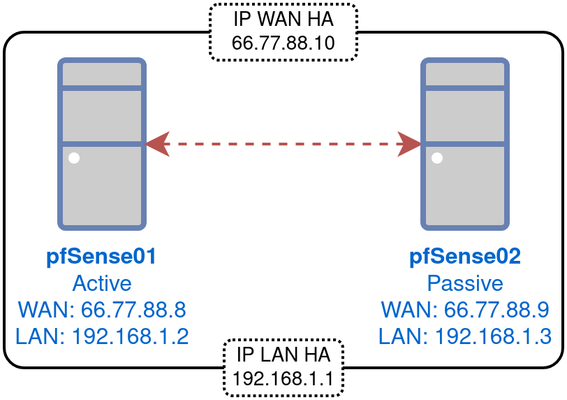

# Alta disponibilidad {#alta-disponibilidad}

El modo de funcionamiento de la alta disponibilidad en PfSense es el método "Activo - Pasivo", esto quiere decir que el servidor pasivo sólo entrará en funcionamiento y se convertirá en activo si el activo original deja de responder. Este tipo de infraestructura también se suele denominar "Master - Failover", ya que el servidor Pasivo entrará en servicio cuando el Activo falle (**conmutación por fallo**).

Hay que entender que en este tipo de arquitectura no significa que el Pasivo esté apagado, si no que los servicios estarán corriendo en el Activo y si este cae, los servicios se activarán en el Pasivo convirtiéndose en el servidor principal y por tanto en el Activo.

Para crear el sistema "Activo - Pasivo" en PfSense vamos a necesitar 2 servidores, y entre ellos debe existir una conexión directa (interfaz **SYNC**) para que entre ellos se puedan comunicar, conocer el estado del otro, intercambiar configuración, datos de estado de los servicios ... El esquema quedaría:

{width="50%"}

Teniendo en cuenta la infraestructura de la imagen, hay que explicar:

-   Cada PfSense tendrá un interfaz "SYNC" que será el utilizado para que se comuniquen y se sincronicen entre ellos. Tal como se puede ver, el direccionamiento es "/30" ya que sólo necesitaremos 2 IPs activas.

-   Cada PfSense tendrá una IP por cada red a la que pertenezca (WAN, LAN, DMZ, ... ).

-   Existirán tantas IPs balanceadas (o IPs HA) por cada red en la que el PfSense tenga configuración.

Una vez realizado esto, hay que seguir unos pasos más que están explicados en la documentación oficial ([enlace 1](https://docs.netgate.com/pfsense/en/latest/solutions/reference/highavailability/clusterconfiguration.html), [enlace 2](https://docs.netgate.com/pfsense/en/latest/recipes/high-availability.html)).

## IPs balanceadas o "IPs HA" {#ips-balanceadas-o-ips-ha}

Las IPs balanceadas (también denominadas "IPs HA" o "IPs de alta disponibilidad") son IPs que pueden estar configuradas en un servidor y en cualquier momento moverse a otro servidor.

En el caso de PfSense, estas IPs se crean en "***Firewall → Virtual IPs***" y deben ser de tipo **CARP**. Estarán en funcionamiento en el servidor Activo, y serán las IPs en las que los servicios estén escuchando y que actuarán como GW para los equipos en cada LAN. Si el servidor activo cae, el pasivo se dará cuenta a través del interfaz SYNC y en ese momento decidirá ponerse como activo y por tanto levantará las IPs HA.

::: errorbox
**Es importante que todos los equipos apunten a estas IPs, ya que son las IPs que se van a mover.**
:::

## Servicios en infraestructura Activo - Pasivo {#servicios-en-infraestructura-activo---pasivo}

Algunos servicios de red no pueden estar en más de un servidor en la misma red, ya que entrarían en conflicto, tal como sucede con DHCP. Por ello, en las infraestructuras "Activo - Pasivo" los servicios sólo están funcionando en el servidor Activo, mientras que en el pasivo están apagados.

## A tener en cuenta {#a-tener-en-cuenta}

Dado que la infraestructura en HA difiere de la infraestructura con un único servidor, hay ciertos cambios a tener en cuenta en la nueva infraestructura:

-   Al dar DHCP en las redes LAN, el "default gateway" que se otorga debe ser la IP HA de cada LAN.

-   Al hacer NAT, hay que modificar para que la IP en salida sea la HA.

