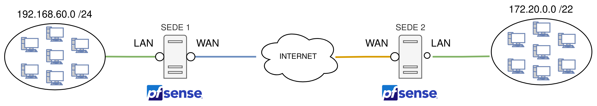
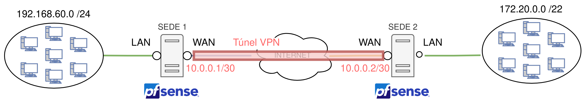
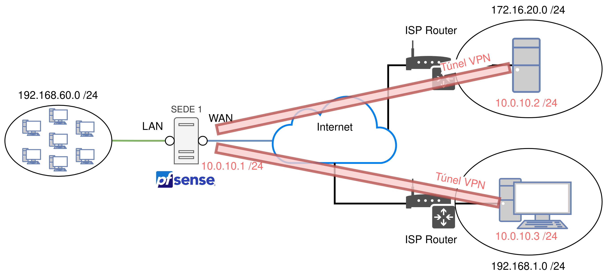
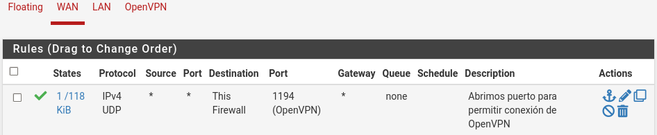
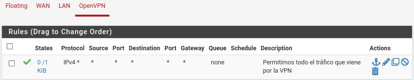

# Crear una VPN {#crear-una-vpn}

Una [VPN](https://es.wikipedia.org/wiki/Red_privada_virtual) (*Virtual Private Network*, en castellano **Red Privada Virtual**) es el modo de extender de manera segura una LAN a través de una red (pública) que no controlamos (a través de Internet suele ser lo más habitual). El concepto es crear un "túnel" entre dos puntos y que el tráfico vaya por él de manera cifrada para que la red sobre la que se ha creado el túnel no sea capaz de ver la información enviada.

Los usos más habituales que se le suele dar a la VPN son:

-   Conectarnos a los equipos de nuestra oficina cuando no estamos en ella.

    -   O conectar desde la oficina a equipos remotos que no están en ella (la idea es la misma, tal como veremos más adelante).

-   Conectar dos sedes que están geográficamente separadas.

Existen distintas tecnologías que nos permiten crear VPNs, y dependiendo del tipo de VPN que queramos montar, tendremos que seleccionar la más adecuada a nuestra infraestructura y necesidades.

## Usos habituales de las VPN {#usos-habituales-de-las-vpn}

Aunque el sistema de VPN se puede utilizar de muchas maneras (incluso en una misma sede, para securizar aún más el acceso entre distintas LANs), los usos más habituales de VPN son los siguientes:

### Conexión entre sedes {#conexión-entre-sedes}

También conocido como sistema "**Peer to Peer**". Vamos a suponer que tenemos una empresa con dos sedes separadas geográficamente, cada una de ellas con un servidor PfSense actuando de firewall y conectado a internet, tal como aparece en la siguiente imagen:

{width="90%"}

La idea, en esta situación, es que los equipos que están en la LAN de la sede 1 puedan llegar a los equipos de la LAN en la sede 2. Para ello, lo que se va a crear es un túnel VPN entre ambos PfSense. Ese túnel se suele denominar "punto a punto" ("peer to peer") y la infraestructura quedaría:

{width="90%"}

Una vez generado el túnel, cada pfSense tendrá un interfaz nuevo privado (10.0.0.1 y 10.0.0.2) que serán las IPs del túnel establecido.

### Conexión de equipo remoto {#conexión-de-equipo-remoto}

Este sistema suele ser el utilizado en las siguientes circunstancias:

-   Empleados fuera de la oficina que necesitan acceso a servidores internos.

    -   Lo habitual suele ser tener configurado un cliente OpenVPN en el portátil y activarlo cuando sea necesario.

-   Equipos que están en remoto con el que queremos comunicarnos de manera segura.

En resumen: cualquier equipo que está fuera de la oficina que quiera llegar a los equipos que están en ella, o al equipo al que queremos llegar desde la oficina de manera segura. De esta manera, el PfSense actuará de Servidor VPN y los clientes serán los equipos remotos, por lo que una vez conectados se formará un túnel con cada uno de ellos, quedando la infraestructura tal que:

{width="90%"}

## Características de las VPNs {#características-de-las-vpns}

Existen diferencias entre las distintas tecnologías a la hora de crear VPNs, pero todos ellos suelen contar con las siguientes características:

### Seguridad {#seguridad}

La principal característica que debe tener una VPN es la seguridad, concretamente el cifrado. Debemos pensar que cualquier tráfico que vaya entre ambos puntos de la VPN atravesará una red no controlada. Si el tráfico no fuese cifrado, cualquier dato que se enviase podría ser capturado y analizado.

Dependiendo del sistema VPN elegido se podrá elegir entre distintos sistemas de cifrado, que hará que la información no pueda ser leída por terceros. Estos sistemas de cifrado cuentan con algoritmos que harán que nuestra información viaje de forma segura.

### Arquitectura del túnel VPN {#arquitectura-del-túnel-vpn}

A la hora de crear el túnel entre los dispositivos que participarán en él, se puede realizar como:

-   **Infraestructura Cliente → Servidor**: Un nodo de la conexión actuará como **Servidor** VPN y el otro como **Cliente** VPN. El Cliente realizará una conexión a un puerto del interfaz WAN del Servidor. Ese puerto será el que se haya configurado en el servidor VPN, por lo que será un puerto que permita la conexión (sin estar filtrado por firewalls). Tras completar la autenticación, se establecerá la conexión y se creará el túnel. Este método se utiliza con el sistema **OpenVPN** y es el utilizado para poder conectarnos a la oficina cuando no nos encontramos en ella.

-   **Infraestructura negociada**: Ambos nodos tienen configurados la IP WAN del otro nodo. Ambos dispositivos iniciarán la comunicación entre si, y entre ellos decidirán quién es el Servidor y quién el Cliente. Este método suele ser el utilizado en el sistema de creación de VPN **IPSec**. También deberán estar abiertos los puertos correspondientes necesarios para establecer la comunicación.

### Autenticación {#autenticación}

Otra característica es la **autenticación** en la VPN. Normalmente, para poder realizar la conexión se necesita autenticar al usuario o al dispositivo antes de que se establezca el túnel, por lo que existirán distintas maneras de realizar dicha autenticación:

-   **Certificados de seguridad**: Similar a los certificados utilizados en las páginas web al ir por protocolo HTTPS. Cada nodo contará con su certificado único e intransferible. Al realizar la conexión se comprobará que es correcto y no está caducado.

-   **Usuario y contraseña**: Se deberá introducir un usuario y una contraseña que deberá estar permitido en el servidor.

-   **Contraseña/Clave compartida**: Este método suele ser el habitual en la infraestructura negociada. Ambos nodos cuentan con una única contraseña (o un certificado clave) configurada que deberá ser la misma en ambos nodos para establecer el túnel.

El sistema OpenVPN permite crear sistemas cuya autenticación unifica los certificados con el usuario y contraseña, por lo que mejora la seguridad.

### Tipo de conectividad {#tipo-de-conectividad}

Una vez establecido el túnel, también existen diferencias a la hora de comunicarse los distintos equipos entre ambas partes de la VPN. Ambas maneras son igual de válidas y dependerá de cómo queramos que nuestra infraestructura funcione, por lo que no debemos descartar de primeras ninguna de ellas y se deberá realizar un análisis del uso que le vamos a dar a la red.

#### Capa 2 del modelo OSI {#capa-2-del-modelo-osi}

En estos casos en ambos lados de la VPN el direccionamiento es el mismo. Es la misma LAN, y los equipos se comportan como tal. La creación de esta infraestructura suele ser más compleja.

#### Capa 3 del modelo OSI {#capa-3-del-modelo-osi}

El tráfico entre ambos nodos de la conexión VPN debe ser enrutado, y existen distintas maneras de realizar dicho enrutado. Teniendo en cuenta el dibujo:

{width="90%"}

-   **Rutas estáticas**: Cada PfSense tendrá rutas estáticas para poder acceder a los equipos de la red LAN de la otra sede. Esto quiere decir, que cuando una comunicación desde un equipo de la Sede1 llegue a la Sede2 llegará con su propia IP de origen. Las rutas serían:

    -   **En Sede1**: Ruta 172.20.0.0/22 gw 10.0.0.2

    -   **En Sede2**: Ruta 192.168.60.0/24 gw 10.0.0.1

-   **NAT**: Cuando se establezca la comunicación entre sedes, se realizará NAT y por tanto si un equipo de Sede1 se comunica con uno de Sede2 la comunicación llegará con la IP 10.0.0.1. (Este método suele ser habitual usarlo en túneles IPSec).

El enrutado también se debe realizar cuando la conexión es entre equipos remotos que se conectan a la VPN contra el servidor:

{width="90%"}

En este caso, sólo los clientes remotos reciben las rutas para acceder a la LAN de la sede.

## OpenVPN como servidor VPN en PfSense {#openvpn-como-servidor-vpn-en-pfsense}

[OpenVPN](https://openvpn.net/community/) es un sistema Servidor-Cliente para realizar infraestructuras VPN. PfSense cuenta con la opción para crear nuestro servidor OpenVPN a través de un asistente (wizard) o a través de todas las opciones que podemos modificar. El interfaz web que tiene PfSense no es más que una manera sencilla de crear el fichero de configuración que después usará por debajo para crear el Servidor.

Entre las opciones que podemos configurar están:

-   Server mode: Tipo de Servidor que queremos crear, las opciones son:

    -   **Peer to Peer**: Para realizar conexiones entre sedes. Existen dos maneras de realizar la autenticación:

        -   Mediante Certificados (SSL/TLS)

        -   Clave compartida

    -   **Remote Access**: El sistema utilizado para equipos remotos que se quieren conectar a la oficina. En este caso existen tres métodos de autenticación:

        -   Mediante **certificados** (SSL/TLS)

        -   **Usuario y contraseña**: PfSense cuenta con una base de datos interna de usuarios pero también se puede realizar una conexión contra un Active Directory externo y usar la autenticación contra él.

        -   **Combinado**: Certificados junto con usuario y contraseña

-   **Protocol**: Protocolo por el que irá la información del túnel (UDP o TCP).

-   **Device mode**: Tipo de conectividad. El tipo "**tun**" (capa 3) es el más compatible y el único que se puede utilizar en teléfonos móviles.

-   **Interface**: Interfaz en el que se pondrá a la escucha el servidor VPN. Normalmente en WAN.

-   **Local port**: Puerto en el que se pondrá a la escucha el servidor VPN.

-   **Description**: Siempre es bueno añadir una descripción al servidor, ya que nuestra infraestructura puede contar con varios.

Teniendo en cuenta estas opciones, habrá que configurar las siguientes opciones:

-   **Cryptographic Settings**: Estas son las opciones que se tendrán en cuenta a la hora de cifrar la información que viajará por el túnel. En caso de hacer uso de certificados, habrá que crear en el PfSense en "***System → Cert Manager***" el certificado raíz en "**CAs**" (CA, de Autoridad Certificadora) y el certificado del servidor en "***Certificates***".

Tras esto, están las opciones que tienen que ver con el direccionamiento del propio túnel y el direccionamiento a la red remota en el apartado **Tunnel Settings**:

-   **IPv4 Tunnel Network**: Cuál será el direccionamiento que se creará en cada nodo cuando el túnel se establezca.

-   **Redirect IPv4 Gateway**: Forzar a que **todo** el tráfico generado en el cliente (no sólo el que se dirige a los equipos de la oficina) vaya por el túnel. Suele ser muy utilizado ya que así se simula al 100% el estar en la oficina.

-   **IPv4 Local network(s)**: Las redes a las que se podrá conectar el cliente cuando el túnel se establezca.

-   **IPv4 Remote network(s)**: En caso de ser una VPN "Peer to Peer", las redes remotas a las que se podrá conectar el Servidor (las que están en el cliente).

Tal como se puede ver, son bastantes opciones de configuración las que deberemos tener en cuenta a la hora de crear un Servidor VPN, por lo que tenemos que tener muy clara cuál es la infraestructura que tenemos y cuál es la infraestructura que queremos conseguir creando la VPN. Antes de crear el sistema deberemos realizar la toma de requisitos y analizar las opciones para elegir el mejor sistema que se adecúe a nuestra infraestructura.

### Reglas de filtrado en PfSense con OpenVPN {#reglas-de-filtrado-en-pfsense-con-openvpn}

Una vez creado el servidor OpenVPN en PfSense deberemos crear al menos dos reglas de filtrado nuevas en el apartado "*Firewall → Rules*":

-   **WAN**: Permitir conexiones al puerto en el que escucha el servidor en el protocolo previamente indicado.

    ::: infobox
    En un sistema multi-cliente de equipos remotos se aceptarán conexiones desde cualquier IP.
    :::

    ::: warnbox
    Si es un sistema “Peer to Peer” sólo aceptaremos conexiones desde la IP origen.
    :::

    {width="100%" framed=true}

-   **OpenVPN**: Al crear la VPN, se creará un nuevo interfaz en el que podremos añadir reglas de filtrado. Por defecto, al no tener ninguna regla, se denegará el tráfico, por lo que deberemos crear reglas de aceptación. En este caso, se acepta todo el tráfico que viene de la VPN:

    {width="100%" framed=true}

### Clientes de conexión OpenVPN {#clientes-de-conexión-openvpn}

Para poder realizar la conexión desde un equipo remoto a un servidor creado con OpenVPN se necesita un programa cliente. Existen clientes OpenVPN para las distintas plataformas:

-   **GNU/Linux**: Paquete openvpn de nuestra distribución.

-   **Windows**: Cliente Openvpn para windows ([web de descarga](https://openvpn.net/community-downloads/)).

-   **MacOS**: Programa [Tunnelblick](https://tunnelblick.net/).

-   **iOS**: Aplicación oficial para iOS ([AppStore](https://apps.apple.com/es/app/openvpn-connect/id590379981)).

-   **Android**: Aplicación oficial para Android ([PlayStore](https://play.google.com/store/apps/details?id=net.openvpn.openvpn)).

Dado que OpenVPN es Software Libre existen otros clientes para las distintas plataformas, pero todos harán uso del mismo núcleo y variará la manera de mostrar la información.

Para realizar la conexión al servidor, necesitaremos de un fichero de configuración que tendrá las opciones que deberá usar el cliente para realizar la conexión al servidor (IP del Servidor, sistema de cifrado, direccionamiento del túnel...).

Para poder obtener el fichero de configuración de cliente en PfSense es recomendable instalar el paquete "**openvpn-client-export**" ya que nos permitirá descargar el fichero para poder usarlo en el cliente.

